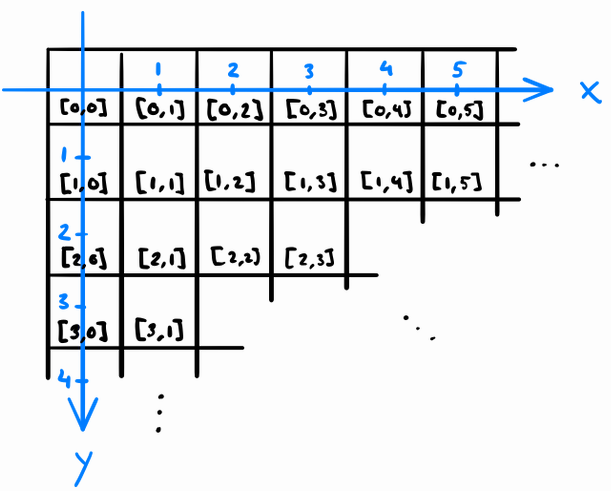

# Introduction

:notebook_with_decorative_cover: Before we get into accessing pixel values, we need to remind ourself that OpenCV images are represented by the same structure as matrices as shown in <a href = "https://mikamustonen.com/2019-06-22-how-to-rotate-an-image-with-opencv.html">Figure 1</a>. 

<p align = "center"><b>Figure 1:</b> OpenCV matrix or array coordinate system</p>

<p align = "center">
   
</p>


:notebook_with_decorative_cover: Figure 1 shows the following: 

1. The origin of this system is the top-left pixel with location `(0,0)`. 
2. The system is `0`-based - meaning we start counting from `0`. 
3. Each pixel represents `1` unit.
4. The y-coordinates which represent the image rows increase downwards, while the x-coordinates (image columns) increase from left to right.
5. The system uses the convention `(y-coordinate, x-coordinate)` when defining the location of a pixel. y-coordinate defines the row of the pixel, and the x-coordinate defines the column.  

:notebook_with_decorative_cover: This system is different from the Cartesian coordinate system which we used in the earlier tutorial on Drawing and Annotation. Cartesian uses `(x-coordinate, y-coordinate)` combination.

## Accessing pixel intensity values

:notebook_with_decorative_cover: In order to get the pixel intensity value, you need to know two things about the image:

1. The data type of the pixel values
2. The number of channels

:notebook_with_decorative_cover: This is because these two pieces of information are important inputs to the template function `at<>()` which we use for accessing intensity values at each pixel location. There are a few things to note about this function:

1. It is a member function of the `cv::Mat` class hence you access it using an object of type `cv::Mat`.
2. Within the documentation there are `12` overloaded functions with various definitions that allow you to access 1D, 2D, 3D matrices, while others allow you to access single-channel or multi-channel images, etc.
3. Each function definition has two versions: 
   * One that returns a constant reference to the pixel value/values, that is `const T&`. Using this version means you cannot alter the pixel value/s.
   * One that returns a non-constant reference to the pixel value/s, that is, `T&`. Using this version means you can alter the pixel value/s.

### Single-channel 2-D images

:notebook_with_decorative_cover: To access pixel values for single-channel 2-D images we use the function definition `T& at<T>(int row, int col)` or `const T& at<T>(int row, int col) const`. `T` is the data type of pixel values in image, `row` is the row/y-coordinate of pixel, `col` is the column/x-coordinate of pixel. Since we are dealing with single-channel images, the returned value is a reference to a single value.

:notebook_with_decorative_cover: The value of `T` that you place within the angle brackets `<T>` depends on the image data type from which you are trying to retrieve the data. The following gives a better insight: 

* If image is of type `CV_8U` then use `cv::Mat.at<uchar>(y,x)`.
* If image is of type `CV_8S` then use `cv::Mat.at<schar>(y,x)`.
* If image is of type `CV_16U` then use `cv::Mat.at<ushort>(y,x)`.
* If image is of type `CV_16S` then use `cv::Mat.at<short>(y,x)`.
* If image is of type `CV_32S` then use `cv::Mat.at<int>(y,x)`.
* If image is of type `CV_32F` then use `cv::Mat.at<float>(y,x)`.
* If image is of type `CV_64F` then use `cv::Mat.at<double>(y,x)`.

:notebook_with_decorative_cover: The following is an example for a single channel gray scale image (type `CV_8UC1`) and pixel location defined by `row` and `column`. The image has been read into a `cv::Mat` object `img`.

```c++
uchar pixelValue = img.at<uchar>(row, column);
```

:notebook_with_decorative_cover: Although the above code works as it should, you will find that if for example the image pixel value was `64` and you try to print `pixelValue` to screen e.g `std::cout << pixelValue`, it will print the character `@`. That is because types such as `unsigned char` (or `uchar`) or `signed char` (or `schar`) are printed as ASCII values, which is not what we want. There are various ways to convert ASC11 values to integers, but it is not easy to remember everytime. The best solution is to use the data type `cv::Scalar` as the return type. OpenCV automatically converts `uchar` or `schar` values to the appropriate values if using `cv::Scalar`. You should also remember from earlier tutorials that `cv::Scalar` can hold `4` values, which can be accessed through indices `0` to `3`. For single-channel images, we return `1` value - which will be stored at index `0` in `cv::Scalar`. To improve the previous code we should write it as follows:

```c++
cv::Scalar pixelValue = img.at<uchar>(row, column)
std::cout << "Pixel value = " << pixelValue[0];
```

:notebook_with_decorative_cover: By taking advantage of the object `cv::Scalar` we can write a function that can return the pixel value of a single-channel image of any data type.

```c++
/**
 * @brief Return the pixel value from a single-channel image
 * 
 * @param image Single-channel image
 * @param type OpenCV data type of pixel values in image e.g. CV_8U or CV_8UC1
 * @param y Row index to find pixel. We start counting indices from '0'. 
 *          The first row is found at the top of the image, and increases 
 *          from top to bottom of image.
 * @param x Column index to fnd pixel. We start counting indices from '0'.
 *          The first column is found on the left of the image, and increases 
 *          from left to right of image. 
 * @return cv::Scalar Pixel value, which will be stored at index '0' 
 *                    of the cv::Scalar object
 */
cv::Scalar pixelValue_C1(const cv::Mat& image, int type, int y, int x)
{
    
   switch (type)
   {
      case CV_8U:
         return image.at<uchar>(y, x);

      case CV_8S:
         return image.at<schar>(y, x);

      case CV_16U: 
         return image.at<ushort>(y, x);

      case CV_16S:
         return image.at<short>(y, x);

      case CV_32S:
         return image.at<int>(y, x);

      case CV_32F:
         return image.at<float>(y, x);

      case CV_64F:
         return image.at<double>(y, x);
                
      default: // Use type 'double' as it can hold any of the above types
         return image.at<double>(y, x);
   }
}
```

:notebook_with_decorative_cover: Since it is likely that we will re-use the above function we will add it to our library we are building. We will add the function under the namespace `BasicImageProcessing`. Remember to add the function declaration in the header file `Example-Code/include/UtilityFunctions/utility_functions.h` and the full definition in the source file `Example-Code/src/UtilityFunctions/utility_functions.cpp`.

:notebook_with_decorative_cover: As mentioned earlier on, we can also use the `at<>()` function to alter/change the pixel value by simply placing this function on the left-hand side of the equal sign `=` and the new pixel value on the right-hand side. This is how you can alter a non-const reference value. In the following example we alter the pixel value at location `(row, column)` to `128`. The `cv::Mat` image object `img` must NOT be a `const` object.

```c++
img.at<uchar>(row, column) = 128;
```

:notebook_with_decorative_cover: If you try to alter the pixel value using a value out of range of the data type, OpenCV will use **saturation casting** to convert your input to the appropriate range. We have already extensively covered saturation casting in an earlier tutorial. 

### 2-D images with 2 channels

:notebook_with_decorative_cover: To access pixel values for 2-D images with 2 channels we use the function definition `T& at<T>(int row, int col)` or `const T& at<T>(int row, int col) const`. `T` is a data object that can store two values of the pixel data type, `row` is the row/y-coordinate of pixel, `col` is the column/x-coordinate of pixel. Since we are dealing with 2-channel images, the returned value is a reference to a container that can hold two values.

:notebook_with_decorative_cover: The value of `T` that you place within the angle brackets `<T>` depends on the image data type from which you are trying to retrieve the data. Since we want a container object that can hold more than 1 value, you will find that most OpenCV users prefer the object type `cv::Vec`. For images with 2 channels the following gives a better insight: 

* If image is of type `CV_8UC2` then use `cv::Mat.at<cv::Vec2b>(y,x)`.
* If image is of type `CV_8SC2` then use `cv::Mat.at<cv::Vec2s>(y,x)`.
* If image is of type `CV_16UC2` then use `cv::Mat.at<cv::Vec2w>(y,x)`.
* If image is of type `CV_16SC2` then use `cv::Mat.at<cv::Vec2s>(y,x)`.
* If image is of type `CV_32SC2` then use `cv::Mat.at<cv::Vec2i>(y,x)`.
* If image is of type `CV_32FC2` then use `cv::Mat.at<cv::Vec2f>(y,x)`.
* If image is of type `CV_64FC2` then use `cv::Mat.at<cv::Vec2d>(y,x)`.

:notebook_with_decorative_cover: As a reminder, in OpenCV, the primitive types are as follows:

* **b** - unsigned char -> used to hold any integer in the range: 0 to 255 (inclusive)
* **s** - short -> holds positive and negative integers, with the range: -32 768 to 32 767 (inclusive) 
* **w** - unsigned short -> holds only positive integers with the range: 0 to 65 535 (inclusive)
* **i** - integer -> 32-bit integer in the range: -2 147 483 648 to 2 147 483 647 (inclusive)
* **f** - float -> 32-bit floating/decimal point number accurate to between 6 and 9 digits
* **d** - double -> 64-bit floating/decimal point number, which is more accurate than the 32-bit floating number. Can be accurate to between 15 and 18 digits of precision. 

:notebook_with_decorative_cover: The following is an example for a 2-D image with 2 channels whose pixel values have data type unsigned char (type `CV_8UC2`) and pixel location defined by `row` and `column`. The image has been read into a `cv::Mat` object `img`.

```c++
cv::Vec2b pixelValue = img.at<cv::Vec2b>(row, column);
uchar channel1Value = pixelValue[0];
uchar channel2Value = pixelValue[1];
```

:notebook_with_decorative_cover: As mentioned before, dealing with types such as `uchar` or `schar` can be a pain as C++ converts them to ASCII characters. To avoid having to do the conversions to numerical values each time, we take advantage of `cv::Scalar` and use it as the object for the return type. OpenCV automatically converts `cv::Vec2b` to `cv::Scalar` with the appropriate numerical values. The above code can be written as follows:

```c++
cv::Scalar pixelValue = img.at<cv::Vec2b>(row, column);
auto channel1Value = pixelValue[0];
auto channel2Value = pixelValue[1];
```

:notebook_with_decorative_cover: By taking advantage of the object `cv::Scalar` we can write a single function that can return the pixel values of a 2-D image with 2 channels whose pixels are of any data type.

```c++
/**
 * @brief Return the pixel value from a 2-dimensional image with '2' channels
 * 
 * @param image 2-dimensional image with '2' channels
 * @param type OpenCV data type of pixel values in image e.g. CV_8UC2
 * @param y Row index to find pixel. We start counting indices from '0'. 
 *          The first row is found at the top of the image, and increases 
 *          from top to bottom of image.
 * @param x Column index to find pixel. We start counting indices from '0'.
 *          The first column is found on the left of the image, and increases 
 *          from left to right of image. 
 * @return cv::Scalar Pixel values, which will be stored at indices '0' & '1' 
 *                    of the cv::Scalar object
 */
cv::Scalar pixelValue_C2(const cv::Mat& image, int type, int y, int x)
{
   switch (type)
   {
      case CV_8UC2:
         return image.at<cv::Vec2b>(y, x);

      case CV_8SC2:
         return image.at<cv::Vec2s>(y, x);

      case CV_16UC2: 
         return image.at<cv::Vec2w>(y, x);

      case CV_16SC2:
         return image.at<cv::Vec2s>(y, x);

      case CV_32SC2:
         return image.at<cv::Vec2i>(y, x);

      case CV_32FC2:
         return image.at<cv::Vec2f>(y, x);

      case CV_64FC2:
         return image.at<cv::Vec2d>(y, x);
                
      default: // Use type 'cv::Vec2d' as it can hold any of the above types
         return image.at<cv::Vec2d>(y, x);
   }
}
```

:notebook_with_decorative_cover: Since it is likely that we will re-use the above function we will add it to our library we are building. We will add the function under the namespace `BasicImageProcessing`. Remember to add the function declaration in the header file `Example-Code/include/UtilityFunctions/utility_functions.h` and the full definition in the source file `Example-Code/src/UtilityFunctions/utility_functions.cpp`.

:notebook_with_decorative_cover: As mentioned earlier on, we can also use the `at<>()` function to alter/change the pixel values by simply placing this function on the left-hand side of the equal sign `=` and the new pixel values on the right-hand side. This is how you can alter a non-const reference value. In the following example we alter the pixel values at location `(row, column)` to `68` and `128` in channel 1 and channel 2, respectively. The `cv::Mat` image object `img` must NOT be a const object.

```c++
cv::Vec2b newPixelValues {68, 128};
img.at<cv::Vec2b>(row, column) = newPixelValues;
```

### 2-D images with 3 channels

:notebook_with_decorative_cover: In the course of building computer vision applications you will work mostly with 2-dimensional images that have 3 channels - also known as color images. Because the channels can be combined in various ways (BGR, RGB, GRB, etc), you should always be aware of the color order when accessing pixel values.

:notebook_with_decorative_cover: Just like the above image types, we use the function `T& at<T>(int row, int col)` or `const T& at<T>(int row, int col) const` to access pixel values. Since we now have 3 channels, we need a container e.g. `cv::Vec` that can handle 3 values of the image data type. Below, is a list that shows how to best combine image data type and the correct container type to store the pixel values:

* If image is of type `CV_8UC3` then use `cv::Mat.at<cv::Vec3b>(y,x)`.
* If image is of type `CV_8SC3` then use `cv::Mat.at<cv::Vec3s>(y,x)`.
* If image is of type `CV_16UC3` then use `cv::Mat.at<cv::Vec3w>(y,x)`.
* If image is of type `CV_16SC3` then use `cv::Mat.at<cv::Vec3s>(y,x)`.
* If image is of type `CV_32SC3` then use `cv::Mat.at<cv::Vec3i>(y,x)`.
* If image is of type `CV_32FC3` then use `cv::Mat.at<cv::Vec3f>(y,x)`.
* If image is of type `CV_64FC3` then use `cv::Mat.at<cv::Vec3d>(y,x)`.

:notebook_with_decorative_cover: The following is an example for a 2-D image with 3 channels whose pixel values have data type unsigned char (type `CV_8UC3`) and pixel location defined by `row` and `column`. The image has been read into a `cv::Mat` object `img`.

```c++
cv::Vec3b pixelValue = img.at<cv::Vec3b>(row, column);
uchar channel1Value = pixelValue[0];
uchar channel2Value = pixelValue[1];
uchar channel3Value = pixelValue[2];
```

:notebook_with_decorative_cover: As mentioned before, dealing with types such as `uchar` or `schar` can be a pain as C++ converts them to ASCII characters. To avoid having to do the conversions to numerical values each time, we take advantage of `cv::Scalar` and use it as the object for the return type. OpenCV automatically converts `cv::Vec3b` to `cv::Scalar` with the appropriate numerical values. The above code can be written as follows:

```c++
cv::Scalar pixelValue = img.at<cv::Vec3b>(row, column);
int channel1Value = pixelValue[0]; // You can also use 'auto' in place of 'int'
int channel2Value = pixelValue[1];
int channel3Value = pixelValue[2];
```

:notebook_with_decorative_cover: By taking advantage of the object `cv::Scalar` we can write a single function that can return the pixel values of a 2-D image with 3 channels whose pixels are of any data type.

```c++
/**
 * @brief Return the pixel values from a 2-dimensional image with '3' channels
 * 
 * @param image 2- dimensional image with '3' channels. Color images can be of any format 
 *              e.g. BGR, RGB etc
 * @param type OpenCV data type of pixel values in image e.g. CV_8UC3
 * @param y Row index to find pixel. We start counting indices from '0'. 
 *          The first row is found at the top of the image, and increases 
 *          from top to bottom of image.
 * @param x Column index to find pixel. We start counting indices from '0'.
 *          The first column is found on the left of the image, and increases 
 *          from left to right of image. 
 * @return cv::Scalar Pixel values, which will be stored at indices '0', '1' & '2' 
 *                    of the cv::Scalar object. The values follow the format 
 *                    of the image provided e.g. BGR, RGB etc
 */
cv::Scalar pixelValue_C3(const cv::Mat& image, int type, int y, int x)
{
   switch (type)
   {
      case CV_8UC3:
         return image.at<cv::Vec3b>(y, x);

      case CV_8SC3:
         return image.at<cv::Vec3s>(y, x);

      case CV_16UC3: 
         return image.at<cv::Vec3w>(y, x);

      case CV_16SC3:
         return image.at<cv::Vec3s>(y, x);

      case CV_32SC3:
         return image.at<cv::Vec3i>(y, x);

      case CV_32FC3:
         return image.at<cv::Vec3f>(y, x);

      case CV_64FC3:
         return image.at<cv::Vec3d>(y, x);
                
      default: // Use type 'cv::Vec3d' as it can hold any of the above types
         return image.at<cv::Vec3d>(y, x);
   }
}
```

:notebook_with_decorative_cover: Since it is likely that we will re-use the above function we will add it to our library we are building. We will add the function under the namespace `BasicImageProcessing`. Remember to add the function declaration in the header file `Example-Code/include/UtilityFunctions/utility_functions.h` and the full definition in the source file `Example-Code/src/UtilityFunctions/utility_functions.cpp`.

:notebook_with_decorative_cover: As mentioned earlier on, we can also use the `at<>()` function to alter/change the pixel values by simply placing this function on the left-hand side of the equal sign `=` and the new pixel values on the right-hand side. This is how you can alter a non-const reference value. In the following example we alter the pixel values at location `(row, column)` to `68`, `90` and `128` in channel 1, channel 2, and channel 3 respectively. The `cv::Mat` image object `img` must NOT be a const object.

```c++
cv::Vec3b newPixelValues {68, 90, 128};
img.at<cv::Vec3b>(row, column) = newPixelValues;
```

### 2-D images with 4 channels

:notebook_with_decorative_cover: Just like the above image types, we use the function `T& at<T>(int row, int col)` or `const T& at<T>(int row, int col) const` to access pixel values for 2-D 4-channel images. Since we now have 4 channels, we need a container e.g. `cv::Vec` that can handle 4 values of the image data type. Below, is a list that shows how to best combine image data type and the correct container type to store the pixel values:

* If image is of type `CV_8UC4` then use `cv::Mat.at<cv::Vec4b>(y,x)`.
* If image is of type `CV_8SC4` then use `cv::Mat.at<cv::Vec4s>(y,x)`.
* If image is of type `CV_16UC4` then use `cv::Mat.at<cv::Vec4w>(y,x)`.
* If image is of type `CV_16SC4` then use `cv::Mat.at<cv::Vec4s>(y,x)`.
* If image is of type `CV_32SC4` then use `cv::Mat.at<cv::Vec4i>(y,x)`.
* If image is of type `CV_32FC4` then use `cv::Mat.at<cv::Vec4f>(y,x)`.
* If image is of type `CV_64FC4` then use `cv::Mat.at<cv::Vec4d>(y,x)`.

:notebook_with_decorative_cover: The following is an example for a 2-D image with 4 channels whose pixel values have data type signed char (type `CV_8SC4`) and pixel location defined by `row` and `column`. The image has been read into a `cv::Mat` object `img`.

```c++
cv::Vec4s pixelValue = img.at<cv::Vec4s>(row, column);
schar channel1Value = pixelValue[0];
schar channel2Value = pixelValue[1];
schar channel3Value = pixelValue[2];
schar channel4Value = pixelValue[3];
```

:notebook_with_decorative_cover: As mentioned before, dealing with types such as `uchar` or `schar` can be a pain as C++ converts them to ASCII characters. To avoid having to do the conversions to numerical values each time, we take advantage of `cv::Scalar` and use it as the object for the return type. OpenCV automatically converts `cv::Vec4s` to `cv::Scalar` with the appropriate numerical values. The above code can be written as follows:

```c++
cv::Scalar pixelValue = img.at<cv::Vec4s>(row, column);
int channel1Value = pixelValue[0]; // You can also use 'auto' in place of 'int'
int channel2Value = pixelValue[1];
int channel3Value = pixelValue[2];
int channel4Value = pixelValue[3];
```

:notebook_with_decorative_cover: By taking advantage of the object `cv::Scalar` we can write a single function that can return the pixel values of a 2-D image with 4 channels whose pixels are of any data type.

```c++
/**
 * @brief Return the pixel values from a 2-dimensional image with '4' channels
 * 
 * @param image 2-dimensional image with '4' channels. Color images can be of any format 
 *              e.g. BGRA, RGBA etc
 * @param type OpenCV data type of pixel values in image e.g. CV_8UC4
 * @param y Row index to find pixel. We start counting indices from '0'. 
 *          The first row is found at the top of the image, and increases 
 *          from top to bottom of image.
 * @param x Column index to find pixel. We start counting indices from '0'.
 *          The first column is found on the left of the image, and increases 
 *          from left to right of image. 
 * @return cv::Scalar Pixel values, which will be stored at indices '0', '1', '2'  
 *                    & '3' of the cv::Scalar object. The values follow the format 
 *                    of the image provided e.g. BGRA, RGBA etc
 */
cv::Scalar pixelValue_C4(const cv::Mat& image, int type, int y, int x)
{
   switch (type)
   {
      case CV_8UC4:
         return image.at<cv::Vec4b>(y, x);

      case CV_8SC4:
         return image.at<cv::Vec4s>(y, x);

      case CV_16UC4: 
         return image.at<cv::Vec4w>(y, x);

      case CV_16SC4:
         return image.at<cv::Vec4s>(y, x);

      case CV_32SC4:
         return image.at<cv::Vec4i>(y, x);

      case CV_32FC4:
         return image.at<cv::Vec4f>(y, x);

      case CV_64FC4:
         return image.at<cv::Vec4d>(y, x);
                
      default: // Use type 'cv::Vec4d' as it can hold any of the above types
         return image.at<cv::Vec4d>(y, x);
   }
}
```

:notebook_with_decorative_cover: Since it is likely that we will re-use the above function we will add it to our library we are building. We will add the function under the namespace `BasicImageProcessing`. Remember to add the function declaration in the header file `Example-Code/include/UtilityFunctions/utility_functions.h` and the full definition in the source file `Example-Code/src/UtilityFunctions/utility_functions.cpp`.

:notebook_with_decorative_cover: As mentioned earlier on, we can also use the `at<>()` function to alter/change the pixel values by simply placing this function on the left-hand side of the equal sign `=` and the new pixel values on the right-hand side. This is how you can alter a non-const reference value. In the following example we alter the pixel values at location `(row, column)` to `-68`, `-90`, `110` and `115` in channel 1, channel 2, channel 3, and channel 4 respectively. The `cv::Mat` image object `img` must NOT be a const object.

```c++
cv::Vec4s newPixelValues {-68, -90, 110, 128};
img.at<cv::Vec4s>(row, column) = newPixelValues;
```

**Example 1** - In this example, we write an application that returns the pixel values for any 2-D single-channel or multi-channel (2, 3, or 4 channels) image, given the `(row, column)` location of a pixel. Our application is capable of handling all the image data types supported by OpenCV.

```c++
#include "opencv2/core.hpp"        // for OpenCV core types e.g. cv::Mat
#include "opencv2/imgcodecs.hpp"   // for cv::imread
#include "opencv2/core/utility.hpp"    // for cv::CommandLineParser

#include "UtilityFunctions/utility_functions.h" // functions from our own library

#include <iostream>

int main(int argc, char* argv[])
{
    //------------------- 1. Extract Command Line Arguments -----------------//

    /*
     * Define the command line arguments 
     * We need the following arguments:
     *      1. Full path to image file 
     *      2. Row location of pixel
     *      3. Column location of pixel
     * 
    */
   const cv::String keys = 
   "{help h usage ? | | Access pixel intensity value/s of an image }"
   "{image | <none> | Full path to image file }"
   "{row | 0 | Row to find pixel }"
   "{column | 0 | Column to find pixel }";

    // Define a cv::CommandLineParser object
    cv::CommandLineParser parser(argc, argv, keys);

    // We also want to display a message about the program
    parser.about("\nApplication to access pixel intensity values of an image\n");
    parser.printMessage();

    // Now lets extract our command line arguments
    cv::String imagePath = parser.get<cv::String>("image");
    int row = parser.get<int>("row");
    int column = parser.get<int>("column");

    // check for any errors encountered 
    if(!parser.check())
    {
        parser.printErrors();

        return -1;
    }
          
    //----------------------- 2. Read image file ----------------------------//

    cv::Mat image {cv::imread(imagePath, cv::IMREAD_ANYCOLOR)};

    // Check if we have successfully read the image data
    if (image.empty())
    {
        std::cout << "\nCould not read image data from " 
                  << imagePath << '\n';
        
        return -1; // Early exit
    }

    // Print some relevant information about the image
    std::cout << "\nSize: " << " width = " << image.cols 
              << ", height = " << image.rows;
    std::cout << "\nNo. of channels = " << image.channels();
    std::cout << "\nData type = " 
              << CPP_CV::General::openCVDescriptiveDataType(image.type()) 
              << '\n';

        
    //----------------------- 3. Access pixel values -------------------------// 
    
    // Check if (row, column) supplied by user are valid, i.e., the pixel 
    // location has to fall within the image boundary
    if ((row < 0) || (row > image.rows) || (column < 0) || (column > image.cols))
    {
        std::cout << "\nERROR: Row/Column of pixel is outside image boundary\n";

        return -1; // early exit
    }

    // Get OpenCV image data type of pixel values
    int OpenCVType = image.type(); 
    
    // Get the no. of channels in image
    int channels = image.channels();

    if (channels == 1)
    {
        const cv::Scalar pixelValue = CPP_CV::BasicImageProcessing::pixelValue_C1(image, OpenCVType, row, column);
        std::cout << "\nPixel value at location (row, column) (" << row << ", " << column << ") = " 
                  << pixelValue[0] << '\n';
    }
    else if (channels == 2)
    {
        const cv::Scalar pixelValue = CPP_CV::BasicImageProcessing::pixelValue_C2(image, OpenCVType, row, column);
        std::cout << "\nPixel values at location (row, column) (" << row << ", " << column << ") = " 
                  << "(" << pixelValue[0] << ", " << pixelValue[1] << ")\n";
    }
    else if (channels == 3)
    {
        const cv::Scalar pixelValue = CPP_CV::BasicImageProcessing::pixelValue_C3(image, OpenCVType, row, column);
        std::cout << "\nPixel values (BGR format) at location (row, column) (" << row << ", " << column << ") = " 
                  << "(" << pixelValue[0] << ", " << pixelValue[1] << ", " 
                  << pixelValue[2] << ")\n";
    }
    else if (channels == 4)
    {
        const cv::Scalar pixelValue = CPP_CV::BasicImageProcessing::pixelValue_C4(image, OpenCVType, row, column);
        std::cout << "\nPixel values (BGRA format) at location (row, column) (" << row << ", " << column << ") = " 
                  << "(" << pixelValue[0] << ", " << pixelValue[1] << ", " 
                  << pixelValue[2] << ", " << pixelValue[3] << ")\n";
    }    
   
    std::cout << '\n';
    
    return 0;
}
```