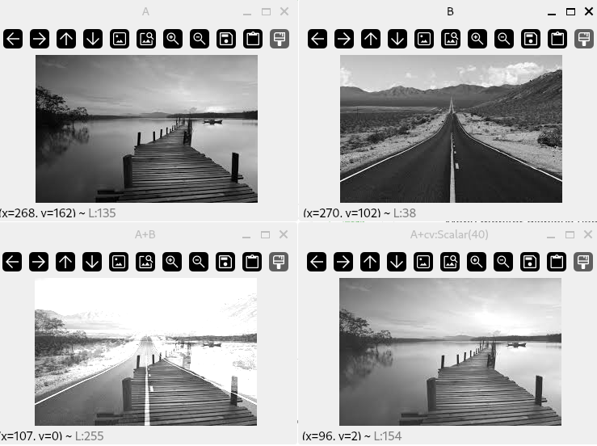
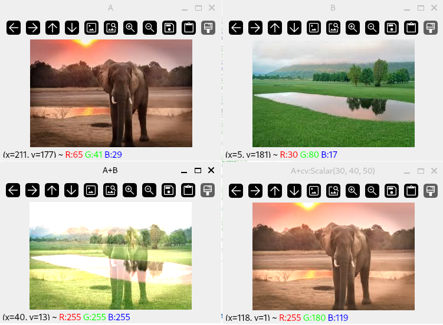

# Introduction

:notebook_with_decorative_cover: Basic arithmetic operations include addition, subtraction, multiplication and division. When working with images, the outputs of these operations are impacted by the limits imposed on the data type of the pixel values. This means the output value cannot be outside the range set aside for that particular data type.

:notebook_with_decorative_cover: For example, an image with the data type  `CV_8UC1` is expected to have pixel values within the range `[0, 255]`. What happens when we try to add the value `10` to a pixel value of `250`. Normally, we would end up with a pixel value of `260` - but since we are dealing with 8-bit unsigned integers, `260` is outside their range and is thus considered an invalid value.

:notebook_with_decorative_cover: OpenCV solves this by applying the concept of **saturation casting** - which we have already dedicated chapter 3 of these tutorials to. Simply put, saturation casting clips any pixel value below `0` to the minimum range value of `0` and any value above `255` to the maximum range value of `255`. As a result, our output value of `260` will be clipped to `255`.

:notebook_with_decorative_cover: Clipping of values applies when the data type is `unsigned char` , `signed char` , `unsigned short` or `signed short`.

:notebook_with_decorative_cover: Sometimes, arithmetic operations such as multiplication and division can result in an answer that has decimal values (also known as a floating-point value). According to the OpenCV documentation: 

**When the input value is a floating-point value and the target type is an integer (8-, 16- or 32-bit), the floating-point value is first rounded to the nearest integer and then clipped if needed (when the target type is 8- or 16-bit)**.

:notebook_with_decorative_cover: In summary:

1. Clipping is done when the target type is `unsigned char` , `signed char` , `unsigned short` or `signed short`. 
2. When the output array is `CV_32S`, no clipping is done. This means **you may even get result of an incorrect sign in the case of overflow**. 
3. When the input value is a floating-point value and the target type is an integer (8-, 16- or 32-bit), the floating-point value is first rounded to the nearest integer and then clipped if needed (when the target type is 8- or 16-bit).

## How OpenCV handles arithmetic operators

:notebook_with_decorative_cover: OpenCV handles arithmetic operators in two main ways:

1. Using <a href = "https://docs.opencv.org/4.8.0/d1/d10/classcv_1_1MatExpr.html#MatrixExpressions">matrix expressions</a>. These resemble mathematical statements e.g. $A + B$, $A - B$, $A * B$ or $A / B$.
2. Using functions. These functions often offer more options than matrix expressions, for example, some functions make use of a **mask** - which allows you to constrain your computations to a smaller area of an image.

:notebook_with_decorative_cover: In this topic, when it comes to matrix expressions, we will use the following notation:

* $A$ and $B$ are image arrays of type `cv::Mat` since most images are dense arrays.
* $s$ is a constant value of type `cv::Scalar` - remember a `cv::Scalar` object can hold up to 4 values.
* $alpha$ is a single real-valued constant of type `double` e.g. 3.14

## Addition operator

:notebook_with_decorative_cover: The addition operator can be applied to images in two situations: 

* Add two images  - This results in a third image, in which each pixel value is the sum of the values of the corresponding pixel from each of the two input images. If $P_1(row, column)$ and $P_2(row, column)$ are pixel values at location $(row, column)$ in two images to be added, then the sum of the pixel values at the same location in the output image is given by $Q(row, column) = P_1(row, column) + P_2(row, column)$. The input images should have the same **size** and **number of channels**. This will result in an image of the same size and number of channels as the input images. However, the input images and the output image can all have the same or different depths/data type. For example, you can add a 16-bit unsigned image array to a 8-bit signed image array and store the sum as a 32-bit floating-point image array. 
* Add a constant value $C$ to a single image - The resulting image will have each pixel value as the sum of the input image pixel value and the constant value at each location, i.e., $Q(row, column) = P_1(row, column) + C$.

:notebook_with_decorative_cover: For images with more than one channel (e.g. color images), the individual values from each channel (e.g. red, green, blue) are simply added seperately to produce the output value.

:notebook_with_decorative_cover: As mentioned previously, we can use the addition operator either in matrix expressions or through functions. 

### Addition through matrix expressions

:notebook_with_decorative_cover: Using matrix expressions we can perform simple image addition as follows:

* Add two image arrays e.g., $A + B$, $B + A$
* Add a constant to an image array e.g., $A + s$, $s + A$

**Example 1:** Use matrix expressions to add grayscale images

```c++
#include "opencv2/core.hpp"        // for OpenCV core types e.g. cv::Mat
#include "opencv2/imgcodecs.hpp"   // for cv::imread
#include "opencv2/highgui.hpp"     // for displaying images in windows

#include "UtilityFunctions/utility_functions.h" // functions from our own library

#include <iostream>

int main()
{
    //------------------ Grayscale or 1-Channel Images --------------//

    // Read two 1 channel images (or Grayscale images)
    // Images should have same size and number of channels
    cv::Mat A { cv::imread("Example-Code/images/grayscale_image_1.jpeg", 
                cv::IMREAD_ANYCOLOR) };
    if (A.empty())
    {
        std::cout << "\nCould not open image A data\n";
        return -1;  
    }
    else
    {
        // Check sizes, no. of channels and data types of image
        std::cout << "\nSize of image A = " << A.size()
                  << "\nData type of image A = " << CPP_CV::General::openCVDescriptiveDataType(A.type()) 
                  << '\n';

    }

    cv::Mat B { cv::imread("Example-Code/images/grayscale_image_2.jpeg",
                cv::IMREAD_ANYCOLOR) };
    if (B.empty())
    {
        std::cout << "\nCould not open image B data\n";
        return -1;  
    }
    else
    {
        std::cout << "\nSize of image B = " << B.size() 
                  << "\nData type of image B = " << CPP_CV::General::openCVDescriptiveDataType(B.type()) 
                  << '\n';
    }

     // 1. Add two images
    cv::Mat C { A + B }; // OR cv::Mat C { B + A };
    std::cout << "\nSize of image C (A+B) = " << C.size() 
              << "\nData type of image C (A+B) = " << CPP_CV::General::openCVDescriptiveDataType(C.type()) 
              << '\n';

    // 2. Add a scalar value to an image
    
    // i.)  We want to increase our intensity values by 40, 
    //      so we define a scalar value to hold this value
    // ii.) Because we are dealing with grayscale images, which have 1 channel, 
    //      we create a cv::Scalar with 1 value
    const cv::Scalar s1 {40};

    cv::Mat D { A + s1 }; // OR cv::Mat E { s1 + A };
    std::cout << "\nSize of image D (A+cv:Scalar(40)) = " << D.size() 
              << "\nData type of image D (A+cv:Scalar(40)) = " << CPP_CV::General::openCVDescriptiveDataType(D.type()) 
              << '\n';

    // Display images in windows
    cv::imshow("A", A);
    cv::imshow("B", B);
    cv::imshow("A+B", C);
    cv::imshow("A+cv:Scalar(40)", D);

    cv::waitKey(0);

    cv::destroyAllWindows();

    std::cout << '\n';

    return 0;
}
```

**Output**

**Figure 1:** Grayscale image addition


:notebook_with_decorative_cover: Image addition `A+B` combined data pixels in such a way that parts of each input image are present in the output image. The addition of a constant value `A + cv::Scalar(40)` resulted in a more brighter output image as the pixel values moved towards the maximum value of `255`.

**Example 2:** Use matrix expressions to add color images

```c++
#include "opencv2/core.hpp"        // for OpenCV core types e.g. cv::Mat
#include "opencv2/imgcodecs.hpp"   // for cv::imread
#include "opencv2/highgui.hpp"     // for displaying images in windows

#include "UtilityFunctions/utility_functions.h" // functions from our own library

#include <iostream>

int main()
{
    //------------------ Color Images --------------//

    // Read two 3 channel color images 
    // Images should have same size and number of channels
    cv::Mat A { cv::imread("Example-Code/images/color_1.jpeg", 
                cv::IMREAD_ANYCOLOR) };
    if (A.empty())
    {
        std::cout << "\nCould not open image A data\n";
        return -1;  
    }
    else
    {
        // Check sizes, no. of channels and data types of image
        std::cout << "\nSize of image A = " << A.size()
                  << "\nData type of image A = " 
                  << CPP_CV::General::openCVDescriptiveDataType(A.type()) 
                  << '\n';

    }

    cv::Mat B { cv::imread("Example-Code/images/color_2.jpeg",
                cv::IMREAD_ANYCOLOR) };
    if (B.empty())
    {
        std::cout << "\nCould not open image B data\n";
        return -1;  
    }
    else
    {
        std::cout << "\nSize of image B = " << B.size() 
                  << "\nData type of image B = " 
                  << CPP_CV::General::openCVDescriptiveDataType(B.type()) 
                  << '\n';
    }


    // 1. Add two images
    cv::Mat C { A + B }; // OR cv::Mat C { B + A };
    std::cout << "\nSize of image C (A+B) = " << C.size() 
              << "\nData type of image C (A+B) = " << CPP_CV::General::openCVDescriptiveDataType(C.type()) 
              << '\n';

    // 2. Add a scalar value to an image
    
    // i.)  We want to increase the pixel values of each channel by 30, 40, 50
    //      respectively, so we define a scalar object to hold these values
    // ii.) Because we are dealing with color images, which have 3 channels, 
    //      we create a cv::Scalar with 3 values
    const cv::Scalar s1 {30, 40, 50};

    cv::Mat D { A + s1 }; // OR cv::Mat E { s1 + A };
    std::cout << "\nSize of image D (A+cv:Scalar(30, 40, 50)) = " << D.size() 
              << "\nData type of image D (A+cv:Scalar(30, 40, 50)) = " 
              << CPP_CV::General::openCVDescriptiveDataType(D.type()) 
              << '\n';

    // Display images in windows
    cv::imshow("A", A);
    cv::imshow("B", B);
    cv::imshow("A+B", C);
    cv::imshow("A+cv:Scalar(30, 40, 50)", D);

    cv::waitKey(0);

    cv::destroyAllWindows();

    std::cout << '\n';

    return 0;
}
```

**Output**

**Figure 2:** Color image addition


:notebook_with_decorative_cover: Figure 2 shows that the output of straight color image addition `A+B` is not that impressive - actually results in an image that is too bright and difficult for the human eye to differentiate its features. This is probably why other processes are needed to complement image addition.


### Addition through a function

:notebook_with_decorative_cover: OpenCV provides the alternative function `void cv::add(cv::InputArray src1, cv::InputArray src2, cv::OutputArray dst, cv::InputArray mask = cv::noArray(), int dtype = -1)` for adding images. This function is found in the header `<opencv2/core.hpp>`.

* `src1` - First input image or constant value. The constant value is constructed as a `cv::Scalar` object.
* `src2` - Second input image or constant value. The constant value is constructed as a `cv::Scalar` object.
* `dst` - Output image that has the same size and number of channels as the input image.
* `mask` - Optional operation mask defining region of interest. This must be an 8-bit single channel array. We have not dealt with masks yet, but will do so in one of the chapters in this tutorial - so be patient - as we need to learn about **bitwise operations** first.
* `dtype` - Optional depth of the output image. When both input images have the same data type, `dtype` can be set to `-1`, which will be equivalent to `src1.depth()`.

:notebook_with_decorative_cover: The above function calculates: 

1. The sum of two images ($src1$ and $src2$) when both input images have the same size and the same number of channels, i.e., $dst = src1 + src2$.
2. The sum of an image, $src1$, and a constant value, $C$. The constant value can be constructed from a `cv::Scalar` object and should have the same number of elements as `src1.channels()`, i.e., $dst = src1 + C$. 
3. The sum of a constant value, $C$, and an image, $src2$. The constant value can be constructed from a `cv::Scalar` object and should have the same number of elements as `src2.channels()`, i.e., $dst = C + src2$. 

**Example 3:** Use a function to add grayscale images

```c++
#include "opencv2/core.hpp"        // for OpenCV core types e.g. cv::Mat
#include "opencv2/imgcodecs.hpp"   // for cv::imread
#include "opencv2/highgui.hpp"     // for displaying images in windows

#include "UtilityFunctions/utility_functions.h" // functions from our own library

#include <iostream>

int main()
{
    //------------------ Grayscale or 1-Channel Images --------------//    

    // Read two 1 channel images (or Grayscale images)
    // Images should have same size and number of channels
    cv::Mat A { cv::imread("Example-Code/images/grayscale_image_1.jpeg", 
                cv::IMREAD_ANYCOLOR) };
    if (A.empty())
    {
        std::cout << "\nCould not open image A data\n";
        return -1;  
    }
    else
    {
        // Check sizes, no. of channels and data types of image
        std::cout << "\nSize of image A = " << A.size()
                  << "\nData type of image A = " 
                  << CPP_CV::General::openCVDescriptiveDataType(A.type()) 
                  << '\n';

    }

    cv::Mat B { cv::imread("Example-Code/images/grayscale_image_2.jpeg",
                cv::IMREAD_ANYCOLOR) };
    if (B.empty())
    {
        std::cout << "\nCould not open image B data\n";
        return -1;  
    }
    else
    {
        std::cout << "\nSize of image B = " << B.size() 
                  << "\nData type of image B = " 
                  << CPP_CV::General::openCVDescriptiveDataType(B.type()) 
                  << '\n';
    }

    // 1. Add two images

    // a.) A + B
    cv::Mat C1;
    cv::add(A,               // First input image array
            B,               // Second input image array
            C1,              // Output image array
            cv::noArray(),   // Mask - we are currently not using this value
            -1               // Output image data type. This will be the same A                             
           );
    std::cout << "\nSize of image C1 (A+B) = " << C1.size() 
              << "\nData type of image C1 (A+B) = " 
              << CPP_CV::General::openCVDescriptiveDataType(C1.type()) 
              << '\n';
    
    // b.) B + A
    cv::Mat C2;
    cv::add(B,               // First input image array
            A,               // Second input image array
            C2,              // Output image array
            cv::noArray(),   // Mask - we are currently not using this value
            CV_8U          // Specify your own output image data type
           );
    std::cout << "\nSize of image C2 (B+A) = " << C2.size() 
              << "\nData type of image C2 (B+A) = " 
              << CPP_CV::General::openCVDescriptiveDataType(C2.type()) 
              << '\n';
        
 
    // 2. Add a scalar value to an image
    
    // i.)  We want to increase our intensity values by 30, 
    //      so we define a scalar value to hold this value
    // ii.) Because we are dealing with grayscale images, which have 1 channel, 
    //      we create a cv::Scalar with 1 value
    const cv::Scalar s1 {30};
    
    // a.) A + s1
    cv::Mat D1;
    cv::add(A,               // Image array
            s1,              // Constant/Scalar value
            D1,              // Output image array
            cv::noArray(),   // Mask - we are currently not using this value
            -1               // Output image data type. This will be the same A                             
           );
    std::cout << "\nSize of image D1 (A+cv:Scalar(30)) = " << D1.size() 
              << "\nData type of image D1 (A+cv:Scalar(30)) = " 
              << CPP_CV::General::openCVDescriptiveDataType(D1.type()) 
              << '\n';
    
    // b.) s1 + A
    cv::Mat D2;
    cv::add(s1,              // Constant/Scalar value
            A,               // Image array
            D2,              // Output image array
            cv::noArray(),   // Mask - we are currently not using this value
            CV_8U            // Specify your own output image data type
           );
    std::cout << "\nSize of image D2 (cv:Scalar(30)+A) = " << D2.size() 
              << "\nData type of image D2 (cv:Scalar(30)+A) = " 
              << CPP_CV::General::openCVDescriptiveDataType(D2.type()) 
              << '\n';

    // Display images in windows
    cv::imshow("A", A);
    cv::imshow("B", B);
    cv::imshow("A+B", C1);
    cv::imshow("B+A", C2);
    cv::imshow("A+cv:Scalar(30)", D1);
    cv::imshow("cv::Scalar(30)+A", D2);

    cv::waitKey(0);

    cv::destroyAllWindows();

    std::cout << '\n';

    return 0;
}
```

### Guidelines for using image addition

:notebook_with_decorative_cover: One direct use of addition includes adding a constant value to all pixels in an image so as to brighten that image.

:notebook_with_decorative_cover: Before applying the addition operator to any image, you should be aware what will be the impact of such an operation. Lets say we have two images of data type `CV_8UC1`. This is a gray scale image with intensity values in the range `[0, 255]`, with `0` being the darkest shade and `255` being the lightest shade. As such, any addition will ultimately increase the intensity values of each pixel thereby making the image brighter in appearance. This can have the positive effect of highlighting previously hidden features, but can also have the opposite effect of losing some features or different features may end up looking the same as the higher intensity values are all clipped to the same maximum value of `255`. 

:notebook_with_decorative_cover: Image addition is a common sub-step in more complicated image algorithms rather than as a useful operator on its own. Such an example is the concept of **image blending** - which uses image addition as one of its operations. We will look at image blending later on in this tutorial.

#### <a href = "https://homepages.inf.ed.ac.uk/rbf/HIPR2/8bitcol.htm">Impact of adding color images</a>

:notebook_with_decorative_cover: Full BGR or RGB color requires that the intensities of three color components be specified for each and every pixel. It is common for each component intensity to be stored as an 8-bit integer, and so each pixel requires 24 bits to completely and accurately specify its color. If this is done, then the image is known as a 24-bit color image. However there are two problems with this approach:

* Storing 24 bits for every pixel leads to very large image files that with current technology are cumbersome to store and manipulate. For instance a 24-bit 512×512 image takes up 750KB in uncompressed form.
* Many monitor displays use <a href = "https://homepages.inf.ed.ac.uk/rbf/HIPR2/colmap.htm">colormaps</a> with 8-bit index numbers, meaning that they can only display 256 different colors at any one time. Thus it is often wasteful to store more than 256 different colors in an image anyway, since it will not be possible to display them all on screen. 

:notebook_with_decorative_cover: Because of this, many image formats (e.g. 8-bit GIF and TIFF) use 8-bit colormaps to restrict the maximum number of different colors to 256. Using this method, it is only necessary to store an 8-bit index into the colormap for each pixel, rather than the full 24-bit color value. Thus 8-bit image formats consist of two parts: a colormap describing what colors are present in the image, and the array of index values for each pixel in the image.

:notebook_with_decorative_cover: When a 24-bit full color image is turned into an 8-bit image, it is usually necessary to throw away some of the colors, a process known as <a href = "https://homepages.inf.ed.ac.uk/rbf/HIPR2/quantize.htm">color quantization</a>. This leads to some degradation in image quality, but in practice the observable effect can be quite small, and in any case, such degradation is inevitable if the image output device (e.g. screen or printer) is only capable of displaying 256 colors or less.

:notebook_with_decorative_cover: The use of 8-bit images with colormaps does lead to some problems in image processing. 

1. First of all, each image has to have its own colormap, and there is usually no guarantee that each image will have exactly the same colormap. Thus on 8-bit displays it is frequently impossible to correctly display two different color images that have different colormaps at the same time. Note that in practice 8-bit images often use reduced size colormaps with less than 256 colors in order to avoid this problem.

2. Another problem occurs when the output image from an image processing operation contains different colors to the input image or images. This can occur very easily, as for instance when two color images are **added together** pixel-by-pixel. Since the output image contains different colors from the input images, it ideally needs a new colormap, different from those of the input images, and this involves further color quantization which will degrade the image quality. Hence the resulting output is usually only an approximation of the desired output. Repeated image processing operations will continually degrade the image colors. And of course we still have the problem that it is not possible to display the images simultaneously with each other on the same 8-bit display.

:notebook_with_decorative_cover: Because of these problems it is to be expected that as computer storage and processing power become cheaper, there will be a shift away from 8-bit images and towards full 24-bit image processing. 