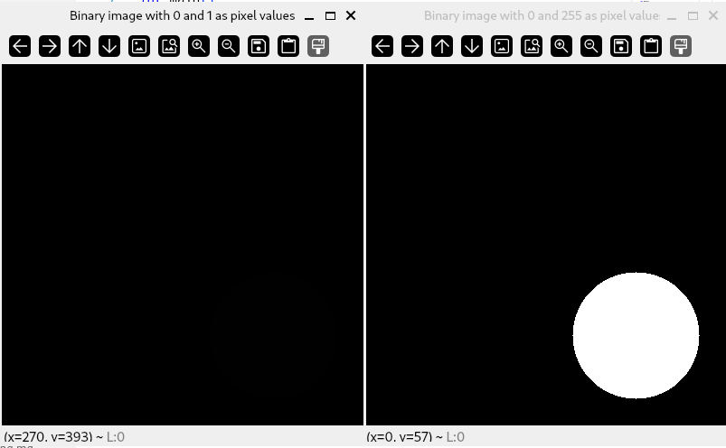
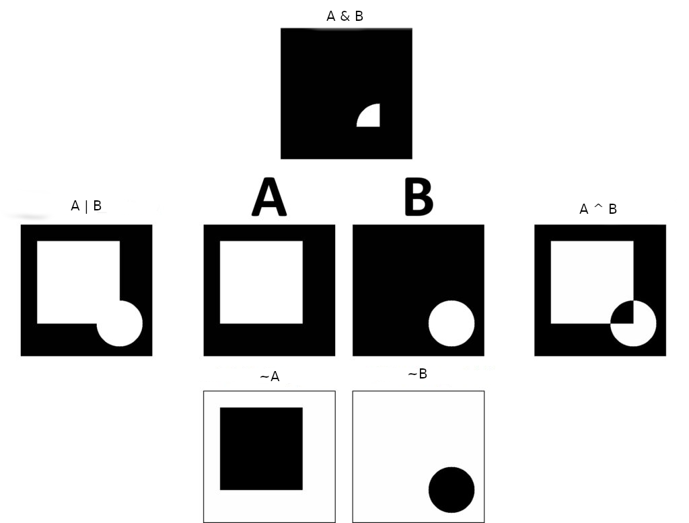

# Introduction

:notebook_with_decorative_cover: **Bitwise operators** work on **binary images**, which are images with pixels that have only two possible intensity values. These two values are often `0` and `1`. A pixel with the value `0` is said to be turned **off**, and it is turned **on** if it has a value of `1`. Binary images are best represented as grayscale images.

:notebook_with_decorative_cover: The output of bitwise operators is another binary image. These images are also represented as grayscale images. Pixels with the intensity value `0` will be *black* and pixels with the intensity value `1` will be white. As such, you will notice that the binary images will be basically black and white images.

## Bitwise operators

:notebook_with_decorative_cover: For image processing, you will most likely need 4 bitwise operators - `AND`, `OR`, `XOR`, and `NOT`. 

:notebook_with_decorative_cover: When using the bitwise operators, `AND`, `OR`, and `XOR`, you work with two input images. You will be comparing two pixels (one from each input image) at the same location.  

:notebook_with_decorative_cover: The `NOT` operator is a unary operator, hence requires one input image. This operator simply inverts the "on" and "off" pixels in an image.

:notebook_with_decorative_cover: To get the output image, the bitwise operators work as follows:

1. **AND** - A bitwise `AND` is said to be `true` if and only if **both** input image pixels have intensity values greater than zero, otherwise it is `false`. `true` is then assigned the value `1`, and `false` is assigned the value `0` in the output image.
2. **OR** - A bitwise `OR` is said to be `true` if **either** of the two input image pixels have intensity values greater than zero, otherwise it is `false`. `true` is then assigned the value `1`, and `false` is assigned the value `0` in the output image.
3. **XOR** - A bitwise `XOR` is said to be `true` if and only if **either** of the two input image pixels are greater than zero, **but not both**. `true` is then assigned the value `1`, and `false` is assigned the value `0` in the output image.
4. **NOT** - A bitwise `NOT` inverts pixels with intensity values of `0` to "on", and those with intensity values greater than `0` to "off". "on" will be assigned the pixel value `1` and "off" the pixel value `0` in the output image.

**Figure 1** Bitwise operators. In the following image, `A` and `B` (in the middle of the image) are binary image arrays. 


**Figure source**: https://datahacker.rs/005-image-arithmetic-and-logical-operations-in-opencv-with-python/


## How OpenCV handles Bitwise operations

:notebook_with_decorative_cover: OpenCV handles the use of bitwise operations through both arithmetic expressions and functions. We will look at arithmetic expressions first.

### Handling bitwise operations through arithmetic expressions

:notebook_with_decorative_cover: In the following expressions, `A` and `B` are `cv::Mat` image arrays, `s` is a scalar/constant value, which in most cases is defined as a `cv::Scalar` object whose number of elements is equal to number of channels in either `A` or `B`. In addition, image arrays `A` and `B` when used as input images together should have the same size and number of channels.

:notebook_with_decorative_cover: The mathematical/logical operators used for bitwise operations are defined as follows:

* Bitwise **AND** uses the character `&` as in the following expressions `A & B`, `B & A`, `A & s` or `s & A`.
* Bitwise **OR** uses the character `|` as in the following expressions `A | B`, `B | A`, `A | s` or `s | A`.
* Bitwise **XOR** uses the character `^` as in the following expressions `A ^ B`, `B ^ A`, `A ^ s` or `s ^ A`.
* Bitwise **NOT** uses the character `~` as in the following expressions `~A` or `~B`.

:notebook_with_decorative_cover: Before we show example code on using arithmetic expressions, we need to briefly discuss visualization issues with binary grayscale images and the possible solution.

:notebook_with_decorative_cover: So far, we have mentioned binary images as grayscale images with intensity values `0` and `1`. The only issue with a grayscale image whose pixel values are either `0` or `1` is that of visualization. Remember that most grayscale images are 8-bit unsigned and have the data range `[0, 255]`. This range defines various shades of gray from darkest to lightest. Because the values `0` and `1` are too close to each other within the data range, it is visually impossible for the naked eye to differentiate pixels with these two values. Both pixels will appear black to the naked eye. As such, you will find in some example code, some people use the values `0` and `255` to create a binary grayscale image. Pixels with intensity value `0` are very dark (black) and those with intensity value `255` are very light (white) - making it easier for the human eye to differentiate between the two pixels - leading to better image visualization. We will demonstrate this in the following example:

**Example 1** Create binary images using either the pixel values `0` and `1` OR the pixel values `0` and `255`. Both images are supposed to show a circle close to the bottom right hand corner of an image.

```c++
#include <opencv2/core.hpp>     // for OpenCV core types
#include <opencv2/imgproc.hpp>  // for drawing functions
#include <opencv2/highgui.hpp>  // for functions that display images in a window

#include <iostream>

int main()
{   

    // 1. Create a binary grayscale image with a circle
    //    We will use the pixel value '0' for the image background.
    //    We will use the pixel value '1' for the circle 
    cv::Mat A {cv::Mat::zeros(cv::Size(400, 400), CV_8UC1)}; // Image array   
    cv::circle(A,                    // Image to draw on
               cv::Point(300, 300),  // Center coordinates of circle
               70,                   // Radius of circle
               cv::Scalar(1),        // Pixel values of circle will be '1'
               -1                    // We want a filled circle
              );

    // 2. Create a binary grayscale image with a circle
    //    We will use the pixel value '0' for the image background.
    //    We will use the pixel value '255' for the circle 
    cv::Mat B {cv::Mat::zeros(cv::Size(400, 400), CV_8UC1)}; // Image array
    cv::circle(B,                    // Image to draw on
               cv::Point(300, 300),  // Center coordinates of circle
               70,                   // Radius of circle
               cv::Scalar(255),      // Pixel values of circle will be '255'
               -1                    // We want a filled circle
              );

    cv::imshow("Binary image with 0 and 1 as pixel values", A);
    cv::imshow("Binary image with 0 and 255 as pixel values", B);

    cv::waitKey();
    cv::destroyAllWindows();

    std::cout << '\n';

    return 0;
}
```

**Output**

**Figure 2** Binary images using different pixel values.



:notebook_with_decorative_cover: As you can see from **Figure 2**, you cannot even see the circle in the image on the left. In terms of visualization, using the pixel values `0` and `255` is much better (image on the right).

:notebook_with_decorative_cover: Now we know how to create much better binary images for practical purposes, we can now write example code on using arithmetic expressions with bitwise operators.

**Example 2** Using bitwise operators in arithmetic expressions

```c++
#include <opencv2/core.hpp>     // for OpenCV core types
#include <opencv2/imgproc.hpp>  // for drawing functions
#include <opencv2/highgui.hpp>  // for functions that display images in a window

#include <iostream>

int main()
{   

    // 1. Create a binary grayscale image with a rectangle in the middle
    //    We will use the pixel value '0' for the image background.
    //    We will use the pixel value '255' for the rectangle 
    cv::Mat A {cv::Mat::zeros(cv::Size(400, 400), CV_8UC1)}; // Image array   
    cv::rectangle(A,                      // Image array
                  cv::Point2i(50, 50),    // Top-left corner coordinates
                  cv::Point2i(300, 300),  // Bottom-right corner coordinates
                  cv::Scalar(255),        // Pixel values of rectangle will be '255'
                  -1                      // We want a filled rectangle
                 );
    

    // 2. Create a binary grayscale image with a circle 
    //    We will use the pixel value '0' for the image background.
    //    We will use the pixel value '255' for the circle 
    cv::Mat B {cv::Mat::zeros(cv::Size(400, 400), CV_8UC1)}; // Image array
    cv::circle(B,                    // Image to draw on
               cv::Point(300, 300),  // Center coordinates of circle
               70,                   // Radius of circle
               cv::Scalar(255),      // Pixel values of circle will be '255'
               -1                    // We want a filled circle
              );


    // Bitwise AND
    cv::Mat m1 {A & B};

    // Bitwise OR
    cv::Mat m2 {A | B};

    // Bitwise XOR
    cv::Mat m3 {A ^ B};
    
    // Bitwise NOT
    cv::Mat m4 {~A};
    cv::Mat m5 {~B};

    cv::imshow("A", A);
    cv::imshow("B", B);
    cv::imshow("Bitwise AND", m1);
    cv::imshow("Bitwise OR", m2);
    cv::imshow("Bitwise XOR", m3);
    cv::imshow("Bitwise NOT A", m4);
    cv::imshow("Bitwise NOT B", m5);

    cv::waitKey();
    cv::destroyAllWindows();    

    std::cout << '\n';

    return 0;
}
```

**Output** The above code will produce a number of images - which have been combined to form Figure 3.

**Figure 3** Output of bitwise operators




### Handling bitwise operations through functions

:notebook_with_decorative_cover: OpenCV provides appropriately named functions that execute bitwise operations. You will find these functions in the `<opencv2/core.hpp>` header file.

1. `void cv::bitwise_and(cv::InputArray src1, cv::InputArray src2, cv::OutputArray dst, cv::InputArray mask = cv::noArray())`
2. `void cv::bitwise_or(cv::InputArray src1, cv::InputArray src2, cv::OutputArray dst, cv::InputArray mask = cv::noArray())`
3. `void cv::bitwise_xor(cv::InputArray src1, cv::InputArray src2, cv::OutputArray dst, cv::InputArray mask = cv::noArray())`
4. `void cv::bitwise_not(cv::InputArray src1, cv::OutputArray dst, cv::InputArray mask = cv::noArray())`

:notebook_with_decorative_cover: The parameters from the above functions can be defined as follows:

* `src1` - First input array or a scalar (which should be a cv::Scalar object)
* `src2` - Second input array or a scalar (which should be a cv::Scalar object)
* `dst` - Output array that has the same size and type as the input arrays
* `mask` - Optional operational mask, 8-bit single channel array, that specifies region of interest.

**Example 3** Using OpenCV functions to work with bitwise operators

```c++
#include <opencv2/core.hpp>     // for OpenCV core types
#include <opencv2/imgproc.hpp>  // for drawing functions
#include <opencv2/highgui.hpp>  // for functions that display images in a window

#include <iostream>

int main()
{   

    // 1. Create a binary grayscale image with a rectangle in the middle
    //    We will use the pixel value '0' for the image background.
    //    We will use the pixel value '255' for the rectangle 
    cv::Mat A {cv::Mat::zeros(cv::Size(400, 400), CV_8UC1)}; // Image array   
    cv::rectangle(A,                      // Image array
                  cv::Point2i(50, 50),    // Top-left corner coordinates
                  cv::Point2i(300, 300),  // Bottom-right corner coordinates
                  cv::Scalar(255),        // Pixel values of rectangle will be '255'
                  -1                      // We want a filled rectangle
                 );
    

    // 2. Create a binary grayscale image with a circle 
    //    We will use the pixel value '0' for the image background.
    //    We will use the pixel value '255' for the circle 
    cv::Mat B {cv::Mat::zeros(cv::Size(400, 400), CV_8UC1)}; // Image array
    cv::circle(B,                    // Image to draw on
               cv::Point(300, 300),  // Center coordinates of circle
               70,                   // Radius of circle
               cv::Scalar(255),      // Pixel values of circle will be '255'
               -1                    // We want a filled circle
              );


    // Bitwise AND
    cv::Mat m1;
    cv::bitwise_and(A,  // First input image
                    B,  // Second input image
                    m1  // Output image
                   );    

    // Bitwise OR
    cv::Mat m2;
    cv::bitwise_or(A,   // First input image
                   B,   // Second input image 
                   m2   // Output image
                  ); 

    // Bitwise XOR
    cv::Mat m3;
    cv::bitwise_xor(A,  // First input image 
                    B,  // Second input image 
                    m3  // Output image
                   ); 

    // Bitwise NOT
    cv::Mat m4;
    cv::bitwise_not(A,  // First input image
                    m4  // Output image
                   ); 
    cv::Mat m5;
    cv::bitwise_not(B,  // First input image
                    m5  // Output image
                   ); 

    // Bitwise AND with a scalar value
    cv::Scalar s1 {255};
    cv::Mat m6;
    cv::bitwise_and(A,   // First input image
                    s1,  // Scalar
                    m6   // Output image
                   );    

    cv::imshow("A", A);
    cv::imshow("B", B);
    cv::imshow("Bitwise AND", m1);
    cv::imshow("Bitwise OR", m2);
    cv::imshow("Bitwise XOR", m3);
    cv::imshow("Bitwise NOT A", m4);
    cv::imshow("Bitwise NOT B", m5);
    cv::imshow("Bitwise AND between image A and a scalar value of 255", m6);

    cv::waitKey();
    cv::destroyAllWindows();    

    std::cout << '\n';

    return 0;
}
```
