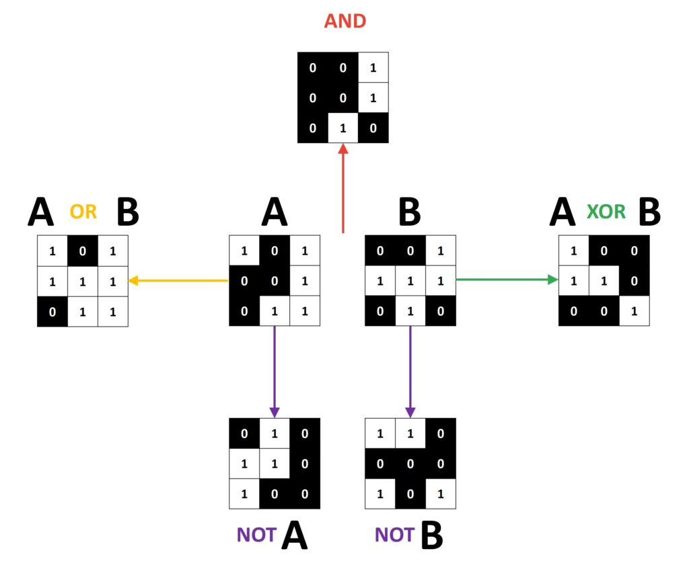

# Introduction

:notebook_with_decorative_cover: **Bitwise operators** work on **binary images**, which are images with pixels that have only two possible intensity values. These two values are often `0` and `1`. A pixel with the value `0` is said to be turned **off**, and it is turned **on** if it has a value of `1`. Binary images are best represented as grayscale images.

:notebook_with_decorative_cover: The output of bitwise operators is another binary image. These images are also represented as grayscale images. Pixels with the intensity value `0` will be *black* and pixels with the intensity value `1` will be white. As such, you will notice that the binary images will be basically black and white images.

## Bitwise operators

:notebook_with_decorative_cover: For image processing, you will most likely need 4 bitwise operators - `AND`, `OR`, `XOR`, and `NOT`. 

:notebook_with_decorative_cover: When using the bitwise operators, `AND`, `OR`, and `XOR`, you work with two input images. You will be comparing two pixels (one from each input image) at the same location.  

:notebook_with_decorative_cover: The `NOT` operator is a unary operator, hence requires one input image. This operator simply inverts the "on" and "off" pixels in an image.

:notebook_with_decorative_cover: To get the output image, the bitwise operators work as follows:

1. **AND** - A bitwise `AND` is said to be `true` if and only if **both** input image pixels have intensity values greater than zero, otherwise it is `false`. `true` is then assigned the value `1`, and `false` is assigned the value `0` in the output image.
2. **OR** - A bitwise `OR` is said to be `true` if **either** of the two input image pixels have intensity values greater than zero, otherwise it is `false`. `true` is then assigned the value `1`, and `false` is assigned the value `0` in the output image.
3. **XOR** - A bitwise `XOR` is said to be `true` if and only if **either** of the two input image pixels are greater than zero, **but not both**. `true` is then assigned the value `1`, and `false` is assigned the value `0` in the output image.
4. **NOT** - A bitwise `NOT` inverts pixels with intensity values of `0` to "on", and those with intensity values greater than `0` to "off". "on" will be assigned the pixel value `1` and "off" the pixel value `0` in the output image.

**Figure 1** Bitwise operators. In the following image, `A` and `B` (in the middle of the image) are binary image arrays. 

**Figure source**: https://datahacker.rs/005-image-arithmetic-and-logical-operations-in-opencv-with-python/
