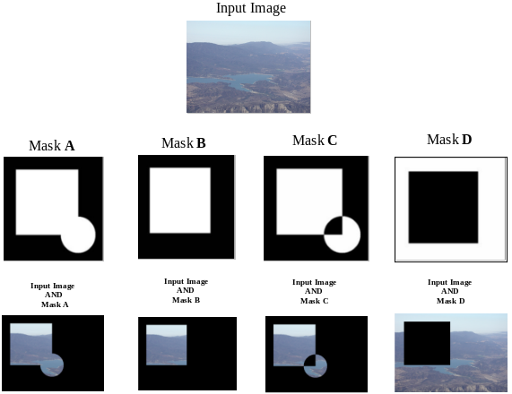

# Introduction

:notebook_with_decorative_cover: In this tutorial, we continue to build on the material on bitwise operators from the previous tutorial, by looking at how to create **masks** for image processing.

:notebook_with_decorative_cover: **Masks** allow us to define a region of interest within an image. This allows us to restrict image operators, functions or algorithms to the area defined by the mask.

:notebook_with_decorative_cover: If you want a mask, you have to create a binary grayscale image whose pixel values consist of zero- and non-zero values.

## Creating masks in OpenCV

:notebook_with_decorative_cover: One thing you will notice with a lot of OpenCV functions that require a mask, is that, it should be an **8-bit single channel array** of the same size as the input image. Which means your mask should have the data type `CV_8UC1` or `CV_8SC1`. `CV_8UC1` is the more preferred option.

:notebook_with_decorative_cover: Once we have our mask, we can apply it on an image either using **pixel multiplication** or **bitwise operator AND**, the latter in general being faster. In the output image, all pixels which are zero in the mask are set to zero in the output image. All others remain unchanged.

:notebook_with_decorative_cover: When applying masks in OpenCV it is best to use the bitwise `AND` function `void cv::bitwise_and(cv::InputArray src1, cv::InputArray src2, cv::OutputArray dst, cv::InputArray mask = cv::noArray())`. When applying mask to one image, which is what you will do most of the time, you will use the parameters as follows:

* `src1` - Input array image
* `src2` - Same input array image as above. Use the same array as for `src1`.
* `dst` - Output array that has the same size and type as the input arrays
* `mask` - Your 8-bit single channel array mask, that specifies region of interest.

:notebook_with_decorative_cover: Just to recap - when applying masks to a single input image, provide the same array input to the parameters `src1` and `src2`. This is because combining the same two images using the `AND` bitwise operator results in an output image the same as the input images. Basicaly, we are applying our mask to the original input image. We only provide two similar images to meet the parameter requirements of the `cv::bitwise_and()` function. 

**Example 1** In the following example we apply various masks to a single input image

```c++
// Program that applies various masks to an image

#include <opencv2/core.hpp>     // for OpenCV core types and bitwise operators
#include <opencv2/imgproc.hpp>  // for drawing functions
#include <opencv2/highgui.hpp>  // for displaying images in a window
#include <opencv2/core/utility.hpp> // for command line or terminal inputs

#include "UtilityFunctions/utility_functions.h" // functions from our own library

#include <iostream>

int main(int argc, char* argv[])
{
    //------------------ 1. Extract Command Line Arguments --------------//

    const cv::String keys = 
    "{help h usage ? | | Apply various masks to input image }"
    "{image | <none> | Full image path }";  

    // Define a cv::CommandLineParser object
    cv::CommandLineParser parser(argc, argv, keys);

    // Display message about application
    parser.about("\nApplication to apply various masks to input image\n");
    parser.printMessage();

    // Extract the command line arguments
    cv::String inputImagePath = parser.get<cv::String>("image");

    // Check for any errors during command line arguments extraction
    if (!parser.check())
    {
        parser.printErrors(); // Print a list of any errors encountered

        return -1; // Early program exit
    }

    //----------------- 2. Read image data ----------------//

    // Read input image from file into an array
    cv::Mat inputImage {cv::imread(inputImagePath, cv::IMREAD_ANYCOLOR)};

    if (inputImage.empty())
    {
        std::cout << "\nERROR! Could not read image data from file: " 
                  << inputImage << '\n';
    }

    // Provide image sizes, no. of channels and data types of input image
    std::cout << "\nSize of input image = " << inputImage.size()
              << "\nData type of input image = " 
              << CPP_CV::General::openCVDescriptiveDataType(inputImage.type())
              << '\n';

    cv::imshow("Input image", inputImage);

    //------------------------ 3. Create masks -----------------------//

    //------------------- 3a. Create Mask A

    // Create a binary grayscale image with a rectangle in the middle
    // We will use the pixel value '0' for the image background.
    // We will use the pixel value '255' for the rectangle 
    cv::Mat tempImage1 {cv::Mat::zeros(cv::Size(inputImage.cols, inputImage.rows), CV_8UC1)}; // Image array   
    cv::rectangle(tempImage1,             // Image array
                  cv::Point2i(50, 50),    // Top-left corner coordinates
                  cv::Point2i(300, 300),  // Bottom-right corner coordinates
                  cv::Scalar(255),        // Pixel values of rectangle will be '255'
                  -1                      // We want a filled rectangle
                 );
    

    // Create a binary grayscale image with a circle 
    // We will use the pixel value '0' for the image background.
    // We will use the pixel value '255' for the circle 
    cv::Mat tempImage2 {cv::Mat::zeros(cv::Size(inputImage.cols, inputImage.rows), CV_8UC1)}; // Image array   
    cv::circle(tempImage2,           // Image to draw on
               cv::Point(300, 300),  // Center coordinates of circle
               70,                   // Radius of circle
               cv::Scalar(255),      // Pixel values of circle will be '255'
               -1                    // We want a filled circle
              );

    // Create mask A using Bitwise OR
    cv::Mat mask_A; // mask
    cv::bitwise_or(tempImage1,   // First input image
                   tempImage2,   // Second input image 
                   mask_A        // Output image
                  );
    cv::imshow("Mask A", mask_A);

    //------------------- 3b. Create Mask B

    cv::Mat mask_B { tempImage1 }; // Mask B same as image array 'tempImage1'
    
    cv::imshow("Mask B", mask_B);

    //------------------- 3c. Create Mask C

    // Create mask C using Bitwise XOR
    cv::Mat mask_C;
    cv::bitwise_xor(tempImage1,  // First input image 
                    tempImage2,  // Second input image 
                    mask_C       // Output image
                   );
    
    cv::imshow("Mask C", mask_C);

    //------------------- 3d. Create Mask D

    // Create mask D using Bitwise NOT
    cv::Mat mask_D;
    cv::bitwise_not(tempImage1,  // First input image
                    mask_D       // Output image
                   ); 
    cv::imshow("Mask D", mask_D);

    
    //----------------------- 4. Apply masks to input image ----------------//

    // 1. Apply Mask A to input image
    cv::Mat inputImage_AND_mask_A;
    cv::bitwise_and(inputImage, 
                    inputImage, 
                    inputImage_AND_mask_A, 
                    mask_A
                   );
                  
    cv::imshow("Input image AND Mask A", inputImage_AND_mask_A);

    // 2. Apply Mask B to input image
    cv::Mat inputImage_AND_mask_B;
    cv::bitwise_and(inputImage, 
                    inputImage, 
                    inputImage_AND_mask_B, 
                    mask_B
                   );
                  
    cv::imshow("Input image AND Mask B", inputImage_AND_mask_B);

    // 3. Apply Mask C to input image
    cv::Mat inputImage_AND_mask_C;
    cv::bitwise_and(inputImage, 
                    inputImage, 
                    inputImage_AND_mask_C, 
                    mask_C
                   );
                  
    cv::imshow("Input image AND Mask C", inputImage_AND_mask_C);

    // 4. Apply Mask D to input image
    cv::Mat inputImage_AND_mask_D;
    cv::bitwise_and(inputImage, 
                    inputImage, 
                    inputImage_AND_mask_D, 
                    mask_D
                   );
                  
    cv::imshow("Input image AND Mask D", inputImage_AND_mask_D);

    
    cv::waitKey(0);
    cv::destroyAllWindows();

    std::cout << '\n';
    
    return 0;
}
```

**Output**

**Figure 1** Expected output images from applying various masks




