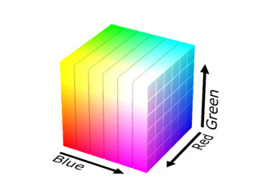
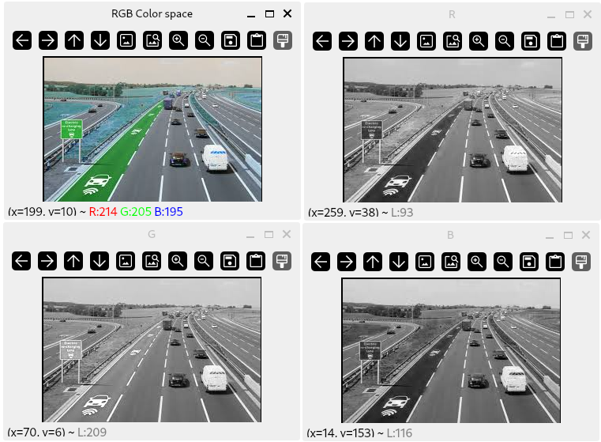
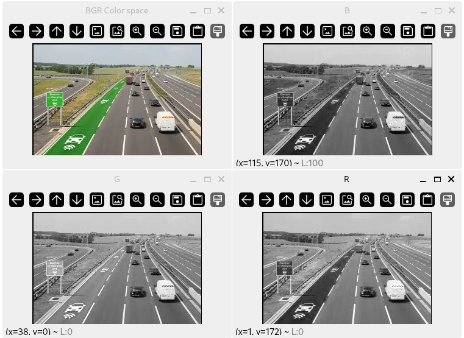
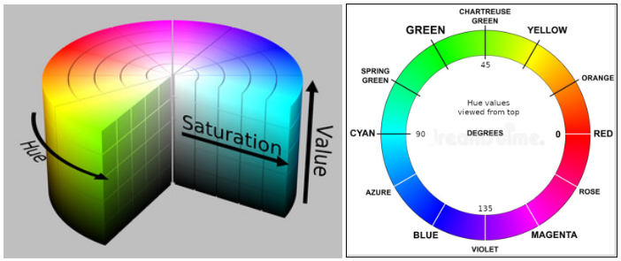
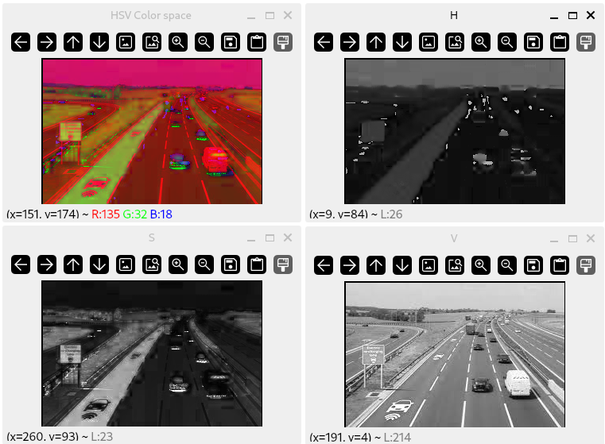
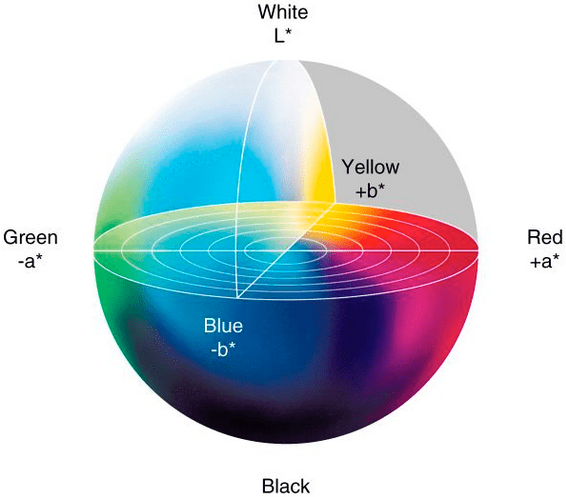
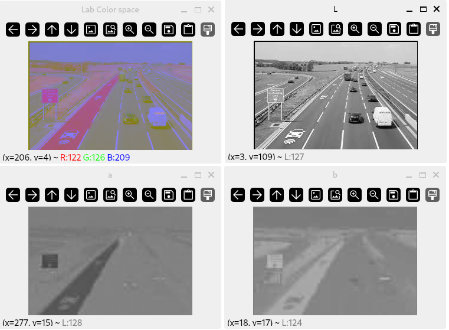
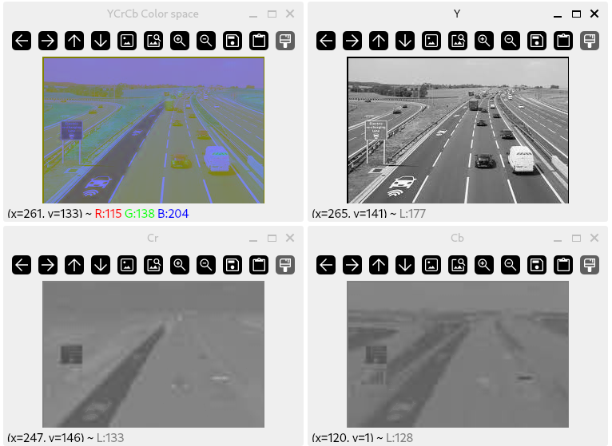
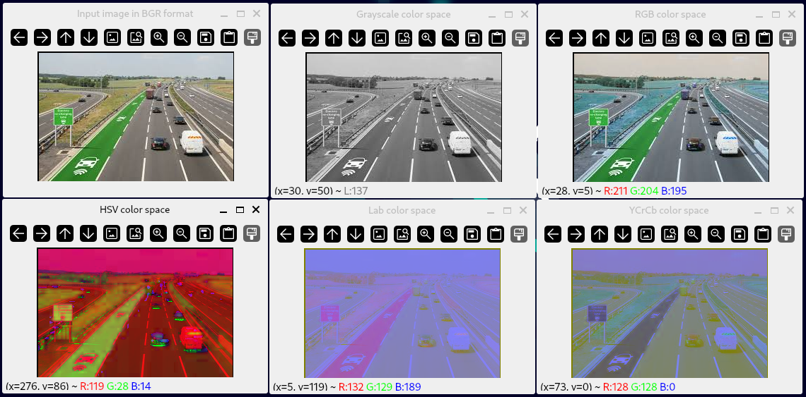
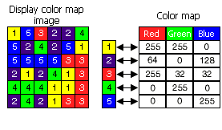

# Introduction

:notebook_with_decorative_cover: A **color space** defines a specific, measurable, reproducable and fixed range of possible colors and luminance/brightness values.

:notebook_with_decorative_cover: Color spaces are fundamental to how digital images are represented and processed in computer vision. 

:notebook_with_decorative_cover: Color spaces are essential for applications such as object detection, segmentation, color correction, and compression.

:notebook_with_decorative_cover: The most commonly known color space is **RGB** (Red, Green, Blue). However, OpenCV also supports other color spaces such as **HSV** (Hue, Saturation, Value), **Lab** (Lightness, a-channel, b-channel) and **YCrCB** (Luminance, Chroma Red, Chroma Blue). There are too many color spaces to mention. In this tutorial we will look at the most commonly used color spaces in computer vision.

## RGB (Red, Green, Blue) color space

:notebook_with_decorative_cover: The **RGB** color space (Figure 1) represents images as a numeric array whose elements specify the intensity values of the **red**, **green**, and **blue** color channels. 

:notebook_with_decorative_cover: The RGB color space is not the most friendly for developing computer vision based applications, its main primary use is to display colors on a monitor.

**Figure 1** RGB color space



**Image source:** https://opencv.org/blog/color-spaces-in-opencv/

:notebook_with_decorative_cover: To define a color in the RGB color model, we specify the intensity value of the Red, Green, and Blue contained in a single pixel. For the majority of RGB color images, the intensity values are represented as `8-bit unsigned` integer values, meaning they can have values in the range `0` to `255` (both inclusive). However, other data types can be used for the intensity values - although they are less common:

* For floating point values, intensity values have the range `[0, 1]`.
* For `16-bit unsigned` values, intensity values have the range `[0, 65535]`.

:notebook_with_decorative_cover: The RGB color space is an example of an **additive color space**: the more of each color is added, the brighter the pixel becomes. Adding the maximum intensity values (i.e. `255`) of all three red, green, and blue together will create a pure white color.

:notebook_with_decorative_cover: RGB colors are highly sensitive to lighting variations; the same object may appear different under different light conditions.

:notebook_with_decorative_cover: Even though the RGB color space is the most common color space around, the OpenCV library uses the `BGR` (Blue, Green, Red) color combination as the default when reading and displaying images. You can choose to convert to RGB  - which we will look at later in this tutorial.

:notebook_with_decorative_cover: Figure 2 and 3 shows the same image in the RGB and BGR color formats.

**Figure 2** Original image in the RGB color space, followed by each of the individual Red, Green, and Blue channels.




**Figure 3** Original image in the BGR color space, followed by each of the individual Blue, Green, and Red channels.



## HSV (Hue, Saturation, Value) color space

:notebook_with_decorative_cover: The **HSV** color space corresponds better to how people **experience** color than the RGB color space does. For example, this color space is often used by people who are selecting colors, such as paint or ink color, from a color wheel or palette. Suitable for art and design applications.

:notebook_with_decorative_cover: HSV color space makes it easier to detect and filter colors, even if lighting changes.

:notebook_with_decorative_cover: The HSV color model is cylindrical in shape as in Figure 4.

**Figure 4** HSV color space with Hue values in the range `0-179` degrees as in OpenCV



**Image source:** https://opencv.org/blog/color-spaces-in-opencv/

:notebook_with_decorative_cover: Using Figure 4 we can explain the various components of the HSV color space model. This model seperates color into the following three distinct components:

* **H (Hue)** - This is the **type** of the basic color. This means, for example, all shadows and tones of the color “red” will have the same Hue value. Because Hue follows a circle in the model, its value is typically represented as an angle. In other software packages this angle has the range `0 - 360` degrees. However, in OpenCV, this range is `0 - 179`, a total of `180` possible values. This is due to the fact that in OpenCV we predominantly represent color images using `8-bit unsigned` integer arrays, and the range `0-360` is not possible in an `8-bit unsigned` array. As Hue increases, colors transition from red to orange, yellow, green, cyan, blue, magenta, etc., and finally back to red. Both `0` and `179` indicate the base color red (see right side of Figure 4). 
* **S (Saturation)** - This defines the **purity** of the color. Saturation values originate from the center of the cylinder going outwards. As saturation increases, colors vary from having shades of white (unsaturated) to having no white components (full saturation). Fully saturated colors are said to be **pure**, making them more vivid and vibrant. Saturation values take the data range `0 to 255` (inclusive), which can be covered by `8-bit unsigned` integers.
* **V (Value)** - This measures the brightness of a color. At full brightness, the color is fully visible, while lower values make the color appear darker. Brightness values take the data range `0 to 255` (inclusive), which can be covered by `8-bit unsigned` integers.

:notebook_with_decorative_cover: Figure 5 shows same image in Figure 2, but in HSV color space.

**Figure 5** Original image in the HSV color space, followed by each of the individual Hue, Saturation, and Value channels.



### Applications of HSV color space

* HSV model is used in **histogram equalization**. Histogram equalization is a technique used to adjust an image's contrast in order to improve visual quality. It works well on a grayscale image. It can also be used on color images. One option is applying the method separately to the red, green and blue components of the RGB color values of the image, which likely produces dramatic changes in the image's color balance since the relative distributions of the color channels change as a result of applying the algorithm. However, if the image is first converted to another color space, Lab, or HSV in particular, then the algorithm can be applied to the luminance or value channel without resulting in changes to color properties of the image (Naik & Murthy, 2003).
* Visualization of images is easy as by plotting the H and S components we can vary the V component or vice-versa and see the different visualizations.
* Great for color-based segmentation and detection tasks (like tracking a green object regardless of light changes). Hue is independent of lighting, making color recognition more reliable.

## Lab (Lightness, a-Channel, b-Channel) color space

:notebook_with_decorative_cover: The RGB and HSV color spaces lack the ability to mimic the methodology in which humans **see** and **interpret** color. This is were the **Lab** color space comes in. The Lab color space models colors according to the typical sensitivity of the three types of cone cells in the human eye.

:notebook_with_decorative_cover: The Lab color space is a 3-axis system as shown in Figure 6.

**Figure 6** Lab color space



**Image source:** https://pyimagesearch.com/2021/04/28/opencv-color-spaces-cv2-cvtcolor/

:notebook_with_decorative_cover: Each axis/channel is defined as follows:

* **L-Channel** - This defines the luminance or brightness of the color. As `L` increases the color moves from black to white. OpenCV maps the data range of `L` to `0-255` for `8-bit` images. 16-bit images are not currently suported. For 32-bit images, `L` has the data range $0 \le L \le 100 $.
* **a-channel** - This axis/channel has its origin at the center of the sphere. This channel defines the amount of red or green tones in the image. A large positive `a` value corresponds to red/magenta. A large negative `a` value corresponds to green. For 8-bit images `a` has the data range `0-255`. 16-bit images are currently not supported. For 32-bit images, `a` has the data range $-127 \le a \le 127$.
* **b-channel** - Originates at the center of the sphere. This channel defines the amount of yellow or blue tones in the image. A large positive `b` value corresponds to yellow. A large negative `b` value corresponds to blue. For 8-bit images `b` has the data range `0-255`. 16-bit images are currently not supported. For 32-bit images, `b` has the data range $-127 \le b \le 127$.

:notebook_with_decorative_cover: Figure 7 shows same image in Figure 2, but in Lab color space.

**Figure 7** Original image in the Lab color space, followed by each of the individual L, a, and b channels.



:notebook_with_decorative_cover: Even though the Lab color space is not easy to understand and is less intuitive than the RGB and HSV color spaces, it still has a lot of uses in Computer Vision. This is due to the Euclidean distance between two arbitrary colors having an actual perceptual meaning. This allows us to overcome various lighting condition problems. Because Lab can separate lighting information (`L`) from color information (`a`, `b`), it can be used in illumination-invariant applications.

## YCrCb (Luminance, Chrominance Red, Chrominance Blue) color space

:notebook_with_decorative_cover: This model defines a color space in terms of one luma/brightness component (**Y**) and two chrominance (color) components (**Cr** and **Cb**). It is one of the two primary color spaces used to represent digital component video (the other is RGB color space).

:notebook_with_decorative_cover: The difference between **YCrCb** and **RGB** is that YCrCb represents color as brightness and two color difference signals, while RGB represents color as red, green and blue.

:notebook_with_decorative_cover: The `Y` component carries brightness information and is computed using a weighted sum of RGB values, i.e., $Y = 0.299R + 0.587G + 0.114B$.

:notebook_with_decorative_cover: The `Cr` component is the chrominance value that indicates the difference between the red color component and luma/luminace component, $Cr = R - Y$.

:notebook_with_decorative_cover: The `Cb` component is the chrominance value that indicates the difference between the blue color component and luma/luminance component, $Cb = B - Y$. 

:notebook_with_decorative_cover: Figure 8 shows same image in Figure 2, but in YCrCb color space.

**Figure 7** Original image in the YCrCb color space, followed by each of the individual Y, Cr, and Cb channels.



### Applications of YCrCb

* **Video technology**  - In video technology, YCrCb is the cornerstone. It's the standard for most forms of digital video, including those which we encounter in MPEG compression — a format used across a variety of platforms such as DVDs and digital television. Conversion from RGB to YCrCb allows for efficient video storage and broadcasting. For instance, signals in the YCrCb color space, as opposed to RGB, can be compressed significantly, which is pivotal for bandwidth-restricted applications. For example, digital camcorders (MiniDV, DV, Digital Betacam, etc.) output YCrCb over a digital link such as FireWire or SDI. The YCrCb format is also commonly used in video outputs such as YPbPr component video, which splits the signal into three separate channels to transmit higher-quality video without the need for conversion to and from RGB, preserving integrity and sharpness.
* **Image compression** - The YCrCb color space is instrumental in image compression, particularly in JPEG compression, due to its structure that separates color into luminance (Y) and chrominance (Cb and Cr) components. Our eyes are less sensitive to the fine details in the color components, allowing the chrominance planes to be downsampled without significantly affecting perceived image quality. This downsampling results in a smaller file size, demonstrating YCrCb’s effectiveness in reducing data redundancy in image processing.
* **Image quality** - Incorporating YCrCb in image processing can lead to quality improvement while compressing images. JPEG uses YCrCb color space as it exploits human visual inefficiencies by compressing the chrominance channels more than the luminance. This selective compression preserves important visual details with high PSNR (Peak Signal-to-Noise Ratio), providing a balance between compression ratio and image integrity.
* **Image segmentation** - YCrCb color space plays a critical role in image segmentation, which involves dividing an image into segments to simplify or change the representation of an image. By separating chrominance from luminance, YCrCb allows for more precise segmentation since variations in lighting and shadows have a reduced impact on the chrominance components, leading to more accurate detection and isolation of objects within an image.
* **YCrCb** is useful for skin detection (skin tones cluster well in Cr and Cb channels).


## Color conversion

:notebook_with_decorative_cover: Now that we have a deeper understanding of the various color models offered by OpenCV, we will look at how we can convert an image from one color model to another to suite our application.

:notebook_with_decorative_cover: Converting from one color model to another requires the use of mathematical equations. The equations can be complicated but if you take your time you will figure out what is actually happening. The equations used by OpenCV can be found <a href = "https://docs.opencv.org/4.8.0/de/d25/imgproc_color_conversions.html">here</a> in great detail. You can also visit this <a href = "https://poynton.ca/notes/colour_and_gamma/ColorFAQ.html">page</a> as some of the equations are a product of this color FAQ article.

:notebook_with_decorative_cover: If you go through these equations and try to implement them yourself, you will find out it is hard work. That is why OpenCV provides the function `cv::cvtColor(cv::InputArray src, cv::OutputArray dst, int code, int dstCn = 0)` for converting an image from one color space to another. You will find this function in the image processing header `<opencv2/imgproc.hpp>`. Let's look at the function parameters:

* `src` - Input image (`8-bit unsigned`, `16-bit unsigned`, or single-precision `32-bit` floating point).
* `dst` - Output image of the same size and depth/type as `src`
* `code` - Color space conversion code, which you can find <a href = "https://docs.opencv.org/4.8.0/d8/d01/group__imgproc__color__conversions.html#ga4e0972be5de079fed4e3a10e24ef5ef0">here</a>. This defines current and output color model
* `dstCn` - Number of channels in the destination image; if the parameter is `0`, the number of the channels is derived automatically from `src` and `code`.

:notebook_with_decorative_cover: If you use `cv::cvtColor()` with `8-bit` images, the conversion will have some information lost. For many applications, this will not be noticeable but it is recommended to use `32-bit` images in applications that need the full range of colors or that convert an image before an operation and then convert back. When using `32-bit` images make sure you scale the image so that it will have the appropriate range `[0, 1]` before using the image in any other function e.g. if `img` is an `8-bit` `cv::Mat` image array, we can convert it to `32-bit` using the expression `img.convertTo(img, CV_32F, 1.0/255)` or `img = img * 1./255` or `img *= 1.0/255`.

:notebook_with_decorative_cover: If color conversion adds the alpha (`A`) channel e.g. BGR->BGRA , its value will be set to the maximum of corresponding channel range: `255` for `CV_8U`, `65535` for `CV_16U`, `1` for `CV_32F`.

:notebook_with_decorative_cover: The color space conversion codes which we use with the `cv::cvtColor()` through the parameter `code` follow a common convention `cv::COLOR_{old color space}2{new color space}`. For example to convert from BGR to RGB you use the code `cv::COLOR_BGR2RGB`. To convert from RGB to Lab you use the code `cv::COLOR_RGB2Lab`. These color codes are part of a C++ **enumerator** named <a href = "https://docs.opencv.org/4.8.0/d8/d01/group__imgproc__color__conversions.html#ga4e0972be5de079fed4e3a10e24ef5ef0">cv::ColorConversionCodes</a>, as such they have equivalent integer values you can use in their place e.g. you can use the integer value `4` or `cv::COLOR_BGR2RGB`. However, using integer code values makes it harder to read your code, hence, you are encouraged to use the enumerator name instead. 

**Example 1** In the following code example, we convert an input image to various color spaces.

```c++
#include <opencv2/core.hpp>     // for OpenCV core types
#include <opencv2/imgproc.hpp>  // for cvtColor()
#include <opencv2/highgui.hpp>  // for displaying images in a window
#include <opencv2/core/utility.hpp> // for command line or terminal inputs

#include "UtilityFunctions/utility_functions.h" // functions from our own library

#include <iostream>

int main(int argc, char* argv[])
{
    //------------------ 1. Extract Command Line Arguments --------------//

    const cv::String keys = 
    "{help h usage ? | | Convert image to various color spaces }"
    "{image | <none> | Full image path }";  

    // Define a cv::CommandLineParser object
    cv::CommandLineParser parser(argc, argv, keys);

    // Display message about application
    parser.about("\nApplication to convert an image to various color spaces. Images are read in BGR format.");
    parser.printMessage();

    // Extract the command line arguments
    cv::String inputImagePath = parser.get<cv::String>("image");

    // Check for any errors during command line arguments extraction
    if (!parser.check())
    {
        parser.printErrors(); // Print a list of any errors encountered

        return -1; // Early program exit
    }

    //----------------- 2. Read image data ----------------//

    // Read input image in BGR format
    cv::Mat inputImage {cv::imread(inputImagePath, cv::IMREAD_UNCHANGED | cv::IMREAD_ANYDEPTH)};

    if (inputImage.empty())
    {
        std::cout << "\nERROR! Could not read image data from file: " 
                  << inputImage << '\n';

        return -1; // Early program exit
    }

    // Provide image sizes, no. of channels and data types of input image
    std::cout << "\nSize of input image = " << inputImage.size()
              << "\nData type of input image = " 
              << CPP_CV::General::openCVDescriptiveDataType(inputImage.type()) 
              << '\n';
    
    // Display input image
    cv::imshow("Input image in BGR format",  inputImage);

    //-------------- 3. Convert image to another color space -------------//

    // a. Convert to Grayscale color space
    cv::Mat dstGrayscale;
    cv::cvtColor(inputImage,  dstGrayscale, cv::COLOR_BGR2GRAY);   
    cv::imshow("Grayscale color space", dstGrayscale); 
    
    // b. Convert to RGB color space
    cv::Mat dstRGB;
    cv::cvtColor(inputImage,  dstRGB, cv::COLOR_BGR2RGB);   
    cv::imshow("RGB color space", dstRGB); 
    
    // c. Convert to HSV color space
    cv::Mat dstHSV;
    cv::cvtColor(inputImage,  dstHSV, cv::COLOR_BGR2HSV);   
    cv::imshow("HSV color space", dstHSV); 

    // c. Convert to Lab color space
    cv::Mat dstLab;
    cv::cvtColor(inputImage,  dstLab, cv::COLOR_LBGR2Lab);   
    cv::imshow("Lab color space", dstLab); 

    // d. Convert to YCrCb color space
    cv::Mat dstYCrCb;
    cv::cvtColor(inputImage, dstYCrCb, cv::COLOR_BGR2YCrCb);
    cv::imshow("YCrCb color space", dstYCrCb);

    cv::waitKey(0);
    cv::destroyAllWindows();

    std::cout << '\n';

    return 0;

}
```

**Output**




:notebook_with_decorative_cover: When we discussed the HSV color model, we indicated that OpenCV uses the data range `0 -179` for the Hue values if dealing with `8-bit unsigned` images. This is the default when for example you use the color conversion code `cv::COLOR_BGR2HSV`. This tends to reduce the color information because we are not making use of the full `8-bit unsigned` range. I have since come to learn that there is another conversion code we can use, `cv::COLOR_BGR2HSV_FULL`, which uses the full `0 -255` data range for the Hue values, thereby giving us more color information.

## Look-up Tables and Colormaps

:notebook_with_decorative_cover: A **Look-Up Table** (LUT) is a table that cross-references an index value to an output value. In image processing, LUTs are used to cross-reference a set of index values in an image to colors used in displaying that image. In this context, LUTs are also known as **colormaps**.

:notebook_with_decorative_cover: Each index value in an image is associated with a color, mainly defined as a set of red, green and blue (RGB/BGR) values. Each index value identifies a **distinct** color associated with it, meaning your image will always be displayed the same way each time you open it in a program that can read an image with a colormap.

:notebook_with_decorative_cover: Most LUTs you will encounter contain 256  entries because the majority of color images are `8-bit`. This means images associated with such LUTs can only display 256 different colors, but this is sufficient for many applications and usually the observable image degradation is small. 

:notebook_with_decorative_cover: Color maps are capable of supporting any bit depth, except floating-point data. They can also support positive and negative values, and the color maps can contain missing color mapped values. When displaying an image with a colormap containing missing values, the pixels with that value will not be displayed.

:notebook_with_decorative_cover: Figure 8 shows an image array with its associated colormap.

**Figure 8** 8-bit color image array and its associated colormap



**Image source:** https://pro.arcgis.com/en/pro-app/latest/help/data/imagery/color-map-concepts.htm

:notebook_with_decorative_cover: The pixels in the image in Figure 8 contain index numbers that point to the RGB value in the color lookup table. The RGB values are the ones used by the display system.

:notebook_with_decorative_cover: By default, an image with a color map will always be displayed using the associated color map. If you want to change the image's appearance, change the colors or the color map file - we will look at how to do this in OpenCV later in this tutorial.

:notebook_with_decorative_cover: According to Fisher et. al, (2003), the use of colormaps in image processing has provided the following advantage:

* LUTs or color maps have taken away the need to store a definite color for each pixel in the image itself. You have to remember that a BGR/RGB color image would require `24-bits` per pixel for each color combination (i.e., `8-bits` for each of red, green and blue channel). This would significantly increase image size and have a negative impact on computational resources. By using an index number that can be stored using fewer bits than the output value, we can save storage space. For instance an `8-bit` index number can be used to look up a `24-bit` RGB/BGR color value in the LUT. Since only the `8-bit` index number needs to be stored for each pixel, such `8-bit` color images take up less space than a full `24-bit` image of the same size. 

:notebook_with_decorative_cover: A downside of using colormaps is the loss of some original color information. When we convert a full `24-bit` color image to an `8-bit` color image that uses a colormap, we go through a process known as <a href = "https://homepages.inf.ed.ac.uk/rbf/HIPR2/quantize.htm">color quantization</a>. During this process decisions have to be made about which original colors will be retained and how to map the discarded colors onto the remaining ones.  

