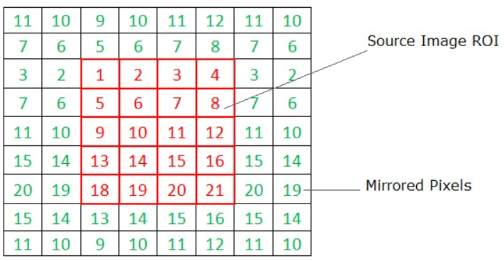

# Introduction

:notebook_with_decorative_cover: Up to this point of our tutorials we have not been required to deal with image processing techniques that require the use of a source image pixel neighbours to compute a value in the destination image. The question would be what do we do when we encounter a pixel that does not have enough neighbours for us to compute a new value from. Such pixels are found at the image borders.

:notebook_with_decorative_cover: OpenCV handles such a problem by creating what are known as **virtual pixels** outside of the image at the borders. This is also known as **padding out** an image. This process always results in a somewhat larger image than the original. The process of creating these artificial pixels in also known as **extrapolation**. Extrapolation takes advantage of existing pixels to artificially create other pixels that fall outside the image boundary. 

:notebook_with_decorative_cover: This tutorial is going to set you up so that you go into future topics (e.g. Filtering, Geometrical Transformation, Thresholding, etc.) knowing how pixels are handled at image borders by various image processing techniques.


## Border Extrapolation

:notebook_with_decorative_cover: In most cases OpenCV functions will create these virtual pixels for you, all you have to do is supply a **flag** specifying how you want the pixels to be created. These flags can be found under the enumerator <a href = "https://docs.opencv.org/4.8.0/d2/de8/group__core__array.html#ga209f2f4869e304c82d07739337eae7c5">cv::BorderTypes</a>. 

:notebook_with_decorative_cover: The following table gives a brief description of the border types you can create. We have also provided images to show how the virtual pixels at the borders are created. We also show examples of how an image would look if you applied the various borders. The following image was used as the original:

<p align = "center"><b>Figure 1:</b> Input image for creating various border types</p>

<p align = "center">
    
</p>


**Table 1** How OpenCV exprapolates pixels when creating image borders. Images in the table use a border size of 20 pixels on all sides.

| Border type | Effect | Pixels | Image example|
| ----------- | ------ | ------ | ----- |
| cv::BORDER_CONSTANT | Extend pixels by using a supplied (constant) value | |Constant value = 25 Constant value = 200  |
| cv::BORDER_REPLICATE | Extend pixels by copying edge pixel |  |  |
| cv::BORDER_REFLECT | Extend pixels by mirror reflection |  |  |
| cv::BORDER_WRAP | Extend pixels by replicating from opposite side |  |  |
| cv::BORDER_REFLECT_101 | Extend pixels by reflection, edge pixel is not "doubled" |  |  |
| cv:: BORDER_REFLECT101 | Same as cv::BORDER_REFLECT_101 | | |
| cv:: BORDER_DEFAULT | Same as cv::BORDER_REFLECT_101 | | |
| cv::BORDER_ISOLATED | Do not look outside of image or region of interest | We will discuss this type on its own later | |

## How to create borders around an image

:notebook_with_decorative_cover: As mentioned previously, OpenCV functions that require an argument on how to handle border pixels will do all the work for you behind the scenes. However, if you want to see how the borders look like you can create them yourself using the function `void cv::copyMakeBorder(InputArray src, OutputArray dst, int top, int bottom, int left, int right, int borderType, const cv::Scalar& value = cv::Scalar())`. This function allows you to form a border around an image. The function copies the source image into the middle of the destination image. The areas to the left, to the right, above and below the copied source image will be filled with extrapolated pixels. Lets have a detailed look at the parameters: 

* `src` - Source image.
* `dst` - Destination image of the same type as `src` and the size $cv::Size(src.cols+left+right, src.rows+top+bottom)$.
* `top` - the number of rows of pixels to be added at the top of `src` image.
* `bottom` - the number of rows of pixels to be added at the bottom of `src` image.
* `left` - the number of columns of pixels to be added at the left side of `src` image.
* `right` - the number of columns of pixels to be added at the right side of `src` image.
* `borderType` - Border type. See <a href = "https://docs.opencv.org/4.8.0/d2/de8/group__core__array.html#ga209f2f4869e304c82d07739337eae7c5">cv::BorderTypes</a> for details. Also see **Table 1** above.
* `value` - Border value if `borderType=cv::BORDER_CONSTANT`. This is provided as a `cv::Scalar` value e.g. `cv::Scalar(value)` for a 1-channel image and `cv::Scalar(value, value, value)` for a 3-channel image.

**Example 1** The following code helps you create a border (of the same size) around an image. For better visualization, use a large border size e.g. 50.

```c++
#include <opencv2/core.hpp>     // for OpenCV core types and cv::copyMakeBorder()
#include <opencv2/highgui.hpp>  // for displaying images in a window
#include <opencv2/core/utility.hpp> // for command line or terminal inputs

#include "UtilityFunctions/utility_functions.h" // functions from our own library

#include <iostream>
#include <string_view>

/**
 * @brief Returns a string describing how an image border type is created
 * 
 * @param borderType Border type as an integer value. See enum cv::BorderTypes
 * @return std::string_view 
 */
std::string_view imageBorderDescription(int borderType);

int main(int argc, char* argv[])
{
    //---------------- 1. Extract Command Line Arguments -----------------//

    const cv::String keys = 
        "{help h usage ? | | Create a border around an image }"
        "{image | <none> | Full path to source image }"
        "{sizeOfBorder | 1 | Size of border as no. of pixel rows/columns }"
        "{typeOfBorder | 4 | Integer value representing border type. Options are: "
        "Constant (0), Replicate (1), Reflect (2), Wrap (3), Reflect_101 (4), Isolated (16)}"
        "{constantValue | -1 | Pixel value used in the case you pick typeOfBorder as 'Constant'}";

    // Define a cv::CommandLineParser object
    cv::CommandLineParser parser(argc, argv, keys);

    // We also want to display a message about the program
    parser.about("\nProgram for creating a border around an image.\n");
    parser.printMessage();

    //----------------------------- Extract command line arguments into program

    cv::String imagePath = parser.get<cv::String>("image");
    int borderSize = parser.get<int>("sizeOfBorder");
    int typeOfBorder = parser.get<int>("typeOfBorder");
    double constantValue = parser.get<double>("constantValue");

    // Check for any errors encountered during arguments extraction
    if (!parser.check())
    {
        parser.printErrors();
        return -1; // early exit from function
    }

    //--------------------- 2. Read image data -------------------------//

    cv::Mat inputImage = cv::imread(imagePath, cv::IMREAD_ANYCOLOR);
    if (inputImage.empty())
    {
        CV_Error_(cv::Error::StsBadArg, 
                      ("Could not read image data from (%s)", 
                        imagePath.c_str())); 
    }
    else 
    {
        // Print image sizes, no. of channels and data types of image
        std::cout << "\nSize of input image = " << inputImage.size()
                  << "\nData type of input image = " 
                  << CPP_CV::General::openCVDescriptiveDataType(inputImage.type())
                  << '\n';
    }

    // Display original source image
    cv::imshow("Input image in BGR format", inputImage);

    // ------------------------ Create border around image ---------------- //

    cv::Mat dst;

    // If using a constant value for the border convert to cv::Scalar
    cv::Scalar constantBorderValue {constantValue, constantValue, constantValue};

    cv::copyMakeBorder(inputImage,        // Input image
                    dst,                  // Output image with border added to it
                    borderSize,           // No. of border pixel rows at top of image
                    borderSize,           // No. of border pixel rows at bottom of image
                    borderSize,           // No. of border pixel columns on left side of image
                    borderSize,           // No. of border pixel columns on right side of image
                    typeOfBorder,         // Type of border
                    constantBorderValue   // Constant value if typeOfBorder == cv::BORDER_CONSTANT     
    );

    // Print image sizes, no. of channels and data types of output image
    std::cout << "\nSize of image with border = " << dst.size()
            << "\nData type of image with border = " 
            << CPP_CV::General::openCVDescriptiveDataType(dst.type())
            << '\n';

    // Display output image with border       
    auto borderDescription = std::string(imageBorderDescription(typeOfBorder));
    cv::imshow(borderDescription, dst);
    cv::waitKey(0);

    cv::destroyAllWindows();

    std::cout << '\n';

    return 0;
}


/**
 * @brief Returns a string describing how an image border type is created
 * 
 * @param borderType Border type as an integer value. See enum cv::BorderTypes
 * @return std::string_view A description on how image border type is created
 */
std::string_view imageBorderDescription(int borderType)
{
    switch (borderType)
    {
        case cv::BORDER_CONSTANT:
            return "Border with a constant pixel value";
        case cv::BORDER_REPLICATE:
            return "Border with replicated pixels";
        case cv::BORDER_REFLECT:
            return "Border with mirror reflected pixel values";
        case cv::BORDER_WRAP:
            return "Border with wraped pixel values";
        case cv::BORDER_REFLECT_101:
            return "Border with reflected pixel values (edge pixels not used)";
        case cv::BORDER_ISOLATED:
            return "Border created without using any pixels outside input image or ROI";
        default:
            return "Invalid border type";
    }
}
```

### `cv::BORDER_ISOLATED`

:notebook_with_decorative_cover: Within the enum `cv::BorderType`, we have the `cv::BORDER_ISOLATED` value - which works differently to the other border type options.

:notebook_with_decorative_cover: `cv::BORDER_ISOLATED` is a border type flag used to force an operation to only consider the pixels within the current region of interest (ROI), ignoring the parent image's pixels. 

:notebook_with_decorative_cover: This is a specific, often critical, detail when you are processing a sub-image (a ROI) that was created as a "view" of a larger, parent image.

:notebook_with_decorative_cover: To save on memory we often create a ROI as a "view" of the larger image to avoid unnecessary expensive copying of image data.

#### Context: How ROIs affect border operations

* **Default behavior**: When you define a smaller `cv::Mat` as an ROI of a larger `cv::Mat`, both objects reference the same underlying pixel data. By default, when you perform an operation that requires neighbourhood pixels on the ROI, OpenCV will "look" outside the ROI's boundary and use the parent image's pixel values to handle the border pixels.

* **The problem**: If your goal is to process the ROI completely independently from the rest of the parent image, this default behavior can lead to incorrect results, as the filtered output will be influenced by data you intended to ignore.

* **The solution**: By using the `cv::BORDER_ISOLATED` flag, you explicitly instruct OpenCV to ignore the parent image's data and instead use the specified border handling for the ROI's own boundaries. 

### How to use `cv::BORDER_ISOLATED`

:notebook_with_decorative_cover: You combine `cv::BORDER_ISOLATED` with another border type using the bitwise OR operator `|`. The other border type (e.g., `cv::BORDER_CONSTANT` or `cv::BORDER_REPLICATE`) specifies how the pixels at the edge of the ROI should be handled. 

**Example 2** How to use `cv::BORDER_ISOLATED` when working with ROIs that are part of a larger image. Data input into the following application is through a `YAML`, `JSON` or `XML` file.

*input-data.yaml*

```yaml
%YAML:1.0
---
SourceImagePath: "/Path/To/Image"
ROI: # Region of interest that is part of 'SourceImagePath'
  top-left-corner-coordinates: [200, 90] # Defined as [row, column]
  bottom-right-corner-coordinates: [290, 200] # Defined as [row, column]
BorderSize:
  top: 25     # No. of pixel rows
  bottom: 25  # No. of pixel rows
  left: 25    # No. of pixel columns
  right: 25   # No. of pixel columns
BorderType: 4 # Integer value representing border type. Options are: 
              # Constant (0), Replicate (1), Reflect (2), Wrap (3), Reflect_101 (4)
ConstantValue: 0 # Pixel value used in the case you pick BorderType as 'Constant'
```

*input-data.json*

```json
{
    "SourceImagePath": "/Path/To/Image",
    "ROI": {
        "top-left-corner-coordinates": [200, 90], 
        "bottom-right-corner-coordinates": [290, 200]
    },
    "BorderSize": {
        "top": 25, 
        "bottom": 25, 
        "left": 25, 
        "right": 25
    }, 
    "BorderType": 0, 
    "ConstantValue": 0 
}
```

*roi-border.cpp*

```c++
#include <opencv2/core.hpp>     // for OpenCV core types and cv::copyMakeBorder()
#include <opencv2/highgui.hpp>  // for displaying images in a window
#include <opencv2/core/utility.hpp> // for command line or terminal inputs
#include "opencv2/core/persistence.hpp" // for cv::FileStorage
#include "opencv2/imgproc.hpp" // for cv::rectangle()

#include "UtilityFunctions/utility_functions.h" // functions from our own library

#include <iostream>
#include <string_view>
#include <string>
#include <algorithm>
#include <vector>

/**
 * @brief Returns a string describing how an image border type is created
 * 
 * @param borderType Border type as an integer value. See enum cv::BorderTypes
 * @return std::string_view A description on how image border type is created
 */
std::string_view imageBorderDescription(int borderType);

int main(int argc, char* argv[])
{
    //---------------- 1. Extract Command Line Arguments -----------------//

    const cv::String keys = 
        "{help h usage ? | | Create a border around a region of interest }"
        "{path | <none> | Full path to file with input data (must have extension e.g. .xml, .yaml, .yml or .json) }";

    // Define a cv::CommandLineParser object
    cv::CommandLineParser parser(argc, argv, keys);

    // We also want to display a message about the program
    parser.about("\nProgram for creating a border around a region of interest without any outside influence from the parent image pixels.\n");
    parser.printMessage();

    // Extract command line arguments into program
    cv::String pathToInputFile = parser.get<cv::String>("path");

    // Check for any errors encountered during arguments extraction
    if (!parser.check())
    {
        parser.printErrors();
        return -1; // early exit from function
    }

    // Since we can only read from 5 file types we need to check if file
    // path provided by user is valid. We first call the function to 
    // extract the file extension
    std::string fileExtension = CPP_CV::ReadWriteFiles::getFileExtension(pathToInputFile);

    // Use the std::find() algorithm to check if file extension exists
    // in our catalogue 'fileTypes'
    auto found = std::find(CPP_CV::General::fileTypes.cbegin(), CPP_CV::General::fileTypes.cend(), fileExtension);
    if (found == CPP_CV::General::fileTypes.cend()) // If the file extension is not valid
    {
        std::cout << "\nERROR: File type is not valid." 
                  << "\nFile extension should be one of: xml, yml, yaml, json or gz.\n";
        
        return -1; // Exit program early
    }

    // If file type is valid, we can start reading our data from file

    // -------------------- 2. Read File Data --------------------------//

    // Create a cv::FileStorage object for READING
    cv::FileStorage fs(pathToInputFile, cv::FileStorage::READ);

    // Check if have successfully opened the filw for reading
    if (!fs.isOpened())
    {
        std::cout << "\nERROR: Could not open file for reading.\n";

        return -1; // Early program exit
    }

    // If we have successfully opened the file, we start readin data

    std::cout << "\nReading data from file...\n";

    // a. Read source image path
    cv::String imagePath;
    fs["SourceImagePath"] >> imagePath;
    std::cout << "\nimagePath = " << imagePath << '\n';

    // b. Read ROI coordinates - Data is a map that contains data in sequences

    // Create a cv::FileNode object from the Map structure
    cv::FileNode roi = fs["ROI"];
    // Check if the data structure is actually a MAP
    if(roi.type() != cv::FileNode::MAP)
    {
        std::cout << "\nYou are attempting to read a data structure that is not a cv::FileNode::MAP\n";

        return -1;
    }
    // Inside the MAP we have two sequences - we will create node objects for them
    cv::FileNode tlCoordinates_seq = roi["top-left-corner-coordinates"];
    cv::FileNode brCoordinates_seq = roi["bottom-right-corner-coordinates"];
    // Check if the structures are actually SEQUENCES
    if (tlCoordinates_seq.type() != cv::FileNode::SEQ)
    {
        std::cout << "\nTop left coordinates of ROI are not a SEQUENCE structure.\n";

        return -1;
    }
    if (brCoordinates_seq.type() != cv::FileNode::SEQ)
    {
        std::cout << "\nBottom right coordinates of ROI are not a SEQUENCE structure.\n";

        return -1;
    }

    // Temporary vectors to store coordinates
    std::vector<int> tlCoordinatesVector; 
    std::vector<int> brCoordinatesVector; 
     
    // Call function to read sequence data into a std::vector
    CPP_CV::ReadWriteFiles::getSequence(tlCoordinates_seq, tlCoordinatesVector);
    CPP_CV::ReadWriteFiles::getSequence(brCoordinates_seq, brCoordinatesVector);

    // Create a cv::Point(row, column) to store our data 
    cv::Point2i topLeftCornerCoordinates;
    cv::Point2i bottomRightCornerCoordinates;
    topLeftCornerCoordinates.x = tlCoordinatesVector.at(0);
    topLeftCornerCoordinates.y = tlCoordinatesVector.at(1);
    bottomRightCornerCoordinates.x = brCoordinatesVector.at(0);
    bottomRightCornerCoordinates.y = brCoordinatesVector.at(1);


    std::cout << "\nTop left corner coordinates: " << topLeftCornerCoordinates << '\n';
    std::cout << "\nBottom right corner coordinates: " << bottomRightCornerCoordinates << '\n';

    // c. Read Border sizes - Data is a MAP structure

    // Create a cv::FileNode object from the Map structure
    cv::FileNode borderSize = fs["BorderSize"];

    // Check if the data structure is actually a MAP
    if(borderSize.type() != cv::FileNode::MAP)
    {
        std::cout << "\nBorder sizes are not in a MAP structure.\n";

        return -1;
    }

    // Inside the borderSize MAP structure the data is made up of single objects
    // we can read straight into a variable that holds an integer
    auto topBorderSize = static_cast<int>(borderSize["top"]);
    auto bottomBorderSize = static_cast<int>(borderSize["bottom"]);
    auto leftBorderSize = static_cast<int>(borderSize["left"]);
    auto rightBorderSize = static_cast<int>(borderSize["right"]);

    std::cout << "\nBorder sizes:"
                << "\n\tTop: " << topBorderSize 
                << "\n\tBottom: " << bottomBorderSize
                << "\n\tLeft: " << leftBorderSize
                << "\n\tRight: " << rightBorderSize 
                << '\n';

    // d. Read the Border Type data
    auto borderType = static_cast<int>(fs["BorderType"]);

    std::cout << "\nBorder type: " << borderType << '\n';

    // e. Read the Constant Value data
    auto constantValue = static_cast<double>(fs["ConstantValue"]);

    std::cout << "\nConstant value: " << constantValue << '\n';

    // f. Explicit closing of cv::FileStorage for reading
    fs.release(); 

    std::cout << "\n\nFinished reading data from file: " 
            << pathToInputFile << '\n';

    //--------------------- 3. Read source image data -------------------------//

    cv::Mat inputImage = cv::imread(imagePath, cv::IMREAD_ANYCOLOR);
    if (inputImage.empty())
    {
        CV_Error_(cv::Error::StsBadArg, 
                      ("Could not read image data from (%s)", 
                        imagePath.c_str())); 
    }
    else 
    {
        // Print image sizes, no. of channels and data types of image
        std::cout << "\nSize of input image = " << inputImage.size()
                  << "\nData type of input image = " 
                  << CPP_CV::General::openCVDescriptiveDataType(inputImage.type())
                  << '\n';
    }

    // Add ROI to image
    // Create a copy of the original source image for drawing onto
    // We want to maintain the original image as is
    cv::Mat copyOfSourceImage;
    inputImage.copyTo(copyOfSourceImage);
    cv::rectangle(copyOfSourceImage, 
            topLeftCornerCoordinates, 
            bottomRightCornerCoordinates, 
            cv::Scalar(0, 0, 0), 
            2, 
            cv::LINE_AA
        );

    // Display original source image with ROI
    cv::imshow("Input image with ROI (BGR format)", copyOfSourceImage);

    //--------------- 4. Create our ROI as a view of the parent image ---------//
    
    cv::Rect area {topLeftCornerCoordinates, bottomRightCornerCoordinates};

    cv::Mat regionOfInterest = inputImage(area); 

    // Print image sizes, no. of channels and data types of ROI
    std::cout << "\nSize of ROI  = " << regionOfInterest.size()
            << "\nData type of ROI = " 
            << CPP_CV::General::openCVDescriptiveDataType(regionOfInterest.type())
            << '\n';

    cv::imshow("ROI", regionOfInterest);

    // ------------------------ Create border around ROI ---------------- //

    cv::Mat dst; // Output image with border added to it

    // If using a constant value for the border convert to cv::Scalar
    const cv::Scalar constantBorderValue {constantValue, constantValue, constantValue};

    cv::copyMakeBorder(
        regionOfInterest,                   // Image defining ROI
        dst,                                // Output image with border added to it
        topBorderSize,                      // No. of border pixel rows at top of image
        bottomBorderSize,                   // No. of border pixel rows at bottom of image
        leftBorderSize,                     // No. of border pixel columns on left side of image
        rightBorderSize,                    // No. of border pixel columns on right side of image
        borderType | cv::BORDER_ISOLATED,   // Type of border
        constantBorderValue                 // Constant value if typeOfBorder == cv::BORDER_CONSTANT     
    );

    // Print image sizes, no. of channels and data types of ROI with border
    std::cout << "\nSize of ROI with border = " << dst.size()
            << "\nData type of ROI with border = " 
            << CPP_CV::General::openCVDescriptiveDataType(dst.type())
            << '\n';

    // Display ROI image with border       
    auto borderDescription = std::string(imageBorderDescription(borderType));
    cv::imshow(borderDescription, dst);
  
    cv::waitKey(0);

    cv::destroyAllWindows();

    std::cout << '\n';

    return 0;
}


/**
 * @brief Returns a string describing how an image border type is created
 * 
 * @param borderType Border type as an integer value. See enum cv::BorderTypes
 * @return std::string_view A description on how image border type is created
 */
std::string_view imageBorderDescription(int borderType)
{
    switch (borderType)
    {
        case cv::BORDER_CONSTANT:
            return "Border with a constant pixel value";
        case cv::BORDER_REPLICATE:
            return "Border with replicated pixels";
        case cv::BORDER_REFLECT:
            return "Border with mirror reflected pixel values";
        case cv::BORDER_WRAP:
            return "Border with wraped pixel values";
        case cv::BORDER_REFLECT_101:
            return "Border with reflected pixel values (edge pixels not used)";
        case cv::BORDER_ISOLATED:
            return "Border created without using any pixels outside input image or ROI";
        default:
            return "Invalid border type";
    }
}
```

### Common use cases of `cv::BORDER_ISOLATED`

* **Parallel processing**: If you divide a large image into multiple ROIs and process them in parallel threads, using `cv::BORDER_ISOLATED` ensures that each thread works only on its designated region without interference from adjacent ROIs.

* **Avoiding edge effects**: In applications where the absolute value of pixels at the edge of an ROI is critical, `cv::BORDER_ISOLATED` prevents "bleed-in" from the parent image during operations that require use of neighbourhood pixels.

* **Image forensics**: When analyzing a specific, cropped portion of an image, using this flag guarantees that the pixel data from outside the cropped area will not influence your analysis.


## References

1. https://github.com/opencv/opencv/issues/9884
2. https://stackoverflow.com/questions/62853834/query-about-border-types-when-using-cv2-gaussianblur
3. https://docs.opencv.org/4.8.0/d2/de8/group__core__array.html#ga209f2f4869e304c82d07739337eae7c5
4. https://www.google.com/url?sa=t&source=web&rct=j&url=https%3A%2F%2Fwww.youtube.com%2Fwatch%3Fv%3DJGYdI5uVHi4&ved=0CAEQqYcPahcKEwioiceUsNqPAxUAAAAAHQAAAAAQCg&opi=89978449
