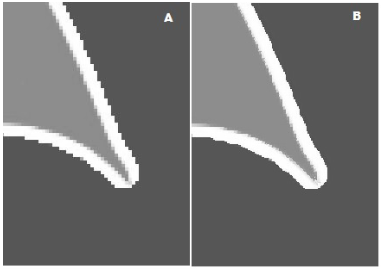
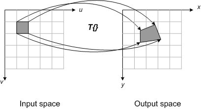

# Geometrical Transformation of images

:notebook_with_decorative_cover: A geometric transformation of an image involves **altering** the **spatial arrangement of its pixels** in order to change its **size**, **shape**, or **orientation**. The spatial arrangement of pixels is defined by their position, arrangement, size, and shape.

:notebook_with_decorative_cover: Geometrical transformation involves two main steps: 

1. A spatial transformation of the pixels.
2. An estimation of the pixel values in the output image. This is done using a process known as interpolation - which we will discuss in greater detail later.

:notebook_with_decorative_cover: It is important to know and understand image geometrical transformations as they are fundamental in:

1. Data augmentation for training machine learning or deep learning AI models. Data augmentation is a strategy used in AI to increase the size and diversity of a training dataset by creating modified copies of existing data through scaling, rotating, resizing, etc., the same image.
2. Correcting image distortions.
3. Aligning images for stitching. Image stitching is the process of combining multiple overlapping photographs into a single, seamless image.

:notebook_with_decorative_cover: There are two main ways in which we can carry out image geometrical transformations:

1. Forward mapping
2. Inverse mapping

## Forward mapping

:notebook_with_decorative_cover: In forward mapping we directly map each pixel from a source image to a new position in a destination image.

:notebook_with_decorative_cover: We will use <a href = "https://blogs.mathworks.com/steve/2006/04/28/spatial-transforms-forward-mapping/?s_tid=blogs_rc_1">Figure 1</a> to show how forward mapping works. 

<b>Figure 1</b> Forward mapping spatial transformation

:notebook_with_decorative_cover: The process of forward mapping follows a simple, step-by-step procedure: 

1. A transformation function, $T$, is defined to map coordinates from the source space, $(u,v)$, to the destination space, $(x,y)$. The transformation function, $T$, could be a rotation, scaling, resizing function or include all three. We will go into detail later about these transformations.

2. The algorithm iterates through each pixel in the source image.

3. For each pixel, it computes its new coordinates in the destination image using the transformation function: $(x,y)=T(u,v)$. If you look closely at Figure 1, you will notice how the pixel centers are not accurately mapped from input to output space.
   
4. The intensity or color value of the source pixel is copied to the calculated position in the destination image.
   
5. Any resulting coordinates in the output image space $(x,y)$ that are not integers, are typically rounded to the nearest integer pixel location.

:notebook_with_decorative_cover: While straightforward, forward mapping presents several major problems that significantly impact image quality: 

1. **Holes (or gaps)**: The transformation may cause some pixels in the destination image to be left unassigned. This happens because multiple source pixels might map to the same destination pixel, or none at all, **due to rounding**. You may end up with some output pixels that do not receive any input image pixels; these are the gaps.These unassigned pixels appear as "holes" or streaks in the final image.

2. **Overlaps**: Conversely, multiple source pixels may be mapped to the same destination pixel. When this happens, a decision must be made about which source pixel's value to use. In a simple implementation, the last pixel written simply overwrites previous values, which can be visually incorrect.

3. **Aliasing**: The rounding of coordinates can introduce aliasing artifacts, such as jagged edges, especially for rotations or scaling transformations. A jagged edge is a visual artifact where an object's boundary appears as a "staircase" pattern instead of a smooth line, caused by the discrete nature of pixels when depicting oblique lines. <a href = "https://www.hilarispublisher.com/open-access/a-novel-technique-for-removing-jagged-edges-of-image-due-to-aliasing-2168-9695-1000161.pdf">Figure 2</a> shows an object with a jagged edge (A) and the same object with a smooth edge (B).

<b>Figure 2:</b> Image of an object with a jagged edge (A) and a smooth edge (B)

4. **Interpolation complexity**: Handling the issues of gaps and overlaps requires more complex solutions than simply overwriting pixels. One such solution is to map pixel rectangles in input space to output space quadrilaterals as shown in <a href = "https://blogs.mathworks.com/steve/2006/04/28/spatial-transforms-forward-mapping/?s_tid=blogs_rc_1">Figure 3</a>. With this procedure, the input pixel value is allocated to different output pixels depending on the relative fractional coverage of the quadrilateral. Although this procedure can produce good results, it is complicated to implement and computationally expensive. 

<b>Figure 3:</b> Solving forward mapping with quadrilaterals

:notebook_with_decorative_cover: Because of the inherent problems with gaps and overlaps, forward mapping is rarely used in practice for geometric transformations. The inverse mapping approach is the standard solution, as it avoids these issues by working backward from the destination image to the source. 

## Inverse mapping

:notebook_with_decorative_cover: The preferred method for geometric image transformation is inverse mapping - also known as reverse maaping. As its name suggests, it is the opposite of forward mapping. 

:notebook_with_decorative_cover: In inverse mapping, we basically iterate through each pixel in the output image space and calculate its corresponding location in the source image. This ensures that pixel locations in the output image space are always integer coordinates.

:notebook_with_decorative_cover: We will use <a href = "https://blogs.mathworks.com/steve/2006/05/05/spatial-transformations-inverse-mapping/?s_tid=blogs_rc_1">Figure 4</a> to demonstrate how inverse mapping works.

<b>Figure 4:</b> Inverse mapping spatial transformation

        

:notebook_with_decorative_cover: The process of inverse mapping follows a simple, step-by-step procedure: 

1. For every pixel at integer coordinates $(x, y)$ in the output space, we apply an inverse transformation function, $T^{-1}$ to find its corresponding location $(u, v)$ in the input space. The inverse mapping function is then defined fully as $(u, v) = T^{-1}(x, y)$.
2. The inverse mapping function often results in non-integer coordinates in the input space - as shown in Figure 4. What you see in Figure 4 are the pixel centres mapped. In the input space these centres are not located centrally to corresponding pixels in the output space - meaning if you were to draw the actual pixel it would overlap into other pixels. The issue then becomes, which pixel value to extract and use in the output image. Often, an interpolation technique is used to estimate the pixel's value from its neighbouring pixels in the input space. There are a number of interpolation techniques we can use e.g. nearest-neighbour, bilinear, bicubic etc. They all have their pros and cons - and we will look closely at these in the next tutorial as it is important to pick the best technique for your application.

:notebook_with_decorative_cover: Using inverse mapping offers the following pros:

1. **No gaps or overlaps**: By guaranteeing a value for every pixel in the output image, inverse mapping eliminates holes and avoids the computational complexity of managing overlapping assignments.

2. **Better quality**: Inverse mapping, combined with an appropriate interpolation technique, generally produces a smoother, higher-quality result.

3. **Simpler parallelization**: Inverse mapping allows each pixel in the destination image to be computed independently, making it easier to parallelize for faster performance on modern GPUs. 

## References

1. https://www.cs.auckland.ac.nz/courses/compsci773s1c/lectures/ImageProcessing-html/topic2.htm
2. https://medium.com/data-science/forward-and-backward-mapping-for-computer-vision-833436e2472
3. https://blogs.mathworks.com/steve/2006/04/28/spatial-transforms-forward-mapping/?s_tid=blogs_rc_1
4. https://www.hilarispublisher.com/open-access/a-novel-technique-for-removing-jagged-edges-of-image-due-to-aliasing-2168-9695-1000161.pdf