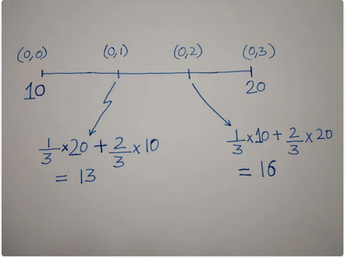
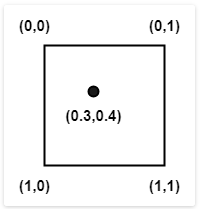
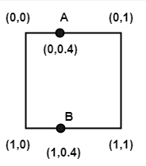
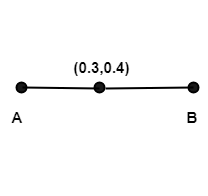
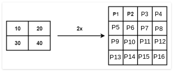
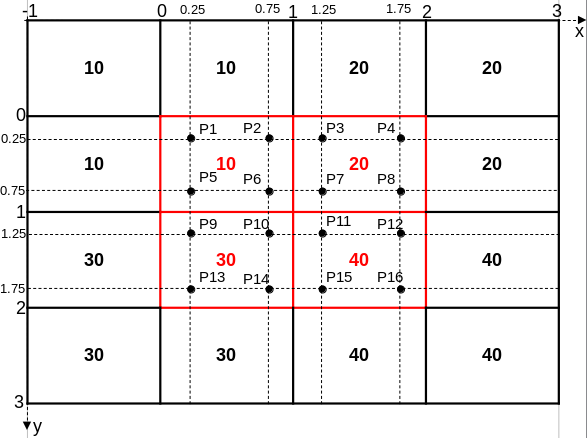
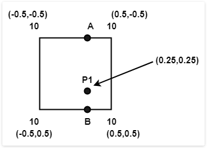
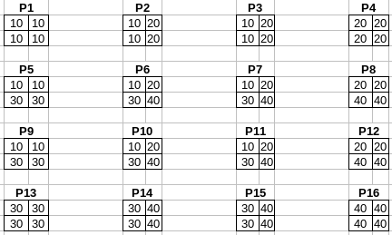
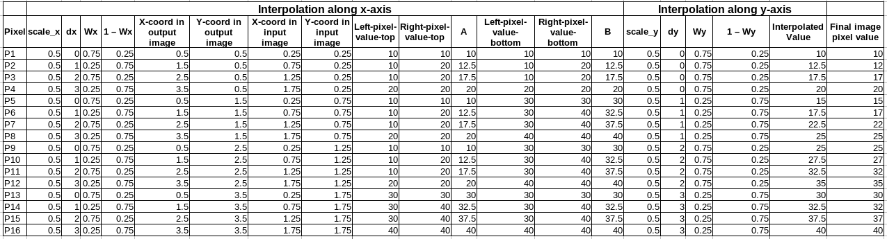
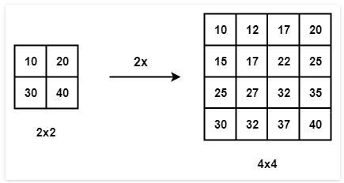

# Introduction

:memo: In the last chapter, we discussed inverse mapping as the most preferred technique for image geometrical transformation. Within that discussion we mentioned that during inverse mapping, a pixel in the output image may map to a non-integer coordinate in the input image, meaning we have to estimate its new color or intensity value using data from the input image. **Interpolation** is the technique used for estimating the pixel values in the output image using data from neighbourhood pixels in the input image.

:memo: There are a number of interpolation techniques - the choice of which, involves a trade-off between speed and image quality. In the following sub-sections, we will look in detail at some of the most common interpolation methods we use in image geometrical transformation. 

## Nearest-neighbor interpolation

:memo: This is the simplest and fastest interpolation method. For each pixel in the destination image, it finds the single closest/nearest pixel in the source image and copies its intensity value.

:memo: In image processing, nearest neighbor interpolation is used for tasks like resizing or resampling, where new pixel values need to be determined for the new, larger image. The process works as follows: 

1. Map output to input coordinates: For every new pixel in the output image, its coordinates are mapped back to a corresponding location in the original input image.

2. Find the nearest neighbor: The algorithm identifies the single closest pixel in the original image to that mapped location.

3. Assign the value: The value of the nearest neighbor pixel is assigned to the new output pixel. 

:memo: Figure 1 is a simplistic view of how the nearest neighbour interpolation technique estimates values in the destination image.

<p style="text-align: center;"><b>Figure 1:</b> A simplistic view of the nearest neighbour interpolation technique when enlarging an image</p>

<p align = "center">
    
</p>


:memo: If you look closely at the final pixel values in Figure 1 you will notice that the nearest neighbour technique tends to replicate the input image pixels into blocks in the enlarged image. The area around each original data point (or pixel) becomes a constant region.

:memo: The nearest neighbour technique has the following advantages:

* **Speed and simplicity**: As the most basic interpolation method, it is computationally very efficient, making it ideal for real-time applications such as video games and image previews.

* **Preserves pixel values**: Unlike more complex methods that calculate an average, nearest neighbor interpolation retains the original pixel values. This is beneficial for applications like medical imaging or satellite imagery, where data accuracy is critical.

* **Maintains sharp edges**: This method does not blur or smooth image details. It is particularly effective for images with sharp edges, text, or geometric elements. 

:memo: While computationally cheap, this technique has the following downsides:

* **Poor image quality**: When scaling images, especially for magnification, the replication of pixels can create a "blocky" or "pixelated" appearance with jagged edges. This can lead to a significant loss of visual quality.

* **Limited accuracy**: Since the algorithm does not consider the values of other neighboring points, it can produce less accurate results for complex datasets compared to more advanced techniques.

* **Not suitable for continuous data**: Because it creates step-like, discontinuous transitions, the method is not suitable for interpolating continuous data sets or functions.

:memo: Common applications of nearest neighbour interpolation include:

1. **Image resizing**: Resampling images to new dimensions, especially in applications where speed is prioritized over image quality.

2. **Real-time 3D rendering**: Selecting color values for textured surfaces in computer graphics.

3. **Geographic information systems (GIS)**: Creating raster data grids from scattered data points, such as with weather or elevation data.


## Bilinear interpolation

:memo: Unlike nearest neighbor, which uses only the value of the single closest point, **bilinear interpolation** uses the weighted average of the four nearest neighboring points to calculate a new value. The closest points will carry more weight than points further away.

:memo: The majority of this discussion is taken from this great article <a href = "https://theailearner.com/2018/12/29/image-processing-bilinear-interpolation/">here</a>. I am repeating it here because it is such a good explanation of bilinear interpolation.

:memo: Before discussing bilinear interpolation, we first need to understand what is **linear interpolation**. Suppose we have 2 points having value `10` and `20` and we want to guess the values in between them. Using <a href = "https://theailearner.com/2018/12/29/image-processing-bilinear-interpolation/">Figure 2</a>, we can estimate the values at locations `(0, 1)` and `(0, 2)` as follows:

<p align = "center"><b>Figure 2:</b> Linear interpolation</p>

<p align  = "center">
    
</p>

:memo: As you can see from Figure 2, more weight is given to the nearest known values/points e.g. when estimating the value at `(0, 1)` we assign a higher weight of `2/3` to the value `10` as it closer, and assign a lesser weight of `1/3` to the value `20` as it is further away from our unknown location.

:memo: For 2D data e.g images, we have to apply linear interpolation twice, first along the rows and then along the columns, hence the term **bi**linear interpolation.

:memo: Applying bilinear interpolation to image data would go as follows:

1. Suppose we have 4 pixels located at `(0,0)`, `(1,0)`, `(0,1)` and `(1,1)` and we want to find value at `(0.3,0.4)` (see <a href = "https://theailearner.com/2018/12/29/image-processing-bilinear-interpolation/">Figure 3</a>). 

<p align = "center"><b>Figure 3a:</b> Bilinear interpolation of 2D images</p>

<p align  = "center">
    
</p>

2. First, find the value along rows i.e at position `A:(0,0.4)` and `B:(1,0.4)` by linear interpolation (see <a href = "https://theailearner.com/2018/12/29/image-processing-bilinear-interpolation/">Figure 3b</a>).

<p align = "center"><b>Figure 3b:</b> Linear interpolation along rows for 2D images</p>

<p align  = "center">
    
</p>

3. After getting the values at `A` and `B`, apply linear interpolation for point `(0.3,0.4)` between `A` and `B` along the columns. If you turn the line `A-B` 90 degrees anti-clockwise (see <a href = "https://theailearner.com/2018/12/29/image-processing-bilinear-interpolation/">Figure 3c</a>), it looks like Figure 2. You can then go ahead and apply the same concept. Remember you will now be using the estimated values you obtained from point `2` above for `A` and `B`.

<p align = "center"><b>Figure 3c:</b> Linear interpolation along columns for 2D images</p>

<p align  = "center">
    
</p>

:memo: We have now looked at the theory behind bilinear interpolation. We need to take a closer look at how this is implemented in OpenCV, for example when enlarging a smaller `2 x 2` image to twice its size, i.e `4 x 4`.

<p align = "center"><b>Figure 4:</b> Image enlargement</p>

<p align  = "center">
    
</p>

1. We will make the assumption that each pixel is of size `1` unit in the output image and pixel location is defined by its center coordinates. For example, pixel `P1` has coordinates `(0.5, 0.5)` in the enlarged image. If we project the `4x4` image onto the input `2x2` we are scaling the pixel size by `0.5` or `1/2`, which means coordinates of `P1` in input image will be `(0.25, 0.25)`
2. Since `P1` is the border pixel and has no values to its left, we add virtual pixels (as discussed in the topic on Image Borders) around the image border. This time we will simply **replicate** the border pixels. There are <a href = "https://docs.opencv.org/4.8.0/d2/de8/group__core__array.html#ga209f2f4869e304c82d07739337eae7c5">other techniques</a> you can use. This means the row or column values at the very edge of the input image are used for creating the virtual pixels making up the image border. After adding the virtual pixels, our input image is shown in Figure 5. Values in red shows the original input image. We have also added the location of the unknown pixels (using their central coordinates) when transferred from output to input image.

<p align = "center"><b>Figure 5:</b> Input image with image border</p>

<p align  = "center">
    
</p>

3. To find the value of `P1`, we need to visualize where `P1` is in the input image. We also need to identify which 4 neighbourhood pixels which will be used for bilinear interpolation - in this case we will use the upper left `2x2` region as shown by <a href = "https://theailearner.com/2018/12/29/image-processing-bilinear-interpolation/">Figure 6</a>. Keep in mind that the coordinates given in Figure 6 for the neighbourhood pixels are center coordinates for that pixel.

<p align = "center"><b>Figure 6:</b> Neighbourhood pixels for P1</p>

<p align  = "center">
    
</p>

4. Before applying Bi-linear interpolation let’s see how weights are distributed. Both **Matlab** (another image processing library) and **OpenCV** yield different results for interpolation because their weight distribution is done differently. Here, we will look at weight calculation in OpenCV. In OpenCV, weights are distributed according to the following equations:

```c++
auto Wx = static_cast<float>((dx + 0.5) * scale_x - 0.5);
auto sx = cvFloor(Wx);
Wx -= sx;
```

   * Where `Wx` is the weight assigned to the right-side pixel, meaning `1 - Wx` is the weight assigned to the left-side pixel. `dx` is the column index of the unknown pixel (in the output image). `scale_x` is the ratio `input image width / output image width`. We can extend these parameters when computing interpolation along the y-axis, `Wy` is the weight assigned to the interpolated value computed using the top two pixels e.g weight applied to computed value at location `A` in Figure 6. `dy` is the row index of the unknown pixel. `scale_y` would be the ratio `input image height / output image height`. The function `cvFloor` in the code above rounds a floating-point number down to the nearest integer e.g. `cvFloor(3.7) = 3`, `cvFloor(-3.7) = -4`.

5. For pixel `P1`, we can use the following code to estimate its value. You should get the value `10`.

```c++
#include <opencv2/core.hpp>     // for OpenCV core types 
#include <iostream>

float weight(int columnIndex, float scale)
{
    auto fx = static_cast<float>((columnIndex + 0.5) * scale - 0.5);
    auto sx = cvFloor(fx);
    fx -= sx;
    return fx;

}

int main(int argc, char* argv[])
{
    int dx = 0;
    float scale_x = 0.5;
    auto Wx = weight(dx, scale_x);

    // Estimated value at point A along x-axis
    int right_side_of_A_pixel_value = 10;
    int left_side_of_A_pixel_value = 10;
    auto A = (Wx * right_side_of_A_pixel_value) + (1 - Wx) * left_side_of_A_pixel_value;
    
    // Estimated value at point B along axis
    int right_side_of_B_pixel_value = 10;
    int left_side_of_B_pixel_value = 10;
    auto B = (Wx * right_side_of_B_pixel_value) + (1 - Wx) * left_side_of_B_pixel_value;

    // Apply linear interpolation between A and B along the y-axis
    int dy = 0;
    float scale_y = 0.5;
    auto Wy = weight(dy, scale_y);

    auto value_of_P1 = static_cast<float>((Wy * B) + (1 - Wy) * A);

    auto final_P1_value = cvFloor(value_of_P1);
    std::cout << "\nInterpolated intensity value of P1 = " << final_P1_value << '\n';

    std::cout << '\n';

    return 0;
}
``` 

6. We can repeat the above process to obtain the remaining pixel values. Figure 7 shows the `2x2` neighbourhood pixels used to interpolate each unknown pixel intensity value.

<p align  = "center"><b>Figure 7:</b> Neighbourhood pixels used for bilinear interpolation.

<p align = "center">
    
</p>

Using Figure 5 and 7 our manual bilinear computations are shown in Figure 8 below.

<p align  = "center"><b>Figure 8:</b> Computed values using bilinear interpolation.

<p align = "center">
    
</p>

The above computations would produce Figure 9.

<p align  = "center"><b>Figure 9:</b> Enlarged image using bilinear interpolation.

<p align = "center">
    
</p>


:memo: You get the following advantages when using bilinear interpolation with image data:

* **Smoother results**: By averaging the values of surrounding pixels, bilinear interpolation creates a smoother transition between pixels during operations like image resizing or rotation. This reduces the jagged edges and "pixelated" appearance common with nearest neighbor.
    
* **Good balance of speed and quality**: While it is more computationally intensive than nearest neighbor, it is still computationally efficient enough for real-time applications, such as computer graphics and image previews.
    
* **Wider applicability**: Its ability to produce a smoother, more continuous result makes it more suitable than nearest neighbor for a wider variety of tasks, including image resizing, texture mapping, and geospatial analysis. 

:memo: There are some drawbacks to using bilinear interpolation: 

* **Can cause blurring**: The averaging process tends to blur or soften image details, especially in areas with sharp transitions or high-frequency information, like edges.
    
* **Less accurate than higher-order methods**: Though an improvement over nearest neighbor, bilinear interpolation is less accurate and can still introduce visual artifacts in certain applications compared to more advanced techniques like bicubic interpolation.  
