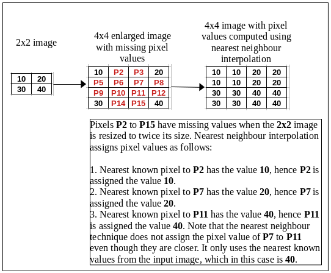

# Introduction

:memo: In the last chapter, we discussed inverse mapping as the most preferred technique for image geometrical transformation. Within that discussion we mentioned that during inverse mapping, a pixel in the output image may map to a non-integer coordinate in the input image, meaning we have to estimate its new color or intensity value using data from the input image. **Interpolation** is the technique used for estimating the pixel values in the output image using data from neighbourhood pixels in the input image.

:memo: There are a number of interpolation techniques - the choice of which, involves a trade-off between speed and image quality. In the following sub-sections, we will look in detail at some of the most common interpolation methods we use in image geometrical transformation. 

## Nearest-neighbor interpolation

:memo: This is the simplest and fastest interpolation method. For each pixel in the destination image, it finds the single closest/nearest pixel in the source image and copies its intensity value.

:memo: In image processing, nearest neighbor interpolation is used for tasks like resizing or resampling, where new pixel values need to be determined for the new, larger image. The process works as follows: 

1. Map output to input coordinates: For every new pixel in the output image, its coordinates are mapped back to a corresponding location in the original input image.

2. Find the nearest neighbor: The algorithm identifies the single closest pixel in the original image to that mapped location.

3. Assign the value: The value of the nearest neighbor pixel is assigned to the new output pixel. 

:memo: Figure 1 is a simplistic view of how the nearest neighbour interpolation technique estimates values in the destination image.

<p style="text-align: center;"><b>Figure 1:</b> A simplistic view of the nearest neighbour interpolation technique when enlarging an image</p>

<p align = "center">
    
</p>


:memo: If you look closely at the final pixel values in Figure 1 you will notice that the nearest neighbour technique tends to replicate the input image pixels into blocks in the enlarged image. The area around each original data point (or pixel) becomes a constant region.

:memo: The nearest neighbour technique has the following advantages:

* **Speed and simplicity**: As the most basic interpolation method, it is computationally very efficient, making it ideal for real-time applications such as video games and image previews.

* **Preserves pixel values**: Unlike more complex methods that calculate an average, nearest neighbor interpolation retains the original pixel values. This is beneficial for applications like medical imaging or satellite imagery, where data accuracy is critical.

* **Maintains sharp edges**: This method does not blur or smooth image details. It is particularly effective for images with sharp edges, text, or geometric elements. 

:memo: While computationally cheap, this technique has the following downsides:

* **Poor image quality**: When scaling images, especially for magnification, the replication of pixels can create a "blocky" or "pixelated" appearance with jagged edges. This can lead to a significant loss of visual quality.

* **Limited accuracy**: Since the algorithm does not consider the values of other neighboring points, it can produce less accurate results for complex datasets compared to more advanced techniques.

* **Not suitable for continuous data**: Because it creates step-like, discontinuous transitions, the method is not suitable for interpolating continuous data sets or functions.

:memo: Common applications of nearest neighbour interpolation include:

1. **Image resizing**: Resampling images to new dimensions, especially in applications where speed is prioritized over image quality.

2. **Real-time 3D rendering**: Selecting color values for textured surfaces in computer graphics.

3. **Geographic information systems (GIS)**: Creating raster data grids from scattered data points, such as with weather or elevation data.


## Bilinear interpolation

:memo: Unlike nearest neighbor, which uses only the value of the single closest point, **bilinear interpolation** uses the weighted average of the four nearest neighboring points to calculate a new value. The closest points will carry more weight than points further away.

:memo: The majority of this discussion is taken from this great article <a href = "https://theailearner.com/2018/12/29/image-processing-bilinear-interpolation/">here</a>. I am repeating it here because it is such a good explanation of bilinear interpolation.

:memo: Before discussing bilinear interpolation, we first need to understand what is **linear interpolation**. Suppose we have 2 points having value `10` and `20` and we want to guess the values in between them. Using <a href = "https://theailearner.com/2018/12/29/image-processing-bilinear-interpolation/">Figure 2</a>, we can estimate the values at locations `(0, 1)` and `(0, 2)` as follows:

<p align = "center"><b>Figure 2:</b> Linear interpolation</p>

<p align  = "center">
    
</p>

:memo: As you can see from Figure 2, more weight is given to the nearest known values/points e.g. when estimating the value at `(0, 1)` we assign a higher weight of `2/3` to the value `10` as it closer, and assign a lesser weight of `1/3` to the value `20` as it is further away from our unknown location.

:memo: For 2D data e.g images, we have to apply linear interpolation twice, first along the rows and then along the columns, hence the term **bi**linear interpolation.

:memo: Applying bilinear interpolation to image data would go as follows:

1. Suppose we have 4 pixels located at `(0,0)`, `(1,0)`, `(0,1)` and `(1,1)` and we want to find value at `(0.3,0.4)` (see <a href = "https://theailearner.com/2018/12/29/image-processing-bilinear-interpolation/">Figure 3</a>). 

<p align = "center"><b>Figure 3a:</b> Bilinear interpolation of 2D images</p>

<p align  = "center">
    
</p>

2. First, find the value along rows i.e at position `A:(0,0.4)` and `B:(1,0.4)` by linear interpolation (see <a href = "https://theailearner.com/2018/12/29/image-processing-bilinear-interpolation/">Figure 3b</a>).

<p align = "center"><b>Figure 3b:</b> Linear interpolation along rows for 2D images</p>

<p align  = "center">
    
</p>

3. After getting the values at `A` and `B`, apply linear interpolation for point `(0.3,0.4)` between `A` and `B` along the columns. If you turn the line `A-B` 90 degrees anti-clockwise (see <a href = "https://theailearner.com/2018/12/29/image-processing-bilinear-interpolation/">Figure 3c</a>), it looks like Figure 2. You can then go ahead and apply the same concept. Remember you will now be using the estimated values you obtained from point `2` above for `A` and `B`.

<p align = "center"><b>Figure 3c:</b> Linear interpolation along columns for 2D images</p>

<p align  = "center">
    
</p>

:memo: We have now looked at the theory behind bilinear interpolation. We need to take a closer look at how this is implemented in OpenCV, for example when enlarging a smaller `2 x 2` image to twice its size, i.e `4 x 4`.

<p align = "center"><b>Figure 4:</b> Image enlargement</p>

<p align  = "center">
    
</p>

1. We will make the assumption that each pixel is of size `1` unit in the output image and pixel location is defined by its center coordinates. For example, pixel `P1` has coordinates `(0.5, 0.5)` in the enlarged image. If we project the `4x4` image onto the input `2x2` we are scaling the pixel size by `0.5` or `1/2`, which means coordinates of `P1` in input image will be `(0.25, 0.25)`
2. Since `P1` is the border pixel and has no values to its left, we add virtual pixels (as discussed in the topic on Image Borders) around the image border. This time we will simply **replicate** the border pixels. There are <a href = "https://docs.opencv.org/4.8.0/d2/de8/group__core__array.html#ga209f2f4869e304c82d07739337eae7c5">other techniques</a> you can use. This means the row or column values at the very edge of the input image are used for creating the virtual pixels making up the image border. After adding the virtual pixels, our input image is shown in Figure 5. Values in red shows the original input image. We have also added the location of the unknown pixels (using their central coordinates) when transferred from output to input image.

<p align = "center"><b>Figure 5:</b> Input image with image border</p>

<p align  = "center">
    
</p>

3. To find the value of `P1`, we need to visualize where `P1` is in the input image. We also need to identify which 4 neighbourhood pixels which will be used for bilinear interpolation - in this case we will use the upper left `2x2` region as shown by <a href = "https://theailearner.com/2018/12/29/image-processing-bilinear-interpolation/">Figure 6</a>. Keep in mind that the coordinates given in Figure 6 for the neighbourhood pixels are center coordinates for that pixel.

<p align = "center"><b>Figure 6:</b> Neighbourhood pixels for P1</p>

<p align  = "center">
    
</p>

4. Before applying Bi-linear interpolation let’s see how weights are distributed. Both **Matlab** (another image processing library) and **OpenCV** yield different results for interpolation because their weight distribution is done differently. Here, we will look at weight calculation in OpenCV. In OpenCV, weights are distributed according to the following equations:

```c++
auto Wx = static_cast<float>((dx + 0.5) * scale_x - 0.5);
auto sx = cvFloor(Wx);
Wx -= sx;
```

   * Where `Wx` is the weight assigned to the right-side pixel, meaning `1 - Wx` is the weight assigned to the left-side pixel. `dx` is the column index of the unknown pixel (in the output image). `scale_x` is the ratio `input image width / output image width`. We can extend these parameters when computing interpolation along the y-axis, `Wy` is the weight assigned to the interpolated value computed using the top two pixels e.g weight applied to computed value at location `A` in Figure 6. `dy` is the row index of the unknown pixel. `scale_y` would be the ratio `input image height / output image height`. The function `cvFloor` in the code above rounds a floating-point number down to the nearest integer e.g. `cvFloor(3.7) = 3`, `cvFloor(-3.7) = -4`.

5. For pixel `P1`, we can use the following code to estimate its value. You should get the value `10`.

```c++
#include <opencv2/core.hpp>     // for OpenCV core types 
#include <iostream>

float weight(int columnIndex, float scale)
{
    auto fx = static_cast<float>((columnIndex + 0.5) * scale - 0.5);
    auto sx = cvFloor(fx);
    fx -= sx;
    return fx;

}

int main(int argc, char* argv[])
{
    int dx = 0;
    float scale_x = 0.5;
    auto Wx = weight(dx, scale_x);

    // Estimated value at point A along x-axis
    int right_side_of_A_pixel_value = 10;
    int left_side_of_A_pixel_value = 10;
    auto A = (Wx * right_side_of_A_pixel_value) + (1 - Wx) * left_side_of_A_pixel_value;
    
    // Estimated value at point B along axis
    int right_side_of_B_pixel_value = 10;
    int left_side_of_B_pixel_value = 10;
    auto B = (Wx * right_side_of_B_pixel_value) + (1 - Wx) * left_side_of_B_pixel_value;

    // Apply linear interpolation between A and B along the y-axis
    int dy = 0;
    float scale_y = 0.5;
    auto Wy = weight(dy, scale_y);

    auto value_of_P1 = static_cast<float>((Wy * B) + (1 - Wy) * A);

    auto final_P1_value = cvFloor(value_of_P1);
    std::cout << "\nInterpolated intensity value of P1 = " << final_P1_value << '\n';

    std::cout << '\n';

    return 0;
}
``` 

6. We can repeat the above process to obtain the remaining pixel values. Figure 7 shows the `2x2` neighbourhood pixels used to interpolate each unknown pixel intensity value.

<p align  = "center"><b>Figure 7:</b> Neighbourhood pixels used for bilinear interpolation.

<p align = "center">
    
</p>

Using Figure 5 and 7 our manual bilinear computations are shown in Figure 8 below.

<p align  = "center"><b>Figure 8:</b> Computed values using bilinear interpolation.

<p align = "center">
    
</p>

The above computations would produce Figure 9.

<p align  = "center"><b>Figure 9:</b> Enlarged image using bilinear interpolation.

<p align = "center">
    
</p>


:memo: You get the following advantages when using bilinear interpolation with image data:

* **Smoother results**: By averaging the values of surrounding pixels, bilinear interpolation creates a smoother transition between pixels during operations like image resizing or rotation. This reduces the jagged edges and "pixelated" appearance common with nearest neighbor.
    
* **Good balance of speed and quality**: While it is more computationally intensive than nearest neighbor, it is still computationally efficient enough for real-time applications, such as computer graphics and image previews.
    
* **Wider applicability**: Its ability to produce a smoother, more continuous result makes it more suitable than nearest neighbor for a wider variety of tasks, including image resizing, texture mapping, and geospatial analysis. 

:memo: There are some drawbacks to using bilinear interpolation: 

* **Can cause blurring**: The averaging process tends to blur or soften image details, especially in areas with sharp transitions or high-frequency information, like edges.
    
* **Less accurate than higher-order methods**: Though an improvement over nearest neighbor, bilinear interpolation is less accurate and can still introduce visual artifacts in certain applications compared to more advanced techniques like bicubic interpolation.  


## Bicubic interpolation

:memo: **Bicubic interpolation** uses  a `4x4` grid of surrounding pixels to estimate the value of a new pixel. The prefix **bi** in bicubic means we interpolate along two directions, first along the x-axis, then along the y-axis.

:memo: In image processing, a technique known as **cubic convolution** is usually preferred when implementing bicubic interpolation.

:memo: In practice, when a software program offers "bicubic" resampling, it is often using a cubic convolution kernel that was proposed by <a href = "https://www.ncorr.com/download/publications/keysbicubic.pdf">Keys</a>. The keys algorithm is defined by a piecewise function. For a one-dimensional problem, the weighting kernel is defined by two polynomial equations that are based on the variable `s`, which represents the distance from the pixel to be interpolated. A key feature is a tunable parameter, `a`, that controls the kernel's behavior.

* For $0 \le |s| < 1$, the function is given by $W(s) = (a+2)|s|^3 - (a+3)|s|^2 + 1$
* For $1 \le |s| < 2$, the function is given by $W(s) = a|s|^3 - 5a|s|^2 + 8a|s| - 4a$
* Outside the range of $s$, the function is `0`, meaning only 4 neighbouring pixels are considered for 1D interpolation.

:memo: Unlike cubic splines, the Keys algorithm is designed for computational efficiency, making it practical for real-time image processing applications.

:memo: In OpenCV, cubic convolution using the Keys algorithm works as follows:

1. Define the kernel - The algorithm defines a function, or kernel, that determines the weight of each of the 16 surrounding pixels used to calculate the interpolated pixel. The kernel is composed of piecewise cubic polynomials that define the weight for a given pixel based on its distance from the point being interpolated. If you go through the OpenCV implementation you will find that they use the following polynomials to obtain `4` weight values to be assigned to each pixel for each row in the `4x4` grid. The weights are stored in a C-style array called `coeffs`.

```c++
static inline void weights(float x, float* coeffs)
{
    const float A = -0.75f;

    coeffs[0] = ((A*(x + 1) - 5*A)*(x + 1) + 8*A)*(x + 1) - 4*A;
    coeffs[1] = ((A + 2)*x - (A + 3))*x*x + 1;
    coeffs[2] = ((A + 2)*(1 - x) - (A + 3))*(1 - x)*(1 - x) + 1;
    coeffs[3] = 1.f - coeffs[0] - coeffs[1] - coeffs[2];
}
``` 

   * The value of `x` used in the code above is obtained using code similar to that we used for bilinear interpolation:

```c++
float x_Value(int index, float scale)
{
    auto x = static_cast<float>((index + 0.5) * scale - 0.5);
    auto sx = cvFloor(x);
    x -= sx;
    return x;

}
```
   * When interpolating along the x-axis, `index` is the column index of the unknown pixel (in the output image). `scale` is the ratio `input image width / output image width`. We can extend these parameters when computing interpolation along the y-axis, `index` becomes the row index of the unknown pixel, `scale` would be the ratio `input image height / output image height`.

2. If you look at the code in function `interpolateCubic()` you will notice the use of variable `A`. In cubic convolution, this is a tunable parameter, and its value affects the behaviour of the interpolation. There are two commonly used values for `A`:
   * `A = -0.5` - This is often known as the **Catmull-Rom** spline. Using this parameter value producs a sharper image but sometimes with ringing artifacts (overshoot) near sharp edges. The image processing library **MATLAB** uses this parameter value.
   * `A = -0.75` - This value produces a smoother result than the Catmull-Rom spline, which can be useful when you want to avoid ringing artifacts. This parameter value is used by OpenCV.

3. Apply convolution to image : During resampling (e.g., resizing), the kernel is used to perform a convolution operation. For each new pixel, the kernel's weights are applied to the 16 surrounding pixels, and a weighted average is calculated to determine the new pixel's value. 

:memo: As an example, we will estimate the value of pixel `P1` in Figure 4. However, it is clear that the input image does not have enough neighbourhood pixels for us to use bicubic interpolation, hence we add virtual pixels around the image. We simply replicate the border pixels by 2 rows/columns (use `cv::BORDER_REPLICATE`). We end up with a `6 x 6` image as shown in Figure 10. We have also added the locations of all unknown pixels to make it easier to identify the nearest `4 x 4` pixel window to use when estimating pixel values.

<p align  = "center"><b>Figure 10:</b> 2 x 2 input image surrounded by virtual border pixels

<p align = "center">
    
</p>

* Using the position of `P1` in the output image in Figure 4 we provide parameters to function `float x_Value(int index, float scale)` above, where `index` is row index of `P1` which is `0`. `scale` is the ratio `input image width / output image width`, which is `2 / 4 = 0.5`. This function will return the value `0.75`.
* We then identify the neighbouring pixels needed for `P1` - this would be the top left `4 x 4` pixels as shown in Figure 11.
  
<p align  = "center"><b>Figure 11:</b> 4 X 4 neighbourhood pixels for P1

<p align = "center">
    
</p>

* Use the function `static inline void weights(float x, float* coeffs)` to compute the weights assigned to pixels. You should get the following values `[-0.0351562, 0.261719, 0.878906, -0.105469]`.
* We then perform cubic interpolation along the rows of our `4 x 4` neighbourhood pixels. We multiply each pixel value by the weight values as follows:

```text
-0.0351562*10 + 0.261719*10 + 0.878906*10 + -0.105469*20 = 8.9453125 

-0.0351562*10 + 0.261719*10 + 0.878906*10 + -0.105469*20 = 8.9453125

-0.0351562*10 + 0.261719*10 + 0.878906*10 + -0.105469*20 = 8.9453125

-0.0351562*30 + 0.261719*30 + 0.878906*30 + -0.105469*40 = 28.9453125
```

* We now need to interpolate for a second time (hence the term **bi**-cubic) - this time along the columns. We use the above computed values. We also need to compute the weights to assign to the above values. Using the position of `P1` in the output image in Figure 4 we provide parameters to function `float x_Value(int index, float scale)` above, where `index` is column index of `P1` which is `0`. `scale` is the ratio `input image height / output image height`, which is `2 / 4 = 0.5`. This function will return the value `0.75`. We then use the function `static inline void weights(float x, float* coeffs)` to compute the weights. You should get the values `[-0.0351562, 0.261719, 0.878906, -0.105469]`. Interpolating along the columns will get you the following:

$$
-0.0351562\times8.9453125 + 0.261719\times8.9453125 + 0.878906\times8.9453125 + -0.105469\times28.9453125 = 6.83594$$


* If you repeat for all pixels you should get an enlarged image with the following pixel values:

<p align  = "center"><b>Figure 12:</b> Output of bicubic interpolation

<p align = "center">
    
</p>

### Advantages over other methods

:memo: By making use of the Keys cubic convolution algorithm we take adavantage of the following benefits compared to other interpolation techniques: 

* **High accuracy**: It provides a high order of accuracy, outperforming both nearest-neighbor and linear (bilinear) interpolation methods.

* **Computational efficiency**: Unlike cubic splines, the Keys algorithm is designed for computational efficiency, making it practical for real-time image processing applications.

* **Superior image quality**: By considering a larger set of surrounding pixels and using a more complex algorithm, it delivers smoother transitions and preserves finer details, resulting in better image quality, especially when enlarging images. 

### When to use bicubic interpolation

:memo: Bicubic interpolation is an excellent choice for tasks where visual quality is prioritized over processing speed. 

* **Enlarging (Upscaling)**: It produces a higher-quality result with less pixelation and blur, making it ideal for creating larger images for printing or display on high-resolution screens.

* **Shrinking (Downscaling)**: The algorithm helps maintain the sharpness of edges and reduces aliasing artifacts when making an image smaller.

* **Image Transformations**: It is also used for other geometric transformations, such as rotating or skewing an image, to maintain quality.

* **Photo editing**: Many editing applications, like Adobe Photoshop, use bicubic as the standard interpolation method. 


## Lanczos resampling

:memo: In OpenCV, the <a href = "https://journals.ametsoc.org/view/journals/apme/18/8/1520-0450_1979_018_1016_lfioat_2_0_co_2.xml">Lanczos resampling algorithm</a> is available as one of the interpolation methods. It is an advanced image interpolation method used primarily for resizing and rotating digital images. It is considered to offer a good balance between maintaining image sharpness and minimizing artifacts compared to simpler filters like bilinear and bicubic interpolation.

:memo: The algorithm was invented by Claude Duchon, who named it after <a href = "https://en.wikipedia.org/wiki/Cornelius_Lanczos">Cornelius Lanczos</a> due to Duchon's use of the <a href = "https://en.wikipedia.org/wiki/Sigma_approximation">sigma approximation</a> in constructing the filter, a technique created by Lanczos.

:memo: Lanczos resampling works as follows:

1. **Sinc Function**: In theory, the ideal filter for perfect image reconstruction is the sinc function (see Figure 13). However, the sinc function extends infinitely, making it impractical for real-world use.

<p align  = "center"><b>Figure 13:</b> Sinc function

<p align = "center">
    
</p>

2. **Windowing**: To get around the fact that the sinc function extends infinitely, Duchon used the concept of "windowing" and applied it to the normalised sinc function. Windowing a sinc function simply means cutting it off after a certain number of oscillations (also called lobes). Using this concept, Duchon was able to create a kernel or filter that can be used to estimate/interpolate values using neighbourhood input sample data within a defined small area. This kernel is commonly known as the **Lanczos kernel**, $L(x)$. It can be defined by the following math formula:

$$
L(x) = 
\begin{cases}
1 & \quad \text{if $x=0$}\\
\frac{asin(\pi x)sin(\pi x/a)}{\pi^2x^2} & \quad \text{if $-a \le x \le a$ and $x \ne 0$}\\
0 & \quad \text{otherwise}
\end{cases}
$$

* The parameter $x$ is the position we want to interpolate at, 
* $a$ is the number of oscillations or lobes of our windowed sinc function.

3. **Weighted Average**: To determine the value of a new pixel, the algorithm takes a weighted average of a large number of surrounding pixels. OpenCV uses a 4-lobed Lancoz kernel for 2D image data, meaning we use a 8x8 window to interpolate an unknown pixel value. The weights are calculated based on the Lanczos kernel function, ensuring that pixels closer to the target point contribute more to the final value. The implementation of the Lanczos kernel in OpenCV is as follows:

```c++
static inline void interpolateLanczos4( float x, float* coeffs )
{
    static const double s45 = 0.70710678118654752440084436210485;
    static const double cs[][2]=
    {{1, 0}, {-s45, -s45}, {0, 1}, {s45, -s45}, {-1, 0}, {s45, s45}, {0, -1}, {-s45, s45}};

    float sum = 0;
    double y0=-(x+3)*CV_PI*0.25, s0 = std::sin(y0), c0= std::cos(y0);
    for(int i = 0; i < 8; i++ )
    {
        float y0_ = (x+3-i);
        if (fabs(y0_) >= 1e-6f)
        {
            double y = -y0_*CV_PI*0.25;
            coeffs[i] = (float)((cs[i][0]*s0 + cs[i][1]*c0)/(y*y));
        }
        else
        {
            // special handling for 'x' values:
            // - ~0.0: 0 0 0 1 0 0 0 0
            // - ~1.0: 0 0 0 0 1 0 0 0
            coeffs[i] = 1e30f;
        }
        sum += coeffs[i];
    }

    sum = 1.f/sum;
    for(int i = 0; i < 8; i++ )
        coeffs[i] *= sum;
}
```

* The above function computes the weights assigned to each pixel in each row. Each row has `8` pixels, hence `coeffs` is a C-style array that can hold 8 values.
* We have encountered the parameter `x` before. It is computed using the following code:

```c++
float x_Value(int index, float scale)
{
    auto x = static_cast<float>((index + 0.5) * scale - 0.5);
    auto sx = cvFloor(x);
    x -= sx;
    return x;

}
```
* When interpolating along the x-axis, `index` is the column index of the unknown pixel (in the output image). `scale` is the ratio `input image width / output image width`. We can extend these parameters when computing interpolation along the y-axis, `index` becomes the row index of the unknown pixel, `scale` would be the ratio `input image height / output image height`.

4. **Separable Filter**: Lanczos is a separable filter, meaning it can be applied in two independent one-dimensional passes (first horizontally along each row, then vertically), which makes it computationally efficient for image processing.

### When to Use Lanczos Resampling

:memo: Lanczos resampling is a popular choice for high-quality image and video scaling in applications like FFmpeg and AviSynth. It is widely used in professional software for tasks where visual fidelity is a priority, and it is often preferred over bicubic interpolation for general upsampling tasks. 

### Advantages and Disadvantages

| Pros | Cons |
| ---- | ---- |
| **High Quality:** Preserves image detail and sharpness effectively, especially when enlarging (upscaling) images. | **Ringing Artifacts:** Can introduce "ringing" or halo artifacts (light and dark bands) along sharp edges due to the nature of the sinc function's oscillations. | 
| **Reduced Aliasing:** Minimizes jagged edges (aliasing artifacts) that often appear with simpler methods. | **Computational Cost:** More computationally intensive than bilinear or simple bicubic methods because it considers more surrounding pixels. |
| **Flexibility:** The parameter **a** (no. of oscillations/lobes) allows a trade-off between sharpness/detail preservation and the reduction of ringing artifacts.| **Edge Cropping:** Using a larger kernel size requires data from further away, which can lead to issues or cropping near the image borders. |


### Key Considerations in OpenCV

* **Kernel Size:** OpenCV's Lanczos interpolation uses a **fixed** 8x8 kernel size (4 lobes) for both upsampling and downsampling.

* **Downsampling Behavior:** For significant downsampling (e.g., reducing the image size by more than half), standard signal processing theory recommends applying a low-pass filter (like a Gaussian blur) before resampling to prevent aliasing artifacts. Unlike some other libraries (like **PIL**), OpenCV's `cv::resize()` function when used with Lanczos interpolation (`cv::INTER_LANCZOS4`) does not automatically include this preliminary low-pass filtering step, which may lead to suboptimal results for drastic downscaling. For general downsampling in OpenCV, `cv2.INTER_AREA` interpolation is often recommended for better results.

* **Upsampling:** For upsampling (enlarging images), OpenCV's Lanczos interpolation (`cv::INTER_LANCZOS4`) works very well, producing sharp results. 
