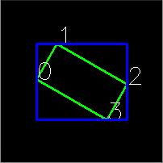

## Rotated Rectangle Data Type

:notebook_with_decorative_cover: The <a href = "https://docs.opencv.org/4.8.0/db/dd6/classcv_1_1RotatedRect.html">cv::RotatedRect</a> class is one of the few classes in the C++ OpenCV interface that is not a template underneath

:notebook_with_decorative_cover: **cv::RotatedRect** represents rotated (i.e. not up-right) rectangular objects that are located relative to their 'center', unlike **cv::Rect**, which represents rectangular objects relative to their upper-left corner 

:notebook_with_decorative_cover: **cv::RotatedRect** uses 3 values to represent rectangular objects:
1. `center` - a **cv::Point2f** data type
2. `size`   - a **cv::Size2f** data type
3. `angle`  - a **float** data type which represents the rotation angle of the rectangle in a clockwise direction 

### Create RotatedRect data objects

1. Use the default constructor where OpenCV will supply all the values, which will all be zero's.
2. Use a value constructor where the user supplies the centre coordinates of the rectangle, its size and angle. This has the syntax: `cv::RotatedRect(const Point2f &center, const Size2f &size, float angle)`
3. Use a copy constructor to copy values from an existing RotatedRect object to a new one.

**Example 1**
```c++
#include "opencv2/core.hpp"
#include <iostream>

int main()
{


    //                              Instantiating cv::RotatedRect Objects
    //                              =====================================

    // 1. Use the default constructor
    const cv::RotatedRect rr {}; // all values will be zeros

    // 2. Use a value constructor
    //    It has the syntax -> cv::RotatedRect(const Point2f &center, const Size2f &size, float angle)	
    const cv::Point2f centre { 100.08, 125.56 }; // centre of rectangle
    const cv::Size2f  size { 200.00, 180.00 };   // width and height of rectangle
    const float angle { 45.00 };                 // clockwise angle

    const cv::RotatedRect rr1 { centre, size, angle };
    
    // 3. Use a copy constructor
    const cv::RotatedRect rr3(rr1);

    return 0;

}
```

### Printing cv::RotatedRect objects

:notebook_with_decorative_cover: You cannot use C++ `std::cout` function to print **cv::RotatedRect** objects like what we do with **cv::Rect** or **cv::Point**. As such if **rr1** is a **cv::RotatedRect** object then the statement `std::cout << rr1;` will result in an error from your compiler.

:notebook_with_decorative_cover: The best way is to print the rotated rectangle's data members - which we do in the following section on **Member Access**.

### Member Access

:notebook_with_decorative_cover: We can access the **centre**, **size** and **angle** of rotation of a 
**cv::RotatedRect** through the same named data members as follows:

**Example 2**
```c++
#include "opencv2/core.hpp"
#include <iostream>

int main()
{


    //                              Instantiating cv::RotatedRect Objects
    //                              =====================================

    // 1. Use the default constructor
    const cv::RotatedRect rr {}; // all values will be zeros

    // 2. Use a value constructor
    //    It has the syntax -> cv::RotatedRect(const Point2f &center, const Size2f &size, float angle)	
    const cv::Point2f centre { 100.08, 125.56 }; // centre of rectangle
    const cv::Size2f  size { 200.00, 180.00 };   // width and height of rectangle
    const float angle { 45.00 };                 // clockwise angle

    const cv::RotatedRect rr1 { centre, size, angle };
    
    // 3. Use a copy constructor
    const cv::RotatedRect rr3(rr1);

    std::cout << "\nRotated Rectangle rr: "
              << "\n\tCentre: " << rr.center
              << "\n\tSize: "   << rr.size
              << "\n\tAngle: "  << rr.angle 
              << '\n';
    
    std::cout << "\nRotated Rectangle rr1: "
              << "\n\tCentre: " << rr1.center
              << "\n\tSize: "   << rr1.size
              << "\n\tAngle: "  << rr1.angle 
              << '\n';
    
    std::cout << "\nRotated Rectangle rr3: "
              << "\n\tCentre: " << rr3.center
              << "\n\tSize: "   << rr3.size
              << "\n\tAngle: "  << rr3.angle 
              << '\n';

    return 0;

}
```

**Output**

    Rotated Rectangle rr: 
            Centre: [0, 0]
            Size: [0 x 0]
            Angle: 0

    Rotated Rectangle rr1: 
            Centre: [100.08, 125.56]
            Size: [200 x 180]
            Angle: 45

    Rotated Rectangle rr3: 
            Centre: [100.08, 125.56]
            Size: [200 x 180]
            Angle: 45

### Member Functions

:notebook_with_decorative_cover: There are very few member functions that are associated with **cv::RotatedRect**. We will use the following image as an example to explain the member functions. In <a href = "https://docs.opencv.org/4.8.0/db/dd6/classcv_1_1RotatedRect.html">Figure 1</a>, the rotated rectangle is in green and the vertices are numbered 0 - 3. 

<p align ="center"><b>Figure 1:</b> Rotated rectangle</p>

<p align ="center">
        
</p>


1. `void cv::RotatedRect::points(cv::Point2f pts[]) const` - returns the coordinates of the 4 vertices of the rotated rectangle. The parameter `pts[]` is a C-style array for storing the vertices. The order of vertices returned is *bottomLeft* (0), *topLeft* (1), *topRight* (2) and *bottomRight* (3). Note that if you rotate the cv::RotatedRect 180 degrees then the *bottomLeft* point will be located at the top right corner of the rectangle.
2. `void cv::RotatedRect::points(std::vector<cv::Point2f>& pts) const` - this is an overloaded function that does the same as the function above. However, it stores the vertices in a std::vector. **You are encouraged to use this function**.
3. `cv::Rect cv::RotatedRect::boundingRect() const` - returns the minimal up-right **integer** rectangle containing the rotated rectangle. This minimal cv::Rect is the blue rectangle in Figure 1.
4. `cv::Rect_<float> cv::RotatedRect::boundingRect2f() const` - returns the minimal (exact) **floating point** rectangle containing the rotated rectangle, not intended for use with images. 

**Example 3**
```c++
#include "opencv2/core.hpp"
#include <iostream>

int main()
{


    // Use a value constructor to create a Rotated Rectangle
    cv::Point2f centre { 100.08, 125.56 }; // centre of rectangle
    cv::Size2f  size { 200.00, 180.00 };   // width and height of rectangle
    float angle { 45.00 };                 // clockwise angle

    cv::RotatedRect rr1 { centre, size, angle };


    //                              Member functions
    //                              ================

    // 1a. Return the rotated rectangle vertices in a C-style array
    cv::Point2f vertices_array[4]; // array to store 4 coordinate pairs
    
    rr1.points(vertices_array);  // store vertices coordinates into an array
    
    std::cout << "Rotated rectangle rr1 vertices have the following coordinates: " 
              << "\n\tBottom left corner: " << vertices_array[0] 
              << "\n\tTop left corner: " << vertices_array[1] 
              << "\n\tTop right corner: " << vertices_array[2] 
              << "\n\tBottom right corner: " << vertices_array[3] 
              << '\n';
    

    std::cout << '\n';

    // 1b. Return the rotated rectangle vertices in a std::vector
    std::vector<cv::Point2f> vertices_vector; // vector to store our 4 coordinate pairs

    rr1.points(vertices_vector); // store vertices coordinates into a std::vector container

    std::cout << "Rotated rectangle rr1 vertices have the following coordinates: " 
              << "\n\tBottom left corner: " << vertices_vector[0] 
              << "\n\tTop left corner: " << vertices_vector[1] 
              << "\n\tTop right corner: " << vertices_vector[2] 
              << "\n\tBottom right corner: " << vertices_vector[3] 
              << '\n';

    std::cout << '\n';

    // 2. Return the minimal up-right rectangle containing the rotated rectangle. 
    //    Values are returned as 'integers'
    const auto up_right_rectangle_integer = rr1.boundingRect();
    std::cout << "\nRotated rectangle rr1 is bounded by the up-right integer rectangle: " 
              << up_right_rectangle_integer << '\n';

    // 3. Return the minimal up-right rectangle containing the rotated rectangle. 
    //    Values are of type 'float'. 
    //    This memeber function is not intended for use with images
    const auto up_right_rectangle_float = rr1.boundingRect2f();
    std::cout << "\nRotated rectangle rr1 is bounded by the up-right float rectangle: " 
              << up_right_rectangle_float << '\n';

    std::cout << '\n';

    return 0;

}    
```

**Output**

    Rotated rectangle rr1 vertices have the following coordinates: 
            Bottom left corner: [-34.2703, 118.489]
            Top left corner: [93.0089, -8.79028]
            Top right corner: [234.43, 132.631]
            Bottom right corner: [107.151, 259.91]

    Rotated rectangle rr1 vertices have the following coordinates: 
            Bottom left corner: [-34.2703, 118.489]
            Top left corner: [93.0089, -8.79028]
            Top right corner: [234.43, 132.631]
            Bottom right corner: [107.151, 259.91]


    Rotated rectangle rr1 is bounded by the up-right integer rectangle: [271 x 270 from (-35, -9)]

    Rotated rectangle rr1 is bounded by the up-right float rectangle: [268.701 x 268.701 from (-34.2703, -8.79028)]
