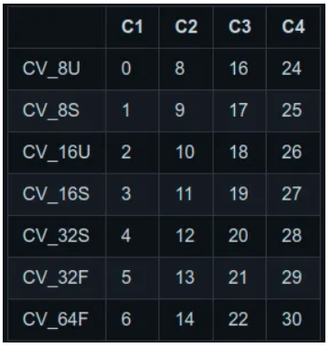
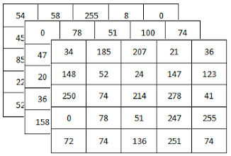
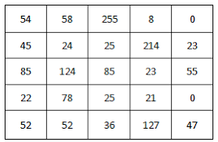

## The cv::Mat Class and N-Dimensional Arrays

:notebook_with_decorative_cover: So far we have looked at OpenCV core types (cv::Point, cv::Scalar, cv::Vec, cv::Matx, cv::Size etc) that are optimized for use with only a few values. When it comes to storing large arrays we need a more suitable data structure, and that is **cv::Mat**. 

:notebook_with_decorative_cover: The <a href = "https://docs.opencv.org/4.8.0/d3/d63/classcv_1_1Mat.html">cv::Mat</a> class represents an n-dimensional dense numerical array. In this context, **dense** means that for every entry in the array, there is a data value stored in memory corresponding to that entry, even if that entry is zero. As we dive deeper into cv::Mat you will learn that this class can be used to represent `1, 2, 3, ...N` dimensional data structures. These multi-dimensional large data structures can be either single-channel (e.g. 100 x 100 matrix) or multi-channel (e.g. an image whose width is 500 pixels and height is 500 pixels and has 3 color channels red, green and blue).

:notebook_with_decorative_cover: **cv::Mat** is actually a base class from which <a href = "https://docs.opencv.org/4.8.0/df/dfc/classcv_1_1Mat__.html">cv::Mat_<\_Tp></a> template classes can be derived from. Here **\_Tp** is the data type, which can be double, float, uchar etc. You can use cv::Mat or if you want to be more specific use the template definition cv::Mat_<\_Tp>.

:notebook_with_decorative_cover: In a one-dimensional array, the elements are stored in sequential order.

:notebook_with_decorative_cover: In a two-dimensional array, the data is organized into rows, and each row appears one after the other in memory. You will mostly deal with 2-D arrays in OpenCV. The 2-D arrays will with very few exceptions have either 1 channel (e.g. grayscale images) or 3 channels (e.g. color images). When laid out in memory, the rows of multichannel arrays may not be absolutely sequential; there may be small gaps that buffer each row before the next. This padding or gaps will always occur at the end of full rows. 

:notebook_with_decorative_cover: For three-dimensional arrays, the data is stored as planes, each plane is filled out row by row, and then the planes are packed one after the other.

## Crucial information about cv::Mat

:notebook_with_decorative_cover: **cv::Mat** is basically a class with two data parts: 
1. the **matrix header** (containing information such as the size of the matrix/array, the method used for storing, at which address is the matrix stored, and so on) and, 
2. a **pointer to the matrix** containing the pixel values (taking any dimensionality depending on the method chosen for storing) . The matrix header size is constant, however the size of the matrix itself may vary from array to array and usually is larger by orders of magnitude.

:notebook_with_decorative_cover: You have to remember that **OpenCV** is an image processing library. It contains a large collection of image processing functions. To solve a computational challenge, most of the time you will end up using multiple functions of the library. Because of this, passing images to functions is a common practice. We should not forget that we are talking about image processing algorithms, which tend to be quite computational heavy. The last thing you want to do is further decrease the speed of your program by making unnecessary copies of potentially large images.

:notebook_with_decorative_cover: To tackle this issue OpenCV uses a **reference counting system**. The idea is that each **cv::Mat** object has its own header, however a matrix may be shared between two **cv::Mat** objects by having their matrix pointers point to the same address. Moreover, the copy operators in OpenCV will only copy the headers and the pointer to the large matrix, not the data itself.

:notebook_with_decorative_cover: Now you may ask – if the matrix itself may belong to multiple **cv::Mat** objects, who takes responsibility for cleaning it up when it's no longer needed? The short answer is: the last object that used it. This is handled by using a **reference counting mechanism**. Whenever somebody copies a header of a **cv::Mat** object, a counter is increased for the matrix. Whenever a header is cleaned, this counter is decreased. When the counter reaches zero the matrix is freed from memory. 

### cv::Mat Data Types

:notebook_with_decorative_cover: When you create a **cv::Mat** object you have to specify:

1. The number of bits occupied by each array element. This can be 8, 16, 32 or 64-bit. 
2. The fundamental data type of the array elements. This is represented by a single uppercase letter, **U** (unsigned integer), **S** (signed integer) and **F** (float). There is no letter for type double, and decimal values should use type float. 
3. The number of channels the array has. These mainly range from 1 to 4. 

:notebook_with_decorative_cover: All this information is put together using the syntax: **CV_{8, 16, 32, 64}{U, S, F}C{1, 2, 3, 4}**. For example `CV_32FC3` would imply a **32-bit floating-point three-channel array**. If you are dealing with arrays that have 1 channel, you can leave out the last bit with **C{1, 2, 3}**. For example **CV_8U** would imply an array whose values are 8-bit unsigned integers (i.e. range of 0 to 255). You will start to include the number of channels in your data type when dealing with image data.

:notebook_with_decorative_cover: Let's have a detailed look at what the data types actually mean:
1. **8U** - 8-bit unsigned integers with range (0 to 255)
2. **8S** - 8-bit signed integers with range (-127 to 128)
3. **16S** - 16-bit signed integers with range (-32,768 to 32,767)
4. **16U** - 16-bit unsigned integers with range (0 to 65,535)
5. **32S** - 32-bit signed integers with range (-2,147,483,648 to 2,147,483,647)
6. **32F** - 32-bit decimal values of type float with range (-3.40282347E+38 to 3.40282347E+38)
7. **64F** - 64-bit decimal values of type float with range (-1.797693134862315E+308 to 1.797693134862315E+308)

:notebook_with_decorative_cover: cv::Mat data types are actually stored as integer types within OpenCV. You will notice this if you look at the constructors for cv::Mat objects as the data type for **type** is **int**, short for integer. <a href = "https://medium.com/@nullbyte.in/part-2-exploring-the-data-types-in-opencv4-a-comprehensive-guide-49272f4a775">Figure 1</a> can help you identify which integer value represents which data type.


<p align ="center"><b>Figure 1:</b> OpenCV data types</p>

<p align ="center">
        
</p>


:notebook_with_decorative_cover: Using Figure 1, **CV_32F** or **CV_32FC1** is represented by the integer value **5**, **CV_8UC3** is represented by the integer value **16**, **CV_8U** or **CV_8UC1** is represented by the integer value **0**. This means if you were to ask OpenCV what data type is held by a cv::Mat object using a function like `type()`, OpenCV will return the integer value and it will be up to you to know the full description of the data type. The problem with these integer values is they are not descriptive and do not give you a full picture of a cv::Mat objects data type hence they are not used that often unless you offer a full explanation. In addition, there are too many integer values to remember. To help, I have created a function with the signature (`std::string_view openCVDescriptiveDataType(int value)`) that I can use to find out the full description of a data type given its integer value equivalent. This function has been added to a header and source files with the names **utility_functions.h** and **utility_functions.cpp**. As we go along our journey, we will add more utility functions or classes to these files. At the end we can build a library that can be used with any other computer vision project. Check the **include** and **src** folders for these files.


### Creating cv::Mat objects

:notebook_with_decorative_cover: The cv::Mat class has several constructors that allow for a variety of ways to create an array. These constructors fall into a number of categories:
1. Default constructor
2. Constructors that take the shape of an array, its data type and initialization values.
3. Constructors that copy data from other data containers such as std::vector, std::array, cv::Vec, cv::Matx, cv::Point etc.
4. Constructors for creating *n*-dimensional arrays (n > 2) and require you to specify the number of dimensions and pass in an array of integers specifying the size of each of the dimensions.

**N.B:** The following examples have small values for the rows and columns for illustration purposes only. In future examples involving images, your **cv::Mat** objects will contain rows and columns in their hundreds or even thousands hence **large dense arrays**.

**Example 1**: Create 2-D cv::Mat objects using default contructors. Using default constructors is usually accompanied by two other functions that help you to allocate memory for your cv::Mat object as well as fill it with data values other than `0` values.

1. The function `create()` - allocates array data so it matches number of rows, columns and data type of cv::Mat array. It is an overloaded function with the following definitions:
    * `void create(int rows, int cols, int type)` - `rows` is the number of rows of the array, `cols` is the number of columns and `type` is the data type of array elements e.g. `CV_8UC1` or use the integer equivalent value `0`.
    * `void create(cv::Size size, int type)` - rows and columns are provided as cv::Size object e.g. `cv::Size(cols, rows)`. Don't get confused here, remember a cv::Size contains width & height - for 2D arrays, width is represented by the number of columns and height by the number of rows.
    * `void create(const std::vector<int>& sizes, int type)` - rows and columns are provided as std::vector values e.g. `const std::vector<int> v {rows, cols};`
    * `void create(int ndims, const int* sizes, int type)` - `ndims` is the array dimensionality, `sizes` is a C-style array of integers specifying array shape e.g. `const int sizes[] {rows, cols}`.
2. `cv::Mat& setTo(cv::InputArray value, cv::InputArray mask = cv::noArray())` - This functions sets all or some of the array elements to the specified `value`. Because you can only set array elements to one value, this limits the use of this function. `mask` defines a region of interest - which we will start to deal with when dealing with actual images. For now, use the default value provided. The data type `cv::InputArray` is an aliase for all OpenCV data types that can be used to provide input data to a function e.g. cv::Scalar, cv::Point, cv::Size, cv::Vec etc. It also includes std::vector for some functions. We will discuss this aliase and others in a seperate topic and you will see how special it is.

```c++
#include "opencv2/core.hpp"
#include <iostream>
#include <vector>

int main()
{
    //                                 Use Default Constructor
    //                                 =======================

    // Use a default constructor to create a cv::Mat arrays
    cv::Mat default_m;
    cv::Mat default_m1;
    cv::Mat default_m2;
    cv::Mat default_m3;                  

    //    You can then use the functions create() & setTo() 
    //    to assign size, data and data type

    // 1. Use the function 'void create(int rows, int cols, int type)'

    // Create 2D array that has 3 rows and 10 columns. 
    // The array has 1 Channel
    // Primitive data type is 32-bit floats
    default_m.create(3, 10, CV_32F);    

    // We will use cv::Scalar to set all the values in the array to 1.5
    default_m.setTo(cv::Scalar(1.5f));

    std::cout << "\ncv::Mat array that has 3 rows and 10 columns. " 
              << "\nPrimitive data type is 32-bit floats. " 
              << "\nAll values have been set to 1.5 = \n" << default_m << '\n';

    // 2. Use the function 'void create(cv::Size size, int type)'

    // Create 2D array that has 5 rows and 6 columns. 
    // The array has 1 Channel
    // Primitive data type is 8-bit unsigned
    default_m1.create(cv::Size(6, 5), CV_8U);
    default_m1.setTo(cv::Scalar(10)); // All values are set to '10'
    std::cout << "\ncv::Mat array that has 5 rows and 6 columns. " 
              << "\nPrimitive data type is 8-bit unsigned integers. " 
              << "\nAll values have been set to 10 = \n" << default_m1 << '\n';

    // 3. Use the function 'void create(const std::vector<int>& sizes, int type)'

    // Create 2D array that has 2 rows and 12 columns. 
    // The array has 1 Channel
    // Primitive data type is 64-bit floats
    const std::vector<int> shape {2, 12};
    default_m2.create(shape, CV_64F);
    default_m2.setTo(cv::Scalar(0.05)); // All values are set to '0.05'
    std::cout << "\ncv::Mat array that has 2 rows and 12 columns. " 
              << "\nPrimitive data type is 64-bit floats. " 
              << "\nAll values have been set to 0.05 = \n" << default_m2 << '\n';

    // 4. Use the function 'void create(int ndims, const int* sizes, int type)'
    // Create 2D array that has 3 rows and 4 columns. 
    // The array has 1 Channel
    // Primitive data type is 16-bit signed
    const int ndims {2};
    const int sizes[] {3, 4};
    default_m3.create(ndims, sizes, CV_16S);
    default_m3.setTo(cv::Scalar(12)); // All values set to `12`
    std::cout << "\ncv::Mat array that has 3 rows and 4 columns. " 
              << "\nPrimitive data type is 16-bit signed integers. " 
              << "\nAll values have been set to 12 = \n" << default_m3 << '\n';

    return 0;
}
```

**Output**

    cv::Mat array that has 3 rows and 10 columns. 
    Primitive data type is 32-bit floats. 
    All values have been set to 1.5 = 
    [1.5, 1.5, 1.5, 1.5, 1.5, 1.5, 1.5, 1.5, 1.5, 1.5;
    1.5, 1.5, 1.5, 1.5, 1.5, 1.5, 1.5, 1.5, 1.5, 1.5;
    1.5, 1.5, 1.5, 1.5, 1.5, 1.5, 1.5, 1.5, 1.5, 1.5]

    cv::Mat array that has 5 rows and 6 columns. 
    Primitive data type is 8-bit unsigned integers. 
    All values have been set to 10 = 
    [ 10,  10,  10,  10,  10,  10;
    10,  10,  10,  10,  10,  10;
    10,  10,  10,  10,  10,  10;
    10,  10,  10,  10,  10,  10;
    10,  10,  10,  10,  10,  10]

    cv::Mat array that has 2 rows and 12 columns. 
    Primitive data type is 64-bit floats. 
    All values have been set to 0.05 = 
    [0.05, 0.05, 0.05, 0.05, 0.05, 0.05, 0.05, 0.05, 0.05, 0.05, 0.05, 0.05;
    0.05, 0.05, 0.05, 0.05, 0.05, 0.05, 0.05, 0.05, 0.05, 0.05, 0.05, 0.05]

    cv::Mat array that has 3 rows and 4 columns. 
    Primitive data type is 16-bit signed integers. 
    All values have been set to 12 = 
    [12, 12, 12, 12;
    12, 12, 12, 12;
    12, 12, 12, 12]

**Example 2**: Create 2-D cv::Mat objects by supplying size of array, data type and initialization values

```c++
#include "opencv2/core.hpp"
#include <iostream>
#include <vector>

int main()
{
    //                             Use Constructors that accept array size, data type and initialization values
    //                             ============================================================================

    // 1. Use the constructor cv::Mat(int rows, int cols, int type, const cv::Scalar& s) 
    //    Array will have 2 rows and 3 columns. 
    //    Data type is 8-bit unsigned integers (0 - 255)
    //    All values have been set to 15
    const int rows = 2;
    const int cols = 3;        
    const cv::Mat m1 {rows, cols, CV_8U, cv::Scalar(15)}; 
    std::cout << "\ncv::Mat array that has 2 rows and 3 columns. " 
              << "\nData type is 8-bit unsigned integers " 
              << "\nAll values have been set to 15 = \n" 
              << m1 << '\n';

    
    // 2. Use the constructor cv::Mat(cv::Size size, int type, const cv::Scalar& s)
    const cv::Size s {10, 3}; // This sets columns = 10 & rows = 3
    const cv::Mat  m2 {s, CV_32F, cv::Scalar(2.5f)};
    std::cout << "\ncv::Mat array with 3 rows and 10 columns "
              << "\nData type is 32-bit float " 
              << "\nAll values set to 2.5 = \n" 
              << m2 << '\n';

    // 3. Use the constructor cv::Mat(int ndims, const int* sizes, int type, const cv::Scalar& s)
    //    Create 2D array that has 3 rows and 4 columns. 
    //    The array has 1 Channel
    //    Primitive data type is 16-bit signed
    const int no_dims {2};
    const int array_size[] {3, 4};
    const cv::Mat m3 {no_dims, array_size, CV_16S, cv::Scalar(16)};
    std::cout << "\ncv::Mat array that has 3 rows and 4 columns. " 
              << "\nPrimitive data type is 16-bit signed integers. " 
              << "\nAll values have been set to 16 = \n" << m3 << '\n';

    // 4. Use the constructor cv::Mat(const std::vector<int>& sizes, int type, const cv::Scalar& s)
    const std::vector<int> array_shape {2, 12};
    const cv::Mat m4 {array_shape, CV_64F, cv::Scalar(3.14)};
    std::cout << "\ncv::Mat array that has 2 rows and 12 columns. " 
              << "\nPrimitive data type is 64-bit floats. " 
              << "\nAll values have been set to 3.14 = \n" << m4 << '\n';


    return 0;
}
```

**Output**

    cv::Mat array that has 2 rows and 3 columns. 
    Data type is 8-bit unsigned integers 
    All values have been set to 15 = 
    [ 15,  15,  15;
    15,  15,  15]

    cv::Mat array with 3 rows and 10 columns 
    Data type is 32-bit float 
    All values set to 2.5 = 
    [2.5, 2.5, 2.5, 2.5, 2.5, 2.5, 2.5, 2.5, 2.5, 2.5;
    2.5, 2.5, 2.5, 2.5, 2.5, 2.5, 2.5, 2.5, 2.5, 2.5;
    2.5, 2.5, 2.5, 2.5, 2.5, 2.5, 2.5, 2.5, 2.5, 2.5]

    cv::Mat array that has 3 rows and 4 columns. 
    Primitive data type is 16-bit signed integers. 
    All values have been set to 16 = 
    [16, 16, 16, 16;
    16, 16, 16, 16;
    16, 16, 16, 16]

    cv::Mat array that has 2 rows and 12 columns. 
    Primitive data type is 64-bit floats. 
    All values have been set to 3.14 = 
    [3.14, 3.14, 3.14, 3.14, 3.14, 3.14, 3.14, 3.14, 3.14, 3.14, 3.14, 3.14;
    3.14, 3.14, 3.14, 3.14, 3.14, 3.14, 3.14, 3.14, 3.14, 3.14, 3.14, 3.14]

**Example 3**: Create 2-D cv::Mat objects from pre-existing data. Here we have two types of constructors:

1. Constructors that do not copy or allocate the actual pre-existing data. Instead, they just initialize the cv::Mat object header with a **pointer**  that points to the source data. This makes them very efficient and can be used to process external data using OpenCV functions. The external data is not automatically deallocated, so you should take care of it. One of the most widely used source of such data is a 1-dimensional C-style array - which decays to a pointer when passed to a function. If creating a 2D cv::Mat arrays you need to make sure the number of elements in your pre-existing dataset can be converted to a 2-D array you want to create e.g. 8 elements can be converted to a (4 x 2) array, (2 x 4) array, (1 x 8) array etc. These constructors are as follows: 

   * `cv::Mat(int rows, int cols, int type, void* data, std::size_t step= cv::AUTO_STEP)` - The function parameters `rows`, `cols` and `type` all mean the same as in previous constructors above. The parameter `data` is a pointer to the source data. The parameter `step` is the number of bytes each matrix row occupies. The value should include the padding bytes at the end of each row, if any. *Remember we have already mentioned that in memory some high dimensional arrays are stored one row after another and sometimes the rows are seperated by a padding.* If the parameter is missing (set to AUTO_STEP), no padding is assumed and the actual step value is calculated as `cols*elemSize()`. In most cases you leave this with the default value.
   * `cv::Mat(cv::Size size, int type, void* data, std::size_t = cv::AUTO_STEP)`
   * `cv::Mat(int ndims, const int* sizes, int type, void* data, const std::size_t* steps = 0)` 
   * `cv::Mat(const std::vector<int>& sizes, int type, void* data, const std::size_t* steps = 0)`

**N:B** - Be careful when dealing with integers. Most people when declaring an integer value use the reserved word `int` e.g. `int number {34}`. However, you have to take into account the number of bits used to represent that value in memory. `int` uses a minimum of 16-bits up to 64-bits for `long long int`. When it comes to OpenCV, you will later realize that a lot of images use 8-bit unsigned or signed integers and to declare such types in basic C++ use `std::uint8_t` or `std::int8_t`, respectively. These wil match up with the OpenCV types `CV_8U` and `CV_8S`.

**Example 3a** 

```c++
#include "opencv2/core.hpp"
#include <iostream>
#include <vector>

int main()
{
    // Create a 1-D C-style arrays with 16 elements. 
    float data_float[] {1, 2, 3, 4, 5, 6, 7, 8, 9, 10, 
                          11, 12, 13, 14, 15, 16
                         }; 
    double data_double[] {0.01, 0.02, 0.03, 0.04, 0.05, 
                            0.06, 0.07, 0.08, 0.09, 0.10, 
                            0.11, 0.12, 0.13, 0.14, 0.15, 0.16
                           };

    // Array with 8-bit unsigned values with range (0 to 255)
    std::uint8_t data_eight_bit_unsigned[] {10, 20, 30, 40, 50, 
                                            60, 70, 80, 90, 100, 
                                            110, 120, 130, 140, 150, 160 
                                           };

    // Array with 8-bit signed values with range (-128 to 127)
    std::int8_t data_eight_bit_signed[] {-10, -20, -30, -40, -50, -60, 
                                         -70, -80, 0, 10, 20, 30, 40, 
                                         50, 60, 70,
                                        };

    // 1. cv::Mat(int rows, int cols, int type, void* data, 
    //            std::size_t step= cv::AUTO_STEP)
    const cv::Mat m5 { 2, 8, CV_32F, data_float }; // create a 2 x 8 array
    std::cout << "\ncv::Mat array with 2 rows and 8 columns. "
              << "\nData type is 32-bit float " 
              << "\nPre-existing data is from a C-style array = \n"
              << m5 << '\n';

    // 2. cv::Mat(cv::Size size, int type, void* data, 
    //            std::size_t = cv::AUTO_STEP) 
    // create a 4 x 4 array
    const cv::Mat m6 { cv::Size(4, 4), CV_64F, data_double }; 
    std::cout << "\ncv::Mat array with 4 rows and 4 columns. "
              << "\nData type is 64-bit float " 
              << "\nPre-existing data is from a C-style array = \n"
              << m6 << '\n';

    // 3. cv::Mat(int ndims, const int* sizes, int type, 
    //            void* data, const std::size_t* steps = 0)
    const int ndims_m7 {2};
    const int sizes_m7[] {8, 2};
    // create a 8 x 2 array
    const cv::Mat m7 {ndims_m7, sizes_m7, CV_8U, data_eight_bit_unsigned}; 
    std::cout << "\ncv::Mat array with 8 rows and 2 columns. "
              << "\nData type is 8-bit unsigned integer" 
              << "\nPre-existing data is from a C-style array = \n"
              << m7 << '\n';
    
    // 4. cv::Mat(const std::vector<int>& sizes, int type, 
    //            void* data, const std::size_t* steps = 0)
    const std::vector<int> sizes_m8 {1, 16};
    // create a 1 x 16 array
    const cv::Mat m8 {sizes_m8, CV_8S, data_eight_bit_signed};  
    std::cout << "\ncv::Mat array with 1 row and 16 columns. "
              << "\nData type is 8-bit signed integer" 
              << "\nPre-existing data is from a C-style array = \n"
              << m8 << '\n';

    std::cout << '\n';

    return 0;
}
```

**Output**

    cv::Mat array with 2 rows and 8 columns. 
    Data type is 32-bit float 
    Pre-existing data is from a C-style array = 
    [1, 2, 3, 4, 5, 6, 7, 8;
    9, 10, 11, 12, 13, 14, 15, 16]

    cv::Mat array with 4 rows and 4 columns. 
    Data type is 64-bit float 
    Pre-existing data is from a C-style array = 
    [0.01, 0.02, 0.03, 0.04;
    0.05, 0.06, 0.07000000000000001, 0.08;
    0.09, 0.1, 0.11, 0.12;
    0.13, 0.14, 0.15, 0.16]

    cv::Mat array with 8 rows and 2 columns. 
    Data type is 8-bit unsigned integer
    Pre-existing data is from a C-style array = 
    [ 10,  20;
    30,  40;
    50,  60;
    70,  80;
    90, 100;
    110, 120;
    130, 140;
    150, 160]

    cv::Mat array with 1 row and 16 columns. 
    Data type is 8-bit signed integer
    Pre-existing data is from a C-style array = 
    [-10, -20, -30, -40, -50, -60, -70, -80,   
    0,  10,  20,  30,  40,  50,  60,  70]

2. Constructors that allow you to copy or share the source data. The data is stored in other OpenCV types (cv::Matx, cv::Vec) and C++ containers such as std::vector and std::array. These constructors accept the templated forms of the source containers as you will see in their definitions. Examples will show you how to easily use them. Although the following constructors allow you to copy the source data - only do so if the source data is going to be de-allocated, otherwise share the data. This is because with cv::Mat objects you are dealing with large data that consumes a lot of memory - the last thing you want is to make unnecessary copies of such data.

    * `cv::Mat(const std::vector<T>& vec, bool copyData = False)` - The parameter `vec` is the C++ STL vector whose elements will be used to form a 1-column cv::Mat array. The `copyData`	parameter is used to specify whether the underlying data of the STL vector should be copied to (`copyData = true`) or shared with (`copyData = False`) the newly constructed cv::Mat array. When the data is **copied**, the allocated buffer is managed using cv::Mat reference counting mechanism (which we have discussed in section **Crucial information about cv::Mat** above). While the data is **shared**, the reference counter is NULL, and you should not deallocate the data until the cv::Mat array/matrix is destructed. 
    * `cv::Mat(const std::array<T, n>& arr, bool copyData = False)` - `arr` is a 1-dimensional std::array object. This function creates a 1-column cv::Mat object.
    * `cv::Mat(const cv::Vec<T, n>& vec, bool copyData = true)` - `vec` is a 1-column matrix. This function creates a 1-column cv::Mat object.
    * `cv::Mat(const cv::Matx<T, m, n>& mtx, bool copyData = true)` - `mtx` is a 2D matrix with `m` rows and `n` columns. This function creates a cv::Mat object with `m` rows and `n` columns.
    * `cv::Mat(const cv::Point_<T>& pt, bool copyData = true)` - `pt` is a cv::Point object with 2 values. This function creates a 1-column cv::Mat object.
    * `cv::Mat(const cv::Point3_<T>& pt, bool copyData = true)` - `pt` is a cv::Point object with 3 values. This function creates a 1-column cv::Mat object.

**Example 3b**

```c++
#include "opencv2/core.hpp"
#include <iostream>
#include <array>
#include <vector>

int main()
{
    // 1. cv::Mat(const std::vector<T>& vec, bool copyData = False)
    const std::vector<float> vector_data_float {1, 2, 3, 4, 5, 6, 7, 8, 9, 10, 
                                                11, 12, 13, 14, 15, 16
                                               }; 
    const cv::Mat m9 {vector_data_float};
    std::cout << "\ncv::Mat array with 16 rows and 1 column. "
              << "\nData type is 32-bit float (CV_32F)" 
              << "\nPre-existing data is from a std::vector = \n"
              << m9 << '\n';
    
    // 2. cv::Mat(const cv::Vec<T, n>& vec, bool copyData = true)
    const cv::Vec<double, 16> vec_data_double {0.01, 0.02, 0.03, 0.04, 0.05, 
                            0.06, 0.07, 0.08, 0.09, 0.10, 
                            0.11, 0.12, 0.13, 0.14, 0.15, 0.16
                           };
    bool copy_vec_data {false}; // We do not want to copy any data
    const cv::Mat m10 {vec_data_double, copy_vec_data};
    std::cout << "\ncv::Mat array with 16 rows and 1 column. "
              << "\nData type is 64-bit float (CV_64F)" 
              << "\nPre-existing data is from a cv::Vec = \n"
              << m10 << '\n';

    // 3. cv::Mat(const std::array<T, n>& arr, bool copyData = False)
    // Array with 8-bit unsigned values with range (0 to 255)
    const std::array<std::uint8_t, 16> array_data_eight_bit_unsigned {10, 20, 30, 40, 50, 
                                            60, 70, 80, 90, 100, 
                                            110, 120, 130, 140, 150, 160 
                                           };
    const cv::Mat m11 {array_data_eight_bit_unsigned};
    std::cout << "\ncv::Mat array with 16 rows and 1 column. "
              << "\nData type is 8-bit unsigned integer (CV_8U)" 
              << "\nPre-existing data is from a std::array = \n"
              << m11 << '\n';

    // 4. cv::Mat(const cv::Matx<T, m, n>& mtx, bool copyData = true)
    // Array with 8-bit signed values with range (-128 to 127)
    const cv::Matx<std::int8_t, 4, 4> matx_data_eight_bit_signed {-10, -20, -30, -40, -50, -60, 
                                         -70, -80, 0, 10, 20, 30, 40, 
                                         50, 60, 70,
                                        };
    bool copy_matx_data {false}; // We do not want to copy data
    const cv::Mat m12 {matx_data_eight_bit_signed, copy_matx_data};
    std::cout << "\ncv::Mat array with 4 rows and 4 columns. "
              << "\nData type is 8-bit signed integer (CV_8S)" 
              << "\nPre-existing data is from a cv::Matx = \n"
              << m12 << '\n';

    // 5. cv::Mat(const cv::Point_<T>& pt, bool copyData = true)
    const cv::Point2d pt {0.0039, 9.8765};
    bool copy_point_data {false};
    const cv::Mat m13 {pt, copy_point_data};
    std::cout << "\ncv::Mat array with 2 rows and 1 column. "
              << "\nData type is 64-bit float (CV_64F)" 
              << "\nPre-existing data is from a cv::Point = \n"
              << m13 << '\n';   

    std::cout << '\n';

    return 0;
}
```

**Output**

    cv::Mat array with 16 rows and 1 column. 
    Data type is 32-bit float (CV_32F)
    Pre-existing data is from a std::vector = 
    [1;
    2;
    3;
    4;
    5;
    6;
    7;
    8;
    9;
    10;
    11;
    12;
    13;
    14;
    15;
    16]

    cv::Mat array with 16 rows and 1 column. 
    Data type is 64-bit float (CV_64F)
    Pre-existing data is from a cv::Vec = 
    [0.01;
    0.02;
    0.03;
    0.04;
    0.05;
    0.06;
    0.07000000000000001;
    0.08;
    0.09;
    0.1;
    0.11;
    0.12;
    0.13;
    0.14;
    0.15;
    0.16]

    cv::Mat array with 16 rows and 1 column. 
    Data type is 8-bit unsigned integer (CV_8U)
    Pre-existing data is from a std::array = 
    [ 10;
    20;
    30;
    40;
    50;
    60;
    70;
    80;
    90;
    100;
    110;
    120;
    130;
    140;
    150;
    160]

    cv::Mat array with 4 rows and 4 columns. 
    Data type is 8-bit signed integer (CV_8S)
    Pre-existing data is from a cv::Matx = 
    [-10, -20, -30, -40;
    -50, -60, -70, -80;
    0,  10,  20,  30;
    40,  50,  60,  70]

    cv::Mat array with 2 rows and 1 column. 
    Data type is 64-bit float (CV_64F)
    Pre-existing data is from a cv::Point = 
    [0.0039;
    9.8765]


### Using Static functions to create cv::Mat arrays

:notebook_with_decorative_cover: The cv::Mat class also provides a number of static member functions that you can use to create certain kinds of commonly used arrays e.g. an array full of zeros, an array full of ones etc. These functions are `static` functions, which means you don't need to instantiate an object to use them. Simply use them through the class name e.g. `cv::Mat::zeros()`. You will also notice that in these function definitions they return a type <a href = "https://docs.opencv.org/4.8.0/d1/d10/classcv_1_1MatExpr.html">**`cv::MatExpr`**</a>. This is a special class in OpenCV that handles any matrix operations e.g. multiplication, division, transpose, scaling, inversion, cross-product, comparisons etc. Because of the high volume of matrix operations OpenCV deals with, they are mainly handled through this class. The class `cv::MatExpr` works in conjuction with other OpenCV data types that create matrix data structures, that is, mainly `cv::Mat` and `cv::Matx`.

1. `static cv::MatEpr cv::Mat::zeros(int rows, int cols, int type)` - Returns an array filled with `0`'s. It has 2 other overloaded functions which only differ in what arguments they accept, `static cv::MatExpr cv::Mat::zeros(cv::Size, int type)` and `static cv::MatExpr cv::Mat::zeros(int ndims, const int* sz, int type)`.
2. `static cv::MatEpr cv::Mat::ones(int rows, int cols, int type` - Returns an array filled with `1`'s. It has 2 other overloaded functions which only differ in what arguments they accept, `static cv::MatExpr cv::Mat::ones(cv::Size, int type)` and `static cv::MatExpr cv::Mat::ones(int ndims, const int* sz, int type)`. One other clever use of this function is to use a scale operation to create a matrix filled values other than `1` e.g. `cv::Mat A = cv::Mat::ones(2, 3, CV_8U) * 5` would make `A` a 2x3 matrix filled with `5`'s.
3. `static cv::MatExpr cv::Mat::eye(int rows, int cols, int type)` - Returns an identity matrix. An identity matrix is a square matrix (same number of rows and columns) in which the main diagonal is filled with `1`'s and every other position is filled with `0`'s. It has one other overloaded function `static cv::MatExpr cv::Mat::eye(cv::Size size, int type)`. One other clever use of this function is to use a scale operation to create a  matrix whose diagonal values are not `1` e.g. `cv::Mat A = cv::Mat::eye(4, 4, CV_32F) * 0.1` - this would make `A` a 4x4 square matrix with `0.1`'s on the diagonal.

**Example 4**

```c++
#include "opencv2/core.hpp"
#include <iostream>

int main()
{

    // 1. Create a cv::Mat object filled with zeros
    const cv::Mat m14 {cv::Mat::zeros(10, 15, CV_8U)}; // create a 10 x 15 array 
    std::cout << "\ncv::Mat filled with zeros = \n" << m14 << '\n';

    // 2a. Create a cv::Mat object filled with ones
    const cv::Mat m15 {cv::Mat::ones(8, 8, CV_8U)}; // create an 8 x 8 array
    std::cout << "\ncv::Mat filled with ones = \n" << m15 << '\n';

    // 2b. Create a cv::Mat object filled with 9's
    const cv::Mat m16 {cv::Mat::ones(4, 4, CV_8U) * 9};
    std::cout << "\ncv::Mat filled with nines = \n" << m16 << '\n';

    // 2c. Create a cv::Mat object filled with 0.05 32-bit floating values
    const cv::Mat m17 {cv::Mat::ones(4, 4, CV_32F) * 0.05};
    std::cout << "\ncv::Mat filled with 32-bit floating values 0.05 = \n" 
              << m17 << '\n'; 

    // 3a. Create a cv::Mat object with an Identity matrix
    const cv::Mat m18 {cv::Mat::eye(5, 5, CV_8U)}; // create a 5 x 5 array
    std::cout << "\nIdentity cv::Mat = \n" << m18 << '\n';

    // 3b. Create a cv::Mat object with 5's in the main diagonal
    const cv::Mat m19 {cv::Mat::eye(5, 5, CV_8U) * 5};
    std::cout << "\ncv::Mat filled with 5's in main diagonal = \n" 
              << m19 << '\n';

    return 0;
}
```

**Output**

    cv::Mat filled with zeros = 
    [  0,   0,   0,   0,   0,   0,   0,   0,   0,   0,   0,   0,   0,   0,   0;
    0,   0,   0,   0,   0,   0,   0,   0,   0,   0,   0,   0,   0,   0,   0;
    0,   0,   0,   0,   0,   0,   0,   0,   0,   0,   0,   0,   0,   0,   0;
    0,   0,   0,   0,   0,   0,   0,   0,   0,   0,   0,   0,   0,   0,   0;
    0,   0,   0,   0,   0,   0,   0,   0,   0,   0,   0,   0,   0,   0,   0;
    0,   0,   0,   0,   0,   0,   0,   0,   0,   0,   0,   0,   0,   0,   0;
    0,   0,   0,   0,   0,   0,   0,   0,   0,   0,   0,   0,   0,   0,   0;
    0,   0,   0,   0,   0,   0,   0,   0,   0,   0,   0,   0,   0,   0,   0;
    0,   0,   0,   0,   0,   0,   0,   0,   0,   0,   0,   0,   0,   0,   0;
    0,   0,   0,   0,   0,   0,   0,   0,   0,   0,   0,   0,   0,   0,   0]

    cv::Mat filled with ones = 
    [  1,   1,   1,   1,   1,   1,   1,   1;
    1,   1,   1,   1,   1,   1,   1,   1;
    1,   1,   1,   1,   1,   1,   1,   1;
    1,   1,   1,   1,   1,   1,   1,   1;
    1,   1,   1,   1,   1,   1,   1,   1;
    1,   1,   1,   1,   1,   1,   1,   1;
    1,   1,   1,   1,   1,   1,   1,   1;
    1,   1,   1,   1,   1,   1,   1,   1]

    cv::Mat filled with nines = 
    [  9,   9,   9,   9;
    9,   9,   9,   9;
    9,   9,   9,   9;
    9,   9,   9,   9]

    cv::Mat filled with 32-bit floating values 0.05 = 
    [0.050000001, 0.050000001, 0.050000001, 0.050000001;
    0.050000001, 0.050000001, 0.050000001, 0.050000001;
    0.050000001, 0.050000001, 0.050000001, 0.050000001;
    0.050000001, 0.050000001, 0.050000001, 0.050000001]

    Identity cv::Mat = 
    [  1,   0,   0,   0,   0;
    0,   1,   0,   0,   0;
    0,   0,   1,   0,   0;
    0,   0,   0,   1,   0;
    0,   0,   0,   0,   1]

    cv::Mat filled with 5's in main diagonal = 
    [  5,   0,   0,   0,   0;
    0,   5,   0,   0,   0;
    0,   0,   5,   0,   0;
    0,   0,   0,   5,   0;
    0,   0,   0,   0,   5]


### Create 2D cv::Mat arrays with channels

:notebook_with_decorative_cover: We will start to talk in detail about arrays with channels when dealing with image data. For example, some color images can be represented as 2D arrays with 3 channels (for the Red, Green and Blue intensity values). <a href = "https://www.bogotobogo.com/OpenCV/opencv_3_tutorial_creating_mat_objects.php">Figure 2</a> below is such an example. 

<p align ="center"><b>Figure 2:</b> 2D array with 3 channels</p>

<p align ="center">
        
</p>


:notebook_with_decorative_cover: Grayscale or black and white images have 1 channel, as shown in <a href = "https://www.bogotobogo.com/OpenCV/opencv_3_tutorial_creating_mat_objects.php
">Figure 3</a>.

<p align ="center"><b>Figure 3:</b> 2D array with 1 channel</p>

<p align ="center">
        
</p>


:notebook_with_decorative_cover: It can be difficult to wrap your head around the concept of channels at this early stage, but we will discuss more about them when we start dealing with image data. Right now we just want to lay out the foundation and for you to know that such kind of large arrays exists.

:notebook_with_decorative_cover: Key points:

* The data types will start to have the form e.g. `CV_8UC3`, where the value after the character `C` represents the number of channels. In OpenCV, you can have up to 4 channels. Data type for 1 channel arrays can use the form `CV_8U` or `CV_8UC1` - they both mean an 8-bit unsigned array with 1 channel.
* The number of elements at each array location or index will be equal to the number of channels. For example location `(0,0)` (the top left location) in Figure 2 will have the values `[34, 0, 54]` for each channnel. In OpenCV the channels are in the order **Blue - Green - Red**, also known as the BGR format. Blue channel has value `34`, green channel has the value `0` and blue channel has the value `54`. In Figure 3, location `(0,0)` will have 1 value, `[54]` since it is a 1 channel array.

:notebook_with_decorative_cover:  For the most part, you will not have to create multi-channel arrays directly and fill them with image data yourself. OpenCV provides functions (which we will discuss later) to help you achieve this. 

:notebook_with_decorative_cover: However, if you have to do this yourself, OpenCV provides constructors that you can use to create and initialize cv::Mat multi-channel arrays with the same value in each channel. Such constructors have the form `cv::Mat(int rows, int cols, int type, const cv::Scalar& s)`. You should by now be familiar with such constructors and their variations. The important bit to point out here is the parameter `s` which provides the initialization values for the array. For a 1 channel array `s` has the form `cv::Scalar(value)`, for a 2 channel array this becomes `cv::Scalar(channel_1_value, channel_2_value)` etc., up to 4 channel arrays.

:notebook_with_decorative_cover: In the following example, take note of how the output for arrays with 2 or more channels is displayed when printed. Read the comments in the code - this will explain how to interpret the printed output in OpenCV. 


**Example 5**
```c++
#include "opencv2/core.hpp"
#include <iostream>

int main()
{
    // a) Create a 3x10 2-D array with 1 channel. The array will have the 
    //    the value '255' at each index. This can be interpreted as a 
    //    an array representing a grayscale image
    const cv::Mat m20 { 3, 10, CV_8UC1, cv::Scalar(255) }; 
    std::cout << "\n3 x 10 dense array with 1 channel" 
              << "\nThe array has the value 255 at all locations = \n" 
              << m20 << '\n';

    // b) Create a 3x10 2-D array with 2 channels. Channel 1 will have the 
    //    value 1.2 and channel 2 will have the value 0.5 at all locations. 
    //    Take note of how the data is displayed when printed e.g. for each 
    //    row you will notice 20 values, that is because we have 2 values 
    //    per location (one value for each channel).
    const cv::Mat m21 {3, 10, CV_32FC2, cv::Scalar(1.2f, 0.5f)}; 
    std::cout << "\n3 x 10 dense array with 2 channels " 
              << "\nChannel 1 will have the value 1.2 and " 
              << "channel 2 will have the value 0.5 at all locations = \n" 
              << m21 << '\n';
    
    // c) Create a 3x10 2-D array with 3 channels. Channels will have the 
    //    values 1.2, 1.7 and 2.5, respectively. This could represent a 
    //    color image. 
    //    Take note of how the data is displayed. Each row you will notice 
    //    30 values, that is because we have 3 values per location (one for 
    //    each channel).
    const cv::Mat m22 {3, 10, CV_32FC3, cv::Scalar(1.2f, 1.7f, 2.5f)}; 
    std::cout << "\n3 x 10 dense array with 3 channels " 
              << "\nChannels have the values 1.2, 1.7 and 2.5, respectively = \n" 
              << m22 << '\n';

    return 0;
}
```

**Output**

    3 x 10 dense array with 1 channel
    The array has the value 255 at all locations = 
    [255, 255, 255, 255, 255, 255, 255, 255, 255, 255;
    255, 255, 255, 255, 255, 255, 255, 255, 255, 255;
    255, 255, 255, 255, 255, 255, 255, 255, 255, 255]

    3 x 10 dense array with 2 channels 
    Channel 1 will have the value 1.2 and channel 2 will have the value 0.5 at all locations = 
    [1.2, 0.5, 1.2, 0.5, 1.2, 0.5, 1.2, 0.5, 1.2, 0.5, 1.2, 0.5, 1.2, 0.5, 1.2, 0.5, 1.2, 0.5, 1.2, 0.5;
    1.2, 0.5, 1.2, 0.5, 1.2, 0.5, 1.2, 0.5, 1.2, 0.5, 1.2, 0.5, 1.2, 0.5, 1.2, 0.5, 1.2, 0.5, 1.2, 0.5;
    1.2, 0.5, 1.2, 0.5, 1.2, 0.5, 1.2, 0.5, 1.2, 0.5, 1.2, 0.5, 1.2, 0.5, 1.2, 0.5, 1.2, 0.5, 1.2, 0.5]

    3 x 10 dense array with 3 channels 
    Channels have the values 1.2, 1.7 and 2.5, respectively = 
    [1.2, 1.7, 2.5, 1.2, 1.7, 2.5, 1.2, 1.7, 2.5, 1.2, 1.7, 2.5, 1.2, 1.7, 2.5, 1.2, 1.7, 2.5, 1.2, 1.7, 2.5, 1.2, 1.7, 2.5, 1.2, 1.7, 2.5, 1.2, 1.7, 2.5;
    1.2, 1.7, 2.5, 1.2, 1.7, 2.5, 1.2, 1.7, 2.5, 1.2, 1.7, 2.5, 1.2, 1.7, 2.5, 1.2, 1.7, 2.5, 1.2, 1.7, 2.5, 1.2, 1.7, 2.5, 1.2, 1.7, 2.5, 1.2, 1.7, 2.5;
    1.2, 1.7, 2.5, 1.2, 1.7, 2.5, 1.2, 1.7, 2.5, 1.2, 1.7, 2.5, 1.2, 1.7, 2.5, 1.2, 1.7, 2.5, 1.2, 1.7, 2.5, 1.2, 1.7, 2.5, 1.2, 1.7, 2.5, 1.2, 1.7, 2.5]


### cv::Mat Attributes

:notebook_with_decorative_cover: All along we have been creating our own cv::Mat arrays by providing the necessary details such as array size (rows and columns), data type, number of channels etc. What if you are using a cv::Mat array created by someone else? What if you use an OpenCV function to read an image and store its data into a cv::Mat array? - something you will oftenly have to do in future tutorials. How do we find such kind of information pertaining to that array. The cv::Mat class gives us access to a few attributes and functions that describe the characteristics of each instantiated object. These include:

1. `int cv::Mat::cols` - this is a public attribute that returns the number of columns in a cv::Mat array
2. `int cv::Mat::rows` - this is a public attribute that returns the number of rows in a cv::Mat array
3. `int cv::Mat::dims` - this is a public attribute that returns the dimensions of a cv::Mat array
4. `cv::MatSize cv::Mat::size` - this is a public attribute that returns the size of a cv::Mat array as a cv::Size object.
5. `std::size_t cv::Mat::total() const` - a member function that returns the total number of array elements.
6. `int cv::Mat::channels() const` - a member function that returns the number of channels
7. `int cv::Mat::type() const` - a member function that returns the data type of the array elements. This function returns an integer value which is not very descriptive e.g. the integer `16` is not very descriptive and does not tell you much about the data type of the array elements. You will need something like Figure 1 to decipher what the integer actually means. Or, we could write our own function that returns a more descriptive string. If you read the README file for this repository you will remember I mentioned we will want to create our own library of functions and classes that we can use in our everyday computer vision projects. The header file will be in the `include/UtilityFunctions` directory path, while the source file will be in the `src/UtilityFunctions` directory path. Our first function in this library is `std::string_view openCVDescriptiveDataType(int value)` - it accepts an integer value returned by the function `type()` and returns a more descriptive string. You will find this function in the namespace `CPP_CV::General`

**Example 6**

```c++
#include "opencv2/core.hpp"
#include <UtilityFunctions/utility_functions.h>     // header file with function that returns full description of OpenCV data types
#include <iostream>

int main()
{
    float testData[] = {1, 2, 3, 4, 5, 6, 7, 8, 9}; 
    const cv::Mat testMat { 3, 3, CV_32F, testData };     

    int arrayDimensions = testMat.dims;       // no. of dimenions of array
    int noRows          = testMat.rows;       // no. of rows in array
    int noColumns       = testMat.cols;       // no. of columns in array
    int noChannels      = testMat.channels(); // no. of channels in array
    int noElements      = testMat.total();    // total no. of elements in array 
    int dataType        = testMat.type();     // data type returned as an integer

    std::cout << "\ntestMat array has the following attributes: \n" 
              << "\tNo. of dimensions = " << arrayDimensions 
              << "\n\tNo. of rows     = " << noRows
              << "\n\tNo. of columns  = " << noColumns
              << "\n\tNo. of channels = " << noChannels
              << "\n\tNo. of elements = " << noElements
              << "\n\tData type       = " << CPP_CV::General::openCVDescriptiveDataType(dataType); 


    std::cout << '\n';
    return 0;

}
```

**Output**

    testMat array has the following attributes: 
            No. of dimensions = 2
            No. of rows     = 3
            No. of columns  = 3
            No. of channels = 1
            No. of elements = 9
            Data type       = CV_32F or CV_32FC1 -> Array with 1 channel and primitive data type 32-bit decimal values of type float with range (-3.40282347E+38 to 3.40282347E+38)
