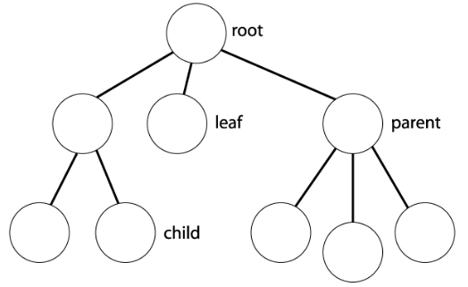

# Introduction

:notebook_with_decorative_cover: Thus far we have discussed OpenCV various data types (including `cv::Mat`, `cv::Vec`, `cv::Matx`, `cv::SparseMat`, `cv::Scalar` etc.). In all the example code we have provided, we had to hardcode these data types in our programs in order to make our examples easier to follow. However, this is not how real world applications work - in most cases you need to read such data types as input into your program from an external file (also known as **deserializing**). You also sometimes need to save/write your results to a file for future reference (also known as **serializing**).

:notebook_with_decorative_cover: OpenCV currently uses 3 file formats to serialize or deserialize OpenCV data types: **XML**, **YMAL** and **JSON**.

## XML - eXtensible Markup Language

:notebook_with_decorative_cover: This is a markup language much like HTML. Information in **XML** is wrapped in tags. The tags are not predefined in an **XML** standard unlike HTML tags. The author of the **XML** document gets to choose which tags to use as long as they are meaningful for them when deciphering the information. 

:notebook_with_decorative_cover: **XML** is extensible - meaning even if we add or remove new data, the older version of the document will still work as expected. 

:notebook_with_decorative_cover: To write an **XML** file use the extension `.xml`. 

:notebook_with_decorative_cover: Lets look at a simple example of an **XML** file below:

*student_record.xml*
```xml
<name>Martin D'vloper</name>
<age>26</age>
<hobbies>painting</hobbies>
<hobbies>playing_music</hobbies>
<hobbies>cooking</hobbies>
<programming_languages>
  <java>Intermediate</java>
  <python>Advanced</python>
  <javascript>Beginner</javascript>
</programming_languages>
<favorite_food>
  <vegetables>tomatoes</vegetables>
</favorite_food>
<favorite_food>
  <fruits>
    <citrics>oranges</citrics>
    <tropical>bananas</tropical>
    <nuts>peanuts</nuts>
    <sweets>raisins</sweets>
  </fruits>
</favorite_food>
```

:notebook_with_decorative_cover:: The file above consists of plain text and tags. The tags are enclosed within angle brackets. Tags come in pairs, the opening `<>` and closing tag `</>` . The actual data being stored is found between the opening and closing tags e.g. `<age>26</age>`, `<age>` is the opening tag, `26` is the data, and `</age>` is the closing tag. 
 
:notebook_with_decorative_cover: In this example, the `XML` file is storing data pertaining to a student name, age, hobbies, skill levels for each programming language they know as well as their favourite vegetables and fruits. 

:notebook_with_decorative_cover: While plain text represents the data, tags indicate what the data is. Each tag represents a type of data, like `name`, `age` or `hobbies`. 

## YAML 

:notebook_with_decorative_cover: Originally **YAML** was said to mean *Yet Another Markup Language* because it was released in an era that saw a proliferation of markup languages for presentation and connectivity (HTML, XML, SGML, etc). Its initial name was intended as a tongue-in-cheek reference to the technology landscape, referencing its purpose as a markup language with the yet another construct, but it was then repurposed as **YAML Ain't Markup Language**, a recursive acronym, to distinguish its purpose as data-oriented, rather than document markup. 

:notebook_with_decorative_cover: To write a file using **YAML** use the extension `.yml` or `.yaml`. 

:notebook_with_decorative_cover: When writing **YAML** files you need to know the following rules:

1. **YAML** files use Python-style indentation to determine the structure and indicate nesting. 

2. Tab characters are not allowed by design, to maintain portability across systems, so whitespaces—literal space characters—are used instead. 

3. Comments can be identified with a pound or hash symbol (`#`). It’s always a best practice to use comments, as they describe the intention of the code. **YAML** does not support multi-line comments, each line needs to be suffixed with the pound character. Comments are ignored when reading the data just like in any programming language. 

4. **YAML** uses 3 dashes (`---`) to signal the start of a document.  

5. **YAML** files are mainly made up of **sequence** and **map** (key-value pairs) structures. 

6. **Map**'s allow you to associate key-value pairs. Each key must be unique, and the order doesn't matter. Think of a Python dictionary. Each map has a parent name and then you can have the key-value pairs. Appropriate indentation separates key-values pairs from the parent. Key-value pairs are seperated by a single colon `:`. character. 

7. A **sequence** includes values listed in a specific order and may contain any number of items needed. You can think of a sequence as a Python list or an array in Bash or Perl. A sequence also has a parent name that groups the list items. The actual items start with a dash (`-`) and a space, while indentation separates it from the parent.  

8. A **sequence** can be embedded into a **map** and vice-versa.

9. **YAML** also contains scalars, which are arbitrary data (encoded in Unicode) that can be used as values such as strings, integers, dates, numbers, or booleans.

:notebook_with_decorative_cover: When creating a **YAML** file, you’ll need to ensure that you follow these syntax rules. This is not an exhaustive list of **YAML** syntax rules. Visit this <a href = "https://www.cloudbees.com/blog/yaml-tutorial-everything-you-need-get-started">page</a> for more details.

:notebook_with_decorative_cover: After you write your **YAML** file you need to check that your file is valid. To achieve it, you can use a **linter** — an application that verifies the syntax of a file. One such package is <a href = "https://pypi.org/project/yamllint/">yamllint</a>. It is a python package. If you don't want to deal with Python copy and paste the contents of your **YAML** file to this <a href = "https://www.yamllint.com/">site</a> - it will check if you have created a valid **YAML** file before you hand it over to an application.

:notebook_with_decorative_cover: We will show the same file from above (`student_record.xml`) as a **YAML** file:

*student_record.yaml*
```yaml
# Comment: Student record
# Describes some characteristics and preferences
--- # Signals start of document
name: Martin D'vloper # key-value pair
age: 26
hobbies: # Name of sequence/list
  - painting # First list item
  - playing_music # Second list item
  - cooking # Third list item
programming_languages: # Name of map
  java: Intermediate # Programming language and skill level
  python: Advanced
  javascript: Beginner
favorite_food: 
  - vegetables: tomatoes 
  - fruits: # Map embedded in a sequence/list
      citrics: oranges 
      tropical: bananas
      nuts: peanuts
      sweets: raisins
```

:notebook_with_decorative_cover: We can see that for this student record, we save the student name and age as maps. Hobbies are saved as a List/Sequence. A Map has been used to associate each unique programming language with the level of skills for the student. The student's favourite food are first placed in a List of two items (vegetables and fruits), which are then broken down further into mappings associating each main class of vegetable or fruit with a specific fruit or vegetable. The file also provides single line comments.


## JSON

:notebook_with_decorative_cover: **JavaScript Object Notation (JSON)** is a very common standard text-based format for representing structured data based on JavaScript object syntax. To create such a file use the extension `.json`.

:notebook_with_decorative_cover: **JSON** files are a collection of key-value pairs, where the **key** must be a **string** type, and the value can be of any of the types: number (integer or float), string, booloean, array, object, null.

:notebook_with_decorative_cover: There are some simple rules you have to maintain to create a valid JSON file:

1. In the **JSON** data format, the keys must be strings and enclosed in double quotes `""`.

2. The key and value must be separated by a colon (`:`) symbol.

3. Strings should be placed in double quotes, while numbers are not.

4. Data is seperated by commas (`,`).

5. No comments are allowed in JSON files. But you can <a href = "https://www.freecodecamp.org/news/json-comment-example-how-to-comment-in-json-files/">get around that</a>, if you're curious.

6. Valid **JSON** data can be in two different formats:

* A collection of key-value pairs enclosed by a pair of curly braces `{...}`. This is the equivalent of a MAP in a **YAML** file. 

* A collection of an ordered list of key-value pairs separated by comma (`,`) and enclosed by a pair of square brackets `[...]` e.g. an array. This is the equivalent of a Sequence/List in a **YAML** file. 

:notebook_with_decorative_cover: **JSON** file format has been around since the early 2000s - which means there is a lot of literature out there if you want to be an expert on it. 

:notebook_with_decorative_cover: Our previous example can be written as a **JSON** file as follows:

*student_record.json*
```json
{
    "name": "Martin D'vloper",
    "age": 26,
    "hobbies": [
      "painting",
      "playing_music",
      "cooking"
    ],
    "programming_languages": {
      "java": "Intermediate",
      "python": "Advanced",
      "javascript": "Beginner"
    },
    "favorite_food": [
      {
        "vegetables": "tomatoes"
      },
      {
        "fruits": {
          "citrics": "oranges",
          "tropical": "bananas",
          "nuts": "peanuts",
          "sweets": "raisins"
        }
      }
    ]
  }
```

:notebook_with_decorative_cover: By looking at the above 3 examples - **XML**, **YAML** and **JSON** file formats all use the same basic concepts especially **Lists** and **Maps** to store grouped data.

:notebook_with_decorative_cover: We should also mention that OpenCV also allows you to work with compressed files. All you have to do is append `.gz` at the end of the file extension e.g. `student_record.xml.gz`.


## cv::FileStorage class

:notebook_with_decorative_cover: The <a href = "https://docs.opencv.org/4.8.0/da/d56/classcv_1_1FileStorage.html">cv::FileStorage</a> class encapsulates all the information necessary for writing or reading data to/from XML/YAML/JSON files. It is found in the header file `<opencv2/core/persistence.hpp>`.

:notebook_with_decorative_cover: The class provides 2 constructors, through which we can create an object for writing/reading to/from a file.

1. `cv::FileStorage(const cv::String& filename, int flags, const cv::String& encoding = cv::String())` - You can open a file writing/reading object by supplying the following parameters:

   * `filename` - Name of the file to open or the text string to read the data from. Extension of the file (`.xml`, `.yml`/`.yaml` or `.json`) determines its format (XML, YAML or JSON respectively). Also you can append `.gz` to work with compressed files, for example `myHugeMatrix.xml.gz`. 

   * `flags` - Mode of operation - which in most cases would be `cv::FileStorage::READ`, `cv::FileStorage::WRITE` or `cv::FileStorage::APPEND` to signal your intention to read, write or append data from/to a file, respectively. You can find the rest of the flags <a href = "https://docs.opencv.org/4.8.0/da/d56/classcv_1_1FileStorage.html#a973e41cb75ef6230412a567723b7482d">here</a>. 

   * `encoding` - Encoding of the file. Currently as of OpenCV 4.8.0, 8-bit encoding is used.
  
    After you have tried to open a file, it is considered good practice to follow that up by calling the function `bool cv::FileStorage::isOpened() const`. It checks whether you have successfully opened the file and returns `true` if you have, `false` otherwise.

2. `cv::FileStorage::FileStorage()` - This is the default constructor, which you can use to create an empty read/write object. You will then need to call the member function `bool cv::FileStorage::open(const cv::String& filename, int flags, const cv::String& encoding = cv::String())`. The parameters have the same meaning as above. The `cv::FileStorage::open()` function returns `true` if we have successfully opened a file, `false` otherwise.

## Writing data to files

:notebook_with_decorative_cover: When using `cv::FileStorage` to write data we do so in one of two forms: as a **mapping** (i.e. key-value pairs) or a **sequence** (a series of unnamed entries). This is important because it allows us to be able to create XML, YAML or JSON files since they also use the same forms to write data.

:notebook_with_decorative_cover: Mappings are the equivalent of <a href = "https://www.geeksforgeeks.org/python-dictionary/">**Python's dictionary**</a> data type, every element has a unique name through which you may access it. Sequences are like the <a href = "https://www.learncpp.com/cpp-tutorial/introduction-to-stdvector-and-list-constructors/">**STL std::vector**</a> - all elements fall under the umbrella of one name and you have to go through them to query a specific item.

:notebook_with_decorative_cover: We can also nest data - i.e. add other mappings or sequences inside other mappings or sequences. You can go as deep as you like.

:notebook_with_decorative_cover: If your data is of type `char` convert it to `std::string` so that it can be written as actual characters - otherwise `cv::FileStorage` will write the `char` data using their <a href = "https://www.learncpp.com/cpp-tutorial/chars/">ASCII</a> values e.g. `h` will be written in your file as the ASCII value `104`.

:notebook_with_decorative_cover: To create a single sequence entry, you first provide the name for the sequence (as a string) and then the data itself. The data can be a number (integer, float, etc.), a string or any OpenCV data type such as cv::Mat, cv::Point, etc.

:notebook_with_decorative_cover: If you want to create a grouped mapping or sequence, you can do so with the special characters: `{...}` (for a mapping) or `[...]` (for a sequence). Each grouped mapping or sequence should have a group name.

:notebook_with_decorative_cover: Once you create a grouped mapping, you enter each element with data name (this is the key) and immediately followed by the data (this is the value) - hence the name key-value pair.

:notebook_with_decorative_cover: If it is a grouped sequence (e.g. a List of items), simply enter the data one item after another until you close the sequence.

:notebook_with_decorative_cover: Map, sequence or data names may only contain alphanumeric characters `a-z`, `A-Z`, `0-9`, `-` and `_`.

:notebook_with_decorative_cover: Once you have completed writing your data, you call the `void cv::FileStorage::release()` member function. It closes the file and releases all the memory buffers.

:notebook_with_decorative_cover: Now that we know the main rules of writing data, we now need to know how to do this in code. Once you have successfully opened a file for writing, you have a choice of two functions which do the actual work of writing your data to a file.

### 1. `operator<<()` 

:notebook_with_decorative_cover: This is implemented as a non-member function that can be used to write data to a file in the same manner you might use `std::cout` to write to screen. You can use this output stream operator to write simple data types such as `int`, `double`, `float` etc. as well as OpenCV more advanced types such as `cv::Mat` or `cv::SparseMat`.

:notebook_with_decorative_cover: We will provide an example on how we can use `cv::FileStorage::operator<<()` to write an XML, YMAL and JSON file. 

:notebook_with_decorative_cover: When writing data to a file we use the flag `cv::FileStorage::WRITE` or `cv::FileStorage::APPEND`. If there is already data in the file, `cv::FileStorage::WRITE` will overwrite that data, while `cv::FileStorage::APPEND` will add the new data at the end of the file.

**Example 1** - In the following example, we write various data types to file. Which file format to use is determined by the file extension extracted from the file path provided by the user as a command line argument. To run the following program, first create an empty **XML**, **YAML** or **JSON** file e.g. `write.xml`. I have created mine in a folder called `temporary-files`. On your terminal you need something like `~/Documents/.../Example-Code/build/Read-Write-Data-app$ ./Read-Write-Data-app --path=/home/.../Documents/.../Example-Code/temporary-files/write.xml` to run the program. 

```c++
#include "opencv2/core.hpp"             // for OpenCV core data types
#include "opencv2/core/utility.hpp"     // for cv::CommandLineParser
#include "opencv2/core/persistence.hpp" // for cv::FileStorage

#include <iostream>
#include <array>
#include <string>
#include <string_view>
#include <algorithm>  // for std::find algorithm
#include <filesystem> // handles files

// std::string_literals allows us to convert text literals to std::string 
// by adding an 's' in front of the literal. This was introduced in C++17
using namespace std::string_literals; 
const std::array<std::string, 5> fileTypes { "xml"s, "yml"s, "yaml"s, "json"s, "gz"s };

/**
 * @brief Get the File Extension from a full file path e.g. from the file path 
 *        `Example-Code/temporary-files/write.xml` you will get the extension `xml`
 * 
 * @param filePath full path including filename and extension
 * @return std::string file extension: Returns an empty string if there is no file extension
 */
std::string getFileExtension(std::string_view filePath);


int main(int argc, char* argv[])
{
    // Define the command line arguments
    const cv::String keys = 
            "{help h usage ? | | Write various data types to file }"
            "{path | <none> | Full path and file name to save data to (must include extension e.g. .xml, .yaml, .json) }";

    // Define a cv::CommandLineParser object
    cv::CommandLineParser parser(argc, argv, keys);

    // Display a message about the program
    parser.about("\nWrite data to file v1.0.0"
                 "\nFile will be XML, YAML or JSON\n");
    parser.printMessage();

    // Extract our command line arguments    
    cv::String pathToWriteFile = parser.get<cv::String>("path");

    // Check for any errors during extract of arguments
    if (!parser.check())
    {
        parser.printErrors(); // Print any errors

        return -1; // Exit program early
    }

    // Since we can only write to 5 file types we need to check if file
    // path provided by user is valid. We first call the function to 
    // extract the file extension
    std::string fileExtension = getFileExtension(pathToWriteFile);

    // Use the std::find() algorithm to check if file extension exists
    // in our catalogue 'fileTypes'
    auto found = std::find(fileTypes.cbegin(), fileTypes.cend(), fileExtension);
    if (found == fileTypes.cend()) // If the file extension is not valid
    {
        std::cout << "\nERROR: File type is not valid." 
                  << "\nFile extension should be one of: xml, yml, yaml, json or gz.\n";
        
        return -1; // Exit program early
    }

    // If file is valid, we can start writing our data to file

    //----------------------- WRITE DATA 

    // Create a cv::FileStorage object for writing
    cv::FileStorage fs(pathToWriteFile, cv::FileStorage::WRITE);

    // Check if we have successfully opened the file for writing
    if (!fs.isOpened())
    {
        std::cout << "\nERROR: Could not open file for writing.\n";
        return -1; // Exit program early
    }

    // If we have successfully opened the file, we start writing data

    std::cout << "\nWriting data to file...\n";

    // Write information about the file we will save our data to as a Map
    fs << "File_Properties" << "{"; // Open up a MAP for writing
    fs << "File_Path" << pathToWriteFile;
    fs << "File_Name" << std::filesystem::path(pathToWriteFile).filename();
    fs << "}"; // Close MAP

    // Write a text string 
    fs << "Name_of_Developer" << "Rodney";

    // Write a scalar value
    fs << "No_of_file_types" << 5;

    // Write all cv::FileStorage file types in a sequence
    fs << "File_Types" << "["; // Open up a sequence for writing
    fs << "XML" << "YML" << "YAML" << "JSON" << "GZ"; // Sequence data
    fs << "]"; // Close sequence

    // Write a cv::Matx
    const cv::Matx22d mtx { 2, 4, 6, 8 };
    fs << "Matrix" << mtx;

    // Write a cv::Point
    const cv::Point2i p { 23, 78 };
    fs << "Point_Cordinates" << p;

    // Write a cv::Mat
    float data[] { 2.34f, 1.245f, 6.09f, 4.56f, 9.07f, 1.234f };
    const cv::Mat m { cv::Size(2, 3), CV_32F, data };
    fs << "Dense_Array" << m;

    // Write a std::vector
    std::vector imageFormats { "jpg"s, "tiff"s, "jpg"s, "webp"s, "jp2"s }; 
    fs << "ImageFormats" << imageFormats;
    

    fs.release(); // Explicit closing of cv::FileStorage for writing

    std::cout << "\nFinished writing data to file " << pathToWriteFile << '\n';

    std::cout << '\n';
    
    return 0;
}

/**
 * @brief Get the File Extension from a full file path e.g. from the file path 
 *        `Example-Code/temporary-files/write.xml` you will get the extension `xml`
 * 
 * @param filePath full path including filename and extension
 * @return std::string file extension: Returns an empty string if there is no file extension
 */
std::string getFileExtension(std::string_view filePath)
{
    // Use the file path to create an object of std::filesystem
    std::filesystem::path p { filePath };

    // get the file extension e.g .xml, .json etc
    std::string fileExtension { p.extension() };

    if(fileExtension.empty()) // If there is no file extension return an empty string 
    {
        return "";
    }
    else // if there is a fileExtension, it will have the form ".fileExtension"
    {
        // extract the sub string after the dot or position = 0
        std::string substring { fileExtension.substr(1) };

        return substring;
    }
}
```

**Output** - Depending on file format, you will get the following files.

*write.xml*
```xml
<?xml version="1.0"?>
<opencv_storage>
<File_Properties>
  <File_Path>/home/.../Documents/.../Example-Code/temporary-files/write.xml</File_Path>
  <File_Name>write.xml</File_Name></File_Properties>
<Name_of_Developer>Rodney</Name_of_Developer>
<No_of_file_types>5</No_of_file_types>
<File_Types>
  XML YML YAML JSON GZ</File_Types>
<Matrix type_id="opencv-matrix">
  <rows>2</rows>
  <cols>2</cols>
  <dt>d</dt>
  <data>
    2. 4. 6. 8.</data></Matrix>
<Point_Cordinates>
  23 78</Point_Cordinates>
<Dense_Array type_id="opencv-matrix">
  <rows>3</rows>
  <cols>2</cols>
  <dt>f</dt>
  <data>
    2.33999991e+00 1.24500000e+00 6.09000015e+00 4.55999994e+00
    9.06999969e+00 1.23399997e+00</data></Dense_Array>
<ImageFormats>
  jpg tiff jpg webp jp2</ImageFormats>
</opencv_storage>
```

*write.yml*
```yml
%YAML:1.0
---
File_Properties:
   File_Path: "/home/.../Documents/.../Example-Code/temporary-files/write.yml"
   File_Name: "write.yml"
Name_of_Developer: Rodney
No_of_file_types: 5
File_Types:
   - XML
   - YML
   - YAML
   - JSON
   - GZ
Matrix: !!opencv-matrix
   rows: 2
   cols: 2
   dt: d
   data: [ 2., 4., 6., 8. ]
Point_Cordinates: [ 23, 78 ]
Dense_Array: !!opencv-matrix
   rows: 3
   cols: 2
   dt: f
   data: [ 2.33999991e+00, 1.24500000e+00, 6.09000015e+00,
       4.55999994e+00, 9.06999969e+00, 1.23399997e+00 ]
ImageFormats:
   - jpg
   - tiff
   - jpg
   - webp
   - jp2

```

*write.yaml*
```yaml
%YAML:1.0
---
File_Properties:
   File_Path: "/home/.../Documents/.../Example-Code/temporary-files/write.yaml"
   File_Name: "write.yaml"
Name_of_Developer: Rodney
No_of_file_types: 5
File_Types:
   - XML
   - YML
   - YAML
   - JSON
   - GZ
Matrix: !!opencv-matrix
   rows: 2
   cols: 2
   dt: d
   data: [ 2., 4., 6., 8. ]
Point_Cordinates: [ 23, 78 ]
Dense_Array: !!opencv-matrix
   rows: 3
   cols: 2
   dt: f
   data: [ 2.33999991e+00, 1.24500000e+00, 6.09000015e+00,
       4.55999994e+00, 9.06999969e+00, 1.23399997e+00 ]
ImageFormats:
   - jpg
   - tiff
   - jpg
   - webp
   - jp2

```

*write.json*
```json
{
    "File_Properties": {
        "File_Path": "/home/.../Documents/.../Example-Code/temporary-files/write.json",
        "File_Name": "write.json"
    },
    "Name_of_Developer": "Rodney",
    "No_of_file_types": 5,
    "File_Types": [
        "XML",
        "YML",
        "YAML",
        "JSON",
        "GZ"
    ],
    "Matrix": {
        "type_id": "opencv-matrix",
        "rows": 2,
        "cols": 2,
        "dt": "d",
        "data": [ 2.0, 4.0, 6.0, 8.0 ]
    },
    "Point_Cordinates": [ 23, 78 ],
    "Dense_Array": {
        "type_id": "opencv-matrix",
        "rows": 3,
        "cols": 2,
        "dt": "f",
        "data": [ 2.33999991e+00, 1.24500000e+00, 6.09000015e+00,
            4.55999994e+00, 9.06999969e+00, 1.23399997e+00 ]
    },
    "ImageFormats": [
        "jpg",
        "tiff",
        "jpg",
        "webp",
        "jp2"
    ]
}
```

:notebook_with_decorative_cover: A closer look at the files above reveals the following:

1. **YAML** and **YML** have the same output format. 
2. **XML** output format is harder to read. Probably not the best option when dealing with a lot of data.
3. OpenCV matrix/array types e.g `cv::Matx`, `cv::Mat` are written to file as Map structures. Other than the actual data (`data`), you also get information on number of rows (`rows`), number of columns (`cols`) as well as data type (`dt`). The actual data is flattened into a 1-D array and writen as a sequence or list of values. For simpler types such as `cv::Point` you only get the actual data as a sequence/list.
4. `std::vector` types are writen as sequence's.

:notebook_with_decorative_cover: Before we move on, we are going to add the function `std::string getFileExtension(std::string_view filePath)` to our library as it is one of those functions you can use in any other future project. Since this is not a template function we will add the function declaration in the header file `utility_functions.h` and the full definition in the source file `utility_functions.cpp`. As this function has to do with files we will create a new namespace `ReadWriteFiles` and add it there. We will also add the file types that we write/read to/from using `cv::FileStorage` to the `General` namespace as an array so we don't need to repeat them everytime we want to check whether file format is valid or not. Hence from now on, our code will reflect these changes.


### 2. `write()`

:notebook_with_decorative_cover: There are two types of `write()` functions - member functions of `cv::FileStorage` and non-member functions. 

:notebook_with_decorative_cover: There are only 5 member functions and each follows the syntax pattern `void write(name, val)`. The parameter `name` is the name of the written data object. It is of type `cv::String`. When writing to sequences (a.k.a. "arrays"), pass an empty string. The parameter `val` is the value of the written data object. This value can be any of the following types: `int`, `double`, `cv::String`, `cv::Mat` or `std::vector<cv::String>`. Remember that to access member functions you create an object of `cv::FileStorage` class then use that object to access the functions.

```c++
void write(const cv::String &name, int val);

void write(const cv::String &name, double val);
 
void write(const cv::String &name, const cv::String &val);
 
void write(const cv::String &name, const cv::Mat &val);
 
void write(const cv::String &name, const std::vector< cv::String > &val);
```

:notebook_with_decorative_cover: The non-member functions add up to 35 overloaded functions and so we will not show all of them here. However, they follow 2 formats and we give an example of each as follows:

```c++
// Use this format if giving your data a name e.g a mapping
void write(cv::FileStorage &fs, const cv::String &name, int value);

// Use this if you have already given the data a name e.g. when writing the data for a sequence
void write(cv::FileStorage &fs, const double &value);
```

:notebook_with_decorative_cover: The overloaded non-member functions allows us to write to file any of the OpenCV data types. Some of them are even implemented as template functions to accomodate this. To access each non-member function prefix the `write()` function with `cv`. 

:notebook_with_decorative_cover: When writing a sequence or map you can use two functions.

1. To open the mapping or sequence use `void cv::FileStorage::startWriteStruct(const cv::String& name, int flags, const cv::String& typeName = cv::String())`, where
   * `name` - Name of the structure. 
   * `flags` - Type of the structure (`cv::FileNode::MAP` or `cv::FileNode::SEQ`. There is also the flag `cv::FileNode::FLOW` - which is a compact representation of a sequence or mapping used only for **YAML** files.
   * `typename` - Optional name of the type you store. The effect of setting this depends on the storage format. I.e. if the format has a specification for storing type information, this parameter is used.

2. To close the mapping or sequence use `void cv::FileStorage::endWriteStruct()`.

:notebook_with_decorative_cover: In the following example we re-write our previous example using the non-member functions of `write()` because they offer you more options than the member functions. To save memory, re-use the files from the previous example. Remember to first clear the file contents - that way we are sure the following code actually works.

**Example 2**

```c++
// This program uses overloaded write() functions to 
// write data to a XML, YAML or JSON file

#include "opencv2/core.hpp"             // for OpenCV core data types
#include "opencv2/core/utility.hpp"     // for cv::CommandLineParser
#include "opencv2/core/persistence.hpp" // for cv::FileStorage

#include <UtilityFunctions/utility_functions.h> // import our library functions

#include <iostream>
#include <vector>
#include <string>
#include <algorithm>  // for std::find algorithm
#include <filesystem> // handles files

int main(int argc, char* argv[])
{
    // Define the command line arguments
    const cv::String keys = 
            "{help h usage ? | | Write various data types to file }"
            "{path | <none> | Full path and file name to save data to (must include extension e.g. .xml, .yaml, .json) }";

    // Define a cv::CommandLineParser object
    cv::CommandLineParser parser(argc, argv, keys);

    // Display a message about the program
    parser.about("\nWrite data to file v1.0.0"
                 "\nFile will be XML, YAML or JSON\n");
    parser.printMessage();

    // Extract our command line arguments    
    cv::String pathToWriteFile = parser.get<cv::String>("path");

    // Check for any errors during extract of arguments
    if (!parser.check())
    {
        parser.printErrors(); // Print any errors

        return -1; // Exit program early
    }

    // Since we can only write to 5 file types we need to check if file
    // path provided by user is valid. We first call the function to 
    // extract the file extension
    std::string fileExtension = CPP_CV::ReadWriteFiles::getFileExtension(pathToWriteFile);

    // Use the std::find() algorithm to check if file extension exists
    // in our catalogue 'fileTypes'
    auto found = std::find(CPP_CV::General::fileTypes.cbegin(),
                           CPP_CV::General::fileTypes.cend(), 
                           fileExtension);
    if (found == CPP_CV::General::fileTypes.cend()) // If the file extension is not valid
    {
        std::cout << "\nERROR: File type is not valid." 
                  << "\nFile extension should be one of: xml, yml, yaml, json or gz.\n";
        
        return -1; // Exit program early
    }

    // If file is valid, we can start writing our data to file

    //----------------------- WRITE DATA 

    // Create a cv::FileStorage object for writing
    cv::FileStorage fs(pathToWriteFile, cv::FileStorage::WRITE);

    // Check if we have successfully opened the file for writing
    if (!fs.isOpened())
    {
        std::cout << "\nERROR: Could not open file for writing.\n";

        return -1; // Exit program early
    }

    // If we have successfully opened the file, we start writing data

    std::cout << "\nWriting data to file...\n";

    // Write information about the file we will save our data to as a Map
    fs.startWriteStruct(cv::String("File_Properties"), cv::FileNode::MAP); // Start of MAP
    cv::write(fs, cv::String("File_Path"), pathToWriteFile);
    cv::write(fs, cv::String("File_Name"), std::filesystem::path(pathToWriteFile).filename());
    fs.endWriteStruct(); // End of MAP

    // Write a text string 
    cv::write(fs, cv::String("Name_of_Developer"), cv::String("Rodney"));   

    // Write a scalar value
    cv::write(fs, cv::String("No_of_file_types"), 5);

    // Write all cv::FileStorage file types in a sequence
    fs.startWriteStruct(cv::String("File_Types"), cv::FileNode::SEQ); // Start of Sequence
    cv::write(fs, "", "XML");
    cv::write(fs, "", "YML");
    cv::write(fs, "", "YAML");
    cv::write(fs, "", "JSON");
    cv::write(fs, "", "GZ");
    fs.endWriteStruct(); // End of Sequence

    // Write a cv::Matx
    const cv::Matx22d mtx { 2, 4, 6, 8 };
    cv::write(fs, cv::String("Matrix"), mtx);    

    // Write a cv::Point
    const cv::Point2i p { 23, 78 };
    cv::write(fs, cv::String("Point_Coordinates"), p);    

    // Write a cv::Mat
    float data[] { 2.34f, 1.245f, 6.09f, 4.56f, 9.07f, 1.234f };
    const cv::Mat m { cv::Size(2, 3), CV_32F, data };
    cv::write(fs, cv::String("Dense_Array"), m);

    // Write a std::vector
    // std::string_literals allows us to convert text literals to std::string 
    // by adding an 's' in front of the literal. This was introduced in C++17
    using namespace std::string_literals; 
    std::vector imageFormats { "jpg"s, "tiff"s, "jpg"s, "webp"s, "jp2"s }; 
    cv::write(fs, cv::String("ImageFormats"), imageFormats);

    fs.release(); // Explicit closing of cv::FileStorage for writing

    std::cout << "\nFinished writing data to file " << pathToWriteFile << '\n';

    std::cout << '\n';
    
    return 0;
}
```

:notebook_with_decorative_cover: Having used both `operator()<<` and `write()` functions, it is clear how much easier it is to use `operator()<<`. It is straight forward and feels natural and I would recommend using `operator()<<` all the time.


**N.B:** Before we move on to discuss how to read data from files, here is a reminder about OpenCV data types. 2-D matrix/array data (`cv::Matx` or `cv::Mat`) is recognized as an `!!openv-matrix` object and its properties such as number of rows, columns, data type and the actual elements are written to file. However, other types such as `cv::Point`, `cv::Vec`, `cv::Size`, `std::vector` are written simply as sequences. You need to recognize this as it determines how you can access the data for reading.

## Reading data from a cv::FileStorage

:notebook_with_decorative_cover: The `cv::FileStorage` class can be accessed for reading the same way it is for writing, except that the `flag` argument should be set to `cv::FileStorage::READ`. You can also create an empty file storage object through the default constructor and open it later with `cv::FileStorage::open()`.

```c++
cv::String fileName = "Example-Code/temporary-files/write.xml"; // File to read data from

// 1. Create a cv::FileStorage object for READING
cv::FileStorage fs(fileName, cv::FileStorage::READ);

// 2. OR use a default constructor to create an empty object
cv::FileStorage fs_1;

// Then use cv::FileStorage::open() to open the file for READING
fs_1.open(fileName, cv::FileStorage::READ);
```

:notebook_with_decorative_cover: It is always recommended you use the function `cv::FileStorage::isOpened()` to check if you have successfully opened the file for reading before you continue.

:notebook_with_decorative_cover: Once the file has been opened for reading, the data can be read with either the overloaded subscript operator `cv::FileStorage::operator[]()` or with the iterator `cv::FileNodeIterator` (if reading sequential data).

:notebook_with_decorative_cover: There are two versions of the subscript operator `cv::FileStorage::operator[]()`:

1. `cv::FileNode cv::FileStorage::operator[](const cv::String& nodename) const` - This is used if the argument `nodename` is supplied as a `cv::String` object. Remember `cv::String` is the equivalent of `std::string`.

2. `cv::FileNode cv::FileStorage::operator[](const char* nodename) const` - This is used if the argument `nodename` is supplied as a string literal.

:notebook_with_decorative_cover: Remember that we write much of the data to a file as key/value pairs. The argument `nodename` is the name used as the key (as a string) to pair up with the actual data value. The argument can be supplied as a `cv::String` object or as a string literal (`const char*`). That key (with the correct spelling) will be important when accessing the data values during reading.

:notebook_with_decorative_cover: The return value of `cv::FileStorage::operator[]()` is not actually the desired object; it is an object of type `cv::FileNode` and some casting will have to be performed to get the correct data type. For now, we will discuss the `cv::FileNode` class next before we start writing code to read data from a file.

### cv::FileNode

:notebook_with_decorative_cover: <a href = "https://docs.opencv.org/4.8.0/de/dd9/classcv_1_1FileNode.html">`cv::FileNode`</a> is a class that handles the actual reading of data when using `cv::FileStorage`.

:notebook_with_decorative_cover: According to OpenCV, `cv::FileNode` in the background is implemented as a <a href = "https://docs.opencv.org/4.8.0/d3/de3/classcv_1_1Node.html">`Node`</a> class. An example of a node structure would look like Figure 1:

<p align ="center"><b>Figure 1:</b> Node structure</p>

<p align ="center">
        
</p>


:notebook_with_decorative_cover: A node is used to store each and every element of the file storage opened for reading. When XML/YAML file is read, it is first parsed and stored in the memory as a hierarchical collection of nodes. Each node can be a "leaf", that is, it can contain a single number or a string object. A "leaf" can also act as a "parent" and have a collection of other nodes under it known as "child" nodes. There can be named collections (mappings) where each element has a name and it is accessed by that name, and ordered collections (sequences) where elements do not have names but rather accessed by index. Type of the file node can be determined using function `cv::FileNode::type()`. *Note that file nodes are only used for navigating file storages opened for reading*. When a file storage is opened for writing, no data is stored in memory after it is written hence there is no need for nodes.

:notebook_with_decorative_cover: Once you have a `cv::FileNode` object you can do one of several things with it:

* If it represents a single object (e.g. a number or a string), you can load it straight into a variable of the appropriate type using the overloaded extraction operator `cv::FileNode::operator>>()`. This operator works in the same way as C++ `std::cin` extraction operator for accepting input from a user and placing it into a variable.

**Example 3** - Read scalar and string data

```c++
#include "opencv2/core.hpp"             // for OpenCV core data types
#include "opencv2/core/utility.hpp"     // for cv::CommandLineParser
#include "opencv2/core/persistence.hpp" // for cv::FileStorage

#include <UtilityFunctions/utility_functions.h> // import our library functions

#include <iostream>
#include <string>
#include <algorithm>  // for std::find algorithm


int main(int argc, char* argv[])
{
    // Define the command line arguments
    const cv::String keys = 
            "{help h usage ? | | Read simple data types from file }"
            "{path | <none> | Full path to file (must have extension e.g. .xml, .yaml, .yml or .json) }";

    // Define a cv::CommandLineParser object
    cv::CommandLineParser parser(argc, argv, keys);

    // Display a message about the program
    parser.about("\nRead data from file v1.0.0"
                 "\nFile must be XML, YAML or JSON\n");
    parser.printMessage();

    // Extract our command line arguments    
    cv::String pathToReadFile = parser.get<cv::String>("path");

    // Check for any errors during extraction of arguments
    if (!parser.check())
    {
        parser.printErrors(); // Print any errors

        return -1; // Exit program early
    }

    // Since we can only read from 5 file types we need to check if file
    // path provided by user is valid. We first call the function to 
    // extract the file extension
    std::string fileExtension = CPP_CV::ReadWriteFiles::getFileExtension(pathToReadFile);

    // Use the std::find() algorithm to check if file extension exists
    // in our catalogue 'fileTypes'
    auto found = std::find(CPP_CV::General::fileTypes.cbegin(), CPP_CV::General::fileTypes.cend(), fileExtension);
    if (found == CPP_CV::General::fileTypes.cend()) // If the file extension is not valid
    {
        std::cout << "\nERROR: File type is not valid." 
                  << "\nFile extension should be one of: xml, yml, yaml, json or gz.\n";
        
        return -1; // Exit program early
    }

    // If file is valid, we can start reading our data from file

    //----------------------- READ DATA 

    // Create a cv::FileStorage object for READING
    cv::FileStorage fs(pathToReadFile, cv::FileStorage::READ);

    // Check if we have successfully opened the file for reading
    if (!fs.isOpened())
    {
        std::cout << "\nERROR: Could not open file for reading.\n";

        return -1; // Exit program early
    }

    // If we have successfully opened the file, we start reading data

    std::cout << "\nReading data from file...\n";
    

    // Read a text string 
    cv::String developer; 
    fs["Name_of_Developer"] >> developer;
    std::cout << "\nName of developer: " << developer;   

    // Read a scalar value
    int n_file_types;
    fs["No_of_file_types"] >> n_file_types;
    std::cout << "\nNo. of file types that can be read using cv::FileStorage: " 
              << n_file_types << '\n';

    fs.release(); // Explicit closing of cv::FileStorage for reading

    std::cout << "\nFinished reading data from file " << pathToReadFile << '\n';

    std::cout << '\n';
    
    return 0;
}

```

* cv::FileNode object also supports direct casting to any of the basic data types. We can also use the **static_cast<>()** function as per modern C++.

**Example 4** - Use casting to convert data to appropriate type

```c++
#include "opencv2/core.hpp"             // for OpenCV core data types
#include "opencv2/core/utility.hpp"     // for cv::CommandLineParser
#include "opencv2/core/persistence.hpp" // for cv::FileStorage

#include <UtilityFunctions/utility_functions.h> // import our library functions

#include <iostream>
#include <string>
#include <algorithm>  // for std::find algorithm

int main(int argc, char* argv[])
{
    // Define the command line arguments
    const cv::String keys = 
            "{help h usage ? | | Read simple data types from file }"
            "{path | <none> | Full path to file (must have extension e.g. .xml, .yaml, .yml or .json) }";

    // Define a cv::CommandLineParser object
    cv::CommandLineParser parser(argc, argv, keys);

    // Display a message about the program
    parser.about("\nRead data from file v1.0.0"
                 "\nFile must be XML, YAML or JSON\n");
    parser.printMessage();

    // Extract our command line arguments    
    cv::String pathToReadFile = parser.get<cv::String>("path");

    // Check for any errors during extraction of arguments
    if (!parser.check())
    {
        parser.printErrors(); // Print any errors

        return -1; // Exit program early
    }

    // Since we can only read from 5 file types we need to check if file
    // path provided by user is valid. We first call the function to 
    // extract the file extension
    std::string fileExtension = CPP_CV::ReadWriteFiles::getFileExtension(pathToReadFile);

    // Use the std::find() algorithm to check if file extension exists
    // in our catalogue 'fileTypes'
    auto found = std::find(CPP_CV::General::fileTypes.cbegin(), CPP_CV::General::fileTypes.cend(), fileExtension);
    if (found == CPP_CV::General::fileTypes.cend()) // If the file extension is not valid
    {
        std::cout << "\nERROR: File type is not valid." 
                  << "\nFile extension should be one of: xml, yml, yaml, json or gz.\n";
        
        return -1; // Exit program early
    }

    // If file is valid, we can start reading our data from file

    //----------------------- READ DATA 

    // Create a cv::FileStorage object for READING
    cv::FileStorage fs(pathToReadFile, cv::FileStorage::READ);

    // Check if we have successfully opened the file for reading
    if (!fs.isOpened())
    {
        std::cout << "\nERROR: Could not open file for reading.\n";

        return -1; // Exit program early
    }

    // If we have successfully opened the file, we start reading data

    std::cout << "\nReading data from file...\n";
    

    // Read a text string using direct casting
    auto developer = (cv::String)fs["Name_of_Developer"];
    std::cout << "\nName of developer: " << developer;   

    // Read a scalar value using static_cast<T>
    auto n_file_types = static_cast<int>(fs["No_of_file_types"]);
    std::cout << "\nNo. of file types that can be read using cv::FileStorage: " 
              << n_file_types << '\n';

    fs.release(); // Explicit closing of cv::FileStorage for reading

    std::cout << "\nFinished reading data from file: " << pathToReadFile << '\n';

    std::cout << '\n';
    
    return 0;
}
```

* If the node represents a mapping, we can read such data as in the following example. Remember that in the previous examples we wrote data about *file properties* as a Map structure. We will need to create a `cv::FileNode` object from the Map structure, then use the Map keys to access the data in each node. 

**Example 5** - Read data from a Map structure

```c++
#include "opencv2/core.hpp"             // for OpenCV core data types
#include "opencv2/core/utility.hpp"     // for cv::CommandLineParser
#include "opencv2/core/persistence.hpp" // for cv::FileStorage

#include <UtilityFunctions/utility_functions.h> // import our library functions

#include <iostream>
#include <string>
#include <algorithm>  // for std::find algorithm

int main(int argc, char* argv[])
{
    // Define the command line arguments
    const cv::String keys = 
            "{help h usage ? | | Read simple data types from file }"
            "{path | <none> | Full path to file (must have extension e.g. .xml, .yaml, .yml or .json) }";

    // Define a cv::CommandLineParser object
    cv::CommandLineParser parser(argc, argv, keys);

    // Display a message about the program
    parser.about("\nRead data from file v1.0.0"
                 "\nFile must be XML, YAML or JSON\n");
    parser.printMessage();

    // Extract our command line arguments    
    cv::String pathToReadFile = parser.get<cv::String>("path");

    // Check for any errors during extraction of arguments
    if (!parser.check())
    {
        parser.printErrors(); // Print any errors

        return -1; // Exit program early
    }

    // Since we can only read from 5 file types we need to check if file
    // path provided by user is valid. We first call the function to 
    // extract the file extension
    std::string fileExtension = CPP_CV::ReadWriteFiles::getFileExtension(pathToReadFile);

    // Use the std::find() algorithm to check if file extension exists
    // in our catalogue 'fileTypes'
    auto found = std::find(CPP_CV::General::fileTypes.cbegin(), CPP_CV::General::fileTypes.cend(), fileExtension);
    if (found == CPP_CV::General::fileTypes.cend()) // If the file extension is not valid
    {
        std::cout << "\nERROR: File type is not valid." 
                  << "\nFile extension should be one of: xml, yml, yaml, json or gz.\n";
        
        return -1; // Exit program early
    }

    // If file is valid, we can start reading our data from file

    //----------------------- READ DATA 

    // Create a cv::FileStorage object for READING
    cv::FileStorage fs(pathToReadFile, cv::FileStorage::READ);

    // Check if we have successfully opened the file for reading
    if (!fs.isOpened())
    {
        std::cout << "\nERROR: Could not open file for reading.\n";

        return -1; // Exit program early
    }

    // If we have successfully opened the file, we start reading data

    std::cout << "\nReading data from file...\n";
    

    // Read file properties from file.
    // The data is a mapping and contains two keys: 'File_Path' and 'File_Name'

    // 1 - Create a cv::FileNode object from the Map structure
    cv::FileNode fileProperties = fs["File_Properties"];

    // 2 - Use function 'cv::FileNode::type()' to check that the structure is 
    //     actually a Map
    if(fileProperties.type() != cv::FileNode::MAP)
    {
        std::cerr << "\nYou are attempting to read a data structure that is not a cv::FileNode::MAP\n";

        return -1;
    } 

    // 3 - Read from Map structure
    //     We want our data to be of type cv::String
    auto filePath = static_cast<cv::String>(fileProperties["File_Path"]);
    auto fileName = static_cast<cv::String>(fileProperties["File_Name"]);

    std::cout << "\nCurrent file path: " << filePath;
    std::cout << "\nCurrent file name: " << fileName;

    fs.release(); // Explicit closing of cv::FileStorage for reading

    std::cout << "\n\nFinished reading data from file " << pathToReadFile << '\n';

    std::cout << '\n';
    
    return 0;
}
```

* If the `cv::FileNode` object represents a sequence, we need an iterator to move through the collection of nodes holding the data for the sequence. Such an iterator is <a href = "https://docs.opencv.org/4.8.0/d7/d4e/classcv_1_1FileNodeIterator.html">cv::FileNodeIterator</a>. It is implemented just like a STL iterator meaning it uses the usual `operator*()` for de-referencing, which returns a `cv::FileNode` object. It also has access to `cv::FileNode` member functions `cv::FileNode::begin()` and `cv::FileNode::end()`, which provide the first and "one past the last" position for a container object. The iterator also supports incrementing and decrementing operators. 

**Example 6** - Read sequence data

```c++
#include "opencv2/core.hpp"             // for OpenCV core data types
#include "opencv2/core/utility.hpp"     // for cv::CommandLineParser
#include "opencv2/core/persistence.hpp" // for cv::FileStorage

#include <UtilityFunctions/utility_functions.h> // import our library functions

#include <iostream>
#include <string>
#include <algorithm>  // for std::find algorithm

int main(int argc, char* argv[])
{
    // Define the command line arguments
    const cv::String keys = 
            "{help h usage ? | | Read simple data types from file }"
            "{path | <none> | Full path to file (must have extension e.g. .xml, .yaml, .yml or .json) }";

    // Define a cv::CommandLineParser object
    cv::CommandLineParser parser(argc, argv, keys);

    // Display a message about the program
    parser.about("\nRead data from file v1.0.0"
                 "\nFile must be XML, YAML or JSON\n");
    parser.printMessage();

    // Extract our command line arguments    
    cv::String pathToReadFile = parser.get<cv::String>("path");

    // Check for any errors during extraction of arguments
    if (!parser.check())
    {
        parser.printErrors(); // Print any errors

        return -1; // Exit program early
    }

    // Since we can only read from 5 file types we need to check if file
    // path provided by user is valid. We first call the function to 
    // extract the file extension
    std::string fileExtension = CPP_CV::ReadWriteFiles::getFileExtension(pathToReadFile);

    // Use the std::find() algorithm to check if file extension exists
    // in our catalogue 'fileTypes'
    auto found = std::find(CPP_CV::General::fileTypes.cbegin(), CPP_CV::General::fileTypes.cend(), fileExtension);
    if (found == CPP_CV::General::fileTypes.cend()) // If the file extension is not valid
    {
        std::cout << "\nERROR: File type is not valid." 
                  << "\nFile extension should be one of: xml, yml, yaml, json or gz.\n";
        
        return -1; // Exit program early
    }

    // If file is valid, we can start reading our data from file

    //----------------------- READ DATA 

    // Create a cv::FileStorage object for READING
    cv::FileStorage fs(pathToReadFile, cv::FileStorage::READ);

    // Check if we have successfully opened the file for reading
    if (!fs.isOpened())
    {
        std::cout << "\nERROR: Could not open file for reading.\n";

        return -1; // Exit program early
    }

    // If we have successfully opened the file, we start reading data

    std::cout << "\nReading data from file...\n";
    

    // Read cv::FileStorage file types from file.
    // The data is written as a Sequence named 'File_Types'
    
    // 1 - Create a cv::FileNode object from the Sequence structure
    cv::FileNode fileTypes = fs["File_Types"];

    // 2 - Use function 'cv::FileNode::type()' to check that the structure is 
    //     actually a Sequence
    if(fileTypes.type() != cv::FileNode::SEQ)
    {
        std::cerr << "\nYou are attempting to read a data structure that is not a cv::FileNode::SEQ\n";

        return -1;
    } 

    // 3 - Define iterators for looping through the Sequence
    //     You can use 'auto' instead of 'cv::FileNodeIterator'
    cv::FileNodeIterator it = fileTypes.begin(); // Start of Sequence
    cv::FileNodeIterator it_end = fileTypes.end(); // 1 past last position in Sequence

    // 4. Iterate through Sequence nodes to extract the data
    //    Our data will be cv::String types
    std::cout << "\nFile types: ";
    for (it; it != it_end; ++it)
    {
        // To access the data:
        //  1. De-reference the iterator using operator*()
        //  2. Cast to desired data type - which is cv::String in our case
        // Then print the data to screen
        std::cout << static_cast<cv::String>(*it) << " ";
    }

    fs.release(); // Explicit closing of cv::FileStorage for reading

    std::cout << "\n\nFinished reading data from file " << pathToReadFile << '\n';

    std::cout << '\n';
    
    return 0;
}
```

**Output**

    Reading data from file...

    File types: XML YML YAML JSON GZ 

    Finished reading data from file /home/.../Example-Code/temporary-files/write.json

* If `cv::FileNode` is an OpenCV data type such as `cv::Matx` or `cv::Mat`, we can read it in the same way as basic data types like `double`. Data stored in the form of a matrix will have its other properties such as number of rows, columns as well as data type accompanying the actual data.

**Example 7** - Read OpenCV N-Dimensional arrays

```c++
#include "opencv2/core.hpp"             // for OpenCV core data types
#include "opencv2/core/utility.hpp"     // for cv::CommandLineParser
#include "opencv2/core/persistence.hpp" // for cv::FileStorage

#include <UtilityFunctions/utility_functions.h> // import our library functions

#include <iostream>
#include <string>
#include <algorithm>  // for std::find algorithm
#include <typeinfo>   // for data type information 

int main(int argc, char* argv[])
{
    // Define the command line arguments
    const cv::String keys = 
            "{help h usage ? | | Read simple data types from file }"
            "{path | <none> | Full path to file (must have extension e.g. .xml, .yaml, .yml or .json) }";

    // Define a cv::CommandLineParser object
    cv::CommandLineParser parser(argc, argv, keys);

    // Display a message about the program
    parser.about("\nRead data from file v1.0.0"
                 "\nFile must be XML, YAML or JSON\n");
    parser.printMessage();

    // Extract our command line arguments    
    cv::String pathToReadFile = parser.get<cv::String>("path");

    // Check for any errors during extraction of arguments
    if (!parser.check())
    {
        parser.printErrors(); // Print any errors

        return -1; // Exit program early
    }

    // Since we can only read from 5 file types we need to check if file
    // path provided by user is valid. We first call the function to 
    // extract the file extension
    std::string fileExtension = CPP_CV::ReadWriteFiles::getFileExtension(pathToReadFile);

    // Use the std::find() algorithm to check if file extension exists
    // in our catalogue 'fileTypes'
    auto found = std::find(CPP_CV::General::fileTypes.cbegin(), CPP_CV::General::fileTypes.cend(), fileExtension);
    if (found == CPP_CV::General::fileTypes.cend()) // If the file extension is not valid
    {
        std::cout << "\nERROR: File type is not valid." 
                  << "\nFile extension should be one of: xml, yml, yaml, json or gz.\n";
        
        return -1; // Exit program early
    }

    // If file is valid, we can start reading our data from file

    //----------------------- READ DATA 

    // Create a cv::FileStorage object for READING
    cv::FileStorage fs(pathToReadFile, cv::FileStorage::READ);

    // Check if we have successfully opened the file for reading
    if (!fs.isOpened())
    {
        std::cout << "\nERROR: Could not open file for reading.\n";

        return -1; // Exit program early
    }

    // If we have successfully opened the file, we start reading data

    std::cout << "\nReading data from file...\n";
    

    // 1. Read a cv::Matx from file.
    cv::Matx22d mtx;
    fs["Matrix"] >> mtx;
    std::cout << "\ncv::Matx: \n" << mtx
              << "\nData type: " << typeid(mtx(0,0)).name()
              << "\nNo. of rows: " << mtx.rows
              << "\nNo. of columns: " << mtx.cols;

    // 2. Read a cv::Mat array from file
    cv::Mat m;
    fs["Dense_Array"] >> m;
    std::cout << "\n\ncv::Mat array: \n" << m
              << "\nData type: " << CPP_CV::General::openCVDescriptiveDataType(m.type()) 
              << "\nNo. of rows: " << m.rows 
              << "\nNo. of columns: " << m.cols
              << "\nNo. of Channels: " << m.channels();
    

    fs.release(); // Explicit closing of cv::FileStorage for reading

    std::cout << "\n\nFinished reading data from file " << pathToReadFile << '\n';

    std::cout << '\n';
    
    return 0;
}
```

**Output**

    Reading data from file...

    cv::Matx: 
    [2, 4;
    6, 8]
    Data type: d
    No. of rows: 2
    No. of columns: 2

    cv::Mat array: 
    [2.3399999, 1.245;
    6.0900002, 4.5599999;
    9.0699997, 1.234]
    Data type: CV_32F or CV_32FC1 -> Array with 1 channel and primitive data type 32-bit decimal values of type float with range (-3.40282347E+38 to 3.40282347E+38)
    No. of rows: 3
    No. of columns: 2
    No. of Channels: 1

    Finished reading data from file /home/.../Example-Code/temporary-files/write.yml

* If the `cv::FileNode` object contains data originally stored in an OpenCV object which is not in Matrix form it will have been written in the form of a sequence. It is up to you which OpenCV or STL object you want to read the data into if you are storing it for later use or you can just print to screen. Because of the flexible nature (in terms of size) of a std::vector, I think its best to place you sequence data into one, then later move the data into an OpenCV data type if desired. 

**Example 8** - Read OpenCV non-matrix data. In this example, we are going to read sequence data into a temporary std::vector's (using a function) then into OpenCV data types.

```c++
#include "opencv2/core.hpp"             // for OpenCV core data types
#include "opencv2/core/utility.hpp"     // for cv::CommandLineParser
#include "opencv2/core/persistence.hpp" // for cv::FileStorage

#include <UtilityFunctions/utility_functions.h> // import our library functions

#include <iostream>
#include <vector>
#include <string>
#include <algorithm>  // for std::find algorithm

/**
 * @brief Read the data in a cv::FileNode sequence object into a std::vector
 * 
 * @tparam T Data type of values in sequence
 * @param sequence A cv::FileNode sequence node/object
 * @param v std::vector to store the values in
 */
template <typename T>
void getSequence(cv::FileNode& sequence, std::vector<T>& v);


/**
 * @brief Print the elements of a std::vector
 * 
 * @tparam T Data type of std::vector elements
 * @param vec std::vector to print
 * @param seperator How we want the elements to be seperated e.g. by a single space (' '), 
 *                  new line (`\n`), tabs (`\t`), single dash (`-`), no space ('') etc
 */
template <typename T>
void printVector(const std::vector<T>& vec, char seperator = '\n');


int main(int argc, char* argv[])
{
    // Define the command line arguments
    const cv::String keys = 
            "{help h usage ? | | Read simple data types from file }"
            "{path | <none> | Full path to file (must have extension e.g. .xml, .yaml, .yml or .json) }";

    // Define a cv::CommandLineParser object
    cv::CommandLineParser parser(argc, argv, keys);

    // Display a message about the program
    parser.about("\nRead data from file v1.0.0"
                 "\nFile must be XML, YAML or JSON\n");
    parser.printMessage();

    // Extract our command line arguments    
    cv::String pathToReadFile = parser.get<cv::String>("path");

    // Check for any errors during extraction of arguments
    if (!parser.check())
    {
        parser.printErrors(); // Print any errors

        return -1; // Exit program early
    }

    // Since we can only read from 5 file types we need to check if file
    // path provided by user is valid. We first call the function to 
    // extract the file extension
    std::string fileExtension = CPP_CV::ReadWriteFiles::getFileExtension(pathToReadFile);

    // Use the std::find() algorithm to check if file extension exists
    // in our catalogue 'fileTypes'
    auto found = std::find(CPP_CV::General::fileTypes.cbegin(), CPP_CV::General::fileTypes.cend(), fileExtension);
    if (found == CPP_CV::General::fileTypes.cend()) // If the file extension is not valid
    {
        std::cout << "\nERROR: File type is not valid." 
                  << "\nFile extension should be one of: xml, yml, yaml, json or gz.\n";
        
        return -1; // Exit program early
    }

    // If file is valid, we can start reading our data from file

    //----------------------- READ DATA 

    // Create a cv::FileStorage object for READING
    cv::FileStorage fs(pathToReadFile, cv::FileStorage::READ);

    // Check if we have successfully opened the file for reading
    if (!fs.isOpened())
    {
        std::cout << "\nERROR: Could not open file for reading.\n";

        return -1; // Exit program early
    }

    // If we have successfully opened the file, we start reading data

    std::cout << "\nReading data from file...\n";
    

    //--------------------------- READ DATA FROM SEQUENCE 'Point_Coordinates'
    
    // Read data from SEQUENCE
    cv::FileNode seq1 = fs["Point_Coordinates"];

    std::vector<int> pointVector; // Temporary vector to store data from sequence 'seq1'

    // Call function to read sequence data into a std::vector
    getSequence(seq1, pointVector);

    // Create a cv::Point to store our data 
    cv::Point2i pointCoordinates;
    pointCoordinates.x = pointVector.at(0);
    pointCoordinates.y = pointVector.at(1);

    std::cout << "\nPoint coordinates: " << pointCoordinates << '\n';

    //--------------------------- READ DATA FROM SEQUENCE 'ImageFormats'

    // Read data from SEQUENCE
    cv::FileNode seq2 = fs["ImageFormats"];

    // std::vector to store data from sequence 'seq2'
    std::vector<cv::String> imageFormatsVector; 

    // Call function to read sequence data into a std::vector
    getSequence(seq2, imageFormatsVector);

    std::cout << "\nImage formats: ";
    printVector(imageFormatsVector, ' ');    
    

    fs.release(); // Explicit closing of cv::FileStorage for reading

    std::cout << "\n\nFinished reading data from file " << pathToReadFile << '\n';

    std::cout << '\n';
    
    return 0;
}


/**
 * @brief Read the data in a cv::FileNode sequence object into a std::vector
 * 
 * @tparam T Data type of values in sequence
 * @param sequence A cv::FileNode sequence node/object
 * @param v std::vector to store the values in
 */
template <typename T>
void getSequence(cv::FileNode& sequence, std::vector<T>& v)
{
    // Check that it is a sequence
    if (!sequence.isSeq())
    {
        throw "Data object is not a sequence";        
    }

    // Continue reading from sequence using iterator to go through the data in nodes
    cv::FileNodeIterator it = sequence.begin(); // Starting position of iterator
    cv::FileNodeIterator it_end = sequence.end(); // 1 past last position 

    // Iterate through nodes to extract our data
    for (it; it != it_end; ++it)
    {
        // To access the data:
        //  1. De-reference the iterator using operator*()
        //  2. Cast to desired data type 
        T data = static_cast<T>(*it);

        // Then add the data into a vector
        v.push_back(data);
    }
}

/**
 * @brief Print the elements of a std::vector
 * 
 * @tparam T Data type of std::vector elements
 * @param vec std::vector to print
 * @param seperator How we want the elements to be seperated e.g. by a single space (' '), 
 *                  new line (`\n`), tabs (`\t`), single dash (`-`), no space ('') etc
 */
template <typename T>
void printVector(const std::vector<T>& vec, char seperator)
{
    for (const auto& element : vec)
    {
        std::cout << element << seperator;
    }
}
```

**Output**

    Reading data from file...

    Point coordinates: [23, 78]

    Image formats: jpg tiff jpg webp jp2 

    Finished reading data from file /home/.../Example-Code/temporary-files/write.yaml

:notebook_with_decorative_cover: In the example above, we used two user-defined functions, `void getSequence(cv::FileNode& sequence, std::vector<T>& v)` and `void printVector(const std::vector<T>& vec, char seperator)`. These are functions we can use in future, therefore we shall add them to our own library. Since the function `void getSequence(cv::FileNode& sequence, std::vector<T>& v)` pertains to reading data from a file, we will add it to the namespace `ReadWriteFiles`. The function `void getSequence(cv::FileNode& sequence, std::vector<T>& v)` will be added to a new namespace `PrintContainers` since it pertains to printing the contents of a data container. Remember, since these are template functions, we add the whole function to the header file `utility_functions.h`.

## References

1. https://www.techtarget.com/whatis/definition/XML-Extensible-Markup-Language
2. https://www.freecodecamp.org/news/what-is-yaml-the-yml-file-format/
3. https://www.cloudbees.com/blog/yaml-tutorial-everything-you-need-get-started
4. https://developer.mozilla.org/en-US/docs/Learn_web_development/Core/Scripting/JSON
5. https://docs.opencv.org/4.8.0/da/d56/classcv_1_1FileStorage.html
6. https://docs.opencv.org/4.8.0/de/dd9/classcv_1_1FileNode.html
