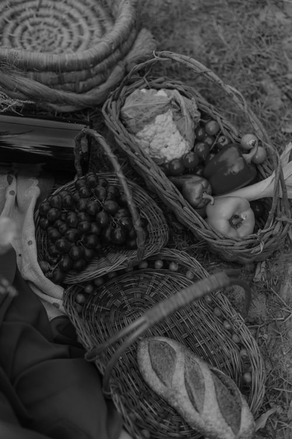
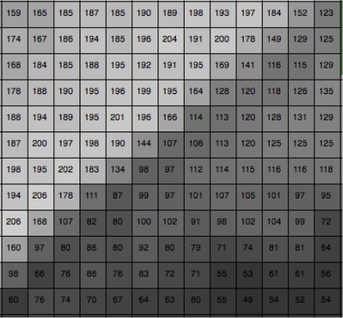
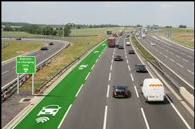
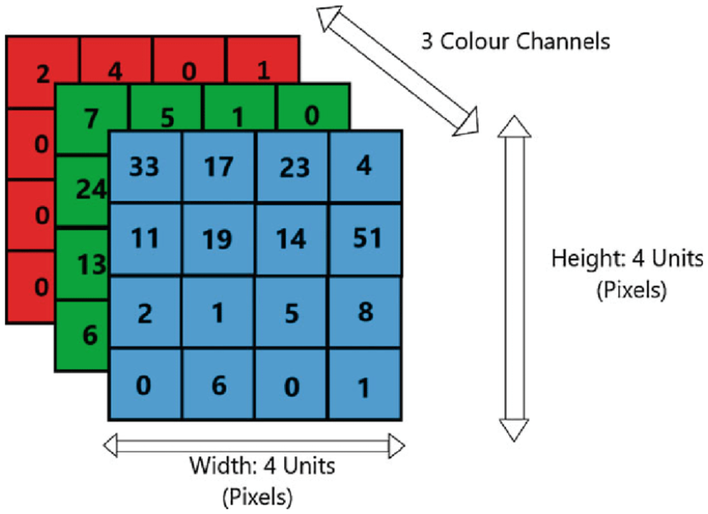

# Introduction to Images

:notebook_with_decorative_cover: Images come in a variety of forms, but when dealing with OpenCV we are mainly concerned with **digital images**. 

:notebook_with_decorative_cover: Digital images are mainly captured using cameras, scanners, computed tomography, and magnetic resonance imaging to name a few.

:notebook_with_decorative_cover: Digital images are electronic snapshots taken of a scene or scanned from documents, such as photographs, manuscripts, printed texts, and artwork. 

:notebook_with_decorative_cover: Digital images must be opened and read using a software programme hence the need for libraries such as OpenCV.

## How digital images are captured

1. Light from the subject enters the camera through the lens, which focuses the light onto the image sensor. 

2. The image sensor (<a href = "https://www.microscopyu.com/digital-imaging/introduction-to-charge-coupled-devices-ccds">CCD</a> or <a href = "https://www.tel.com/museum/exhibition/principle/cmos.html">CMOS</a>), made up of millions of tiny light-sensitive cells called pixels, captures the focused light. 

3. Each pixel records how much light of a specific color (red, green, or blue) reaches it. 

4. The sensor converts the light into digital data, which is then processed by the camera's image processor. 

5. The processed image data is then stored as a digital file, such as a JPEG or RAW file, on a memory card or the device's internal storage. 

6. In the case of color images, the camera uses a <a href = "https://www.arrow.com/en/research-and-events/articles/introduction-to-bayer-filters">Bayer filter</a> array to capture color information. After the image data is captured, the camera uses a process called <a href = "https://www.cse.iitb.ac.in/~ajitvr/CS663_Fall2016/demosaicing.pdf">demosaicing</a> to interpolate the color information from the neighboring pixels to create a full-color image. 

## Types of Digital Images: Raster vs. Vector

:notebook_with_decorative_cover: **Raster** images (also called **bitmaps**), are stored as **pixels**, or tiny boxes of colour arranged in a pattern to form an image. The higher the number of pixels in an image, the higher the image quality will be. Raster images often become *blurry* or *fuzzy* if scaled up or zoomed in.

:notebook_with_decorative_cover: **Pixels** in a raster image hold a numerical value that represents its brightness and/or color.

:notebook_with_decorative_cover:  **Vector** images, on the other hand, are stored using mathematical formulas that represent lines and curves. Vector images tend to be smaller than raster images and can be scaled up without losing quality because the image is simply redrawn using the mathematical formula. 

:notebook_with_decorative_cover:  While vector images would seem like the best choice for preservation because they are versatile and relatively small files, they have some disadvantages. Vector images work well for creating graphs or simple icons but do not work for photographic images. In addition, vector image file types (AL, EPS) are not well supported on the web, restricting how these types of images can be shared or published.

:notebook_with_decorative_cover: Raster images can be stored as different types of files: JPG, GIF, PNG, and TIFF are all common types. Each type of image file has advantages and disadvantages for long-term preservation. TIFF files store high quality images but are often very large and so take up a lot of storage space. JPG, GIF, and PNG images are much smaller files, however, are usually not of a high enough quality to produce derivative copies, which limits how they can be used in the future. The file standard JPEG 2000 provides an alternative that meets both requirements: a high-quality image file that can be compressed to take up less space.

:notebook_with_decorative_cover: OpenCV mainly handles raster images using arrays/matrices. 

:notebook_with_decorative_cover: There are two main types of raster images we deal with in OpenCV: grayscale and color images.

### Grayscale images

:notebook_with_decorative_cover: Each pixel in a grayscale image has a single value representing its brightness or intensity. This value ranges from `0` (black) to `255` (white), with values in between representing different shades of gray.

:notebook_with_decorative_cover: In other literature, grayscale images  are also known as black and white images.

:notebook_with_decorative_cover: Since the range of pixel values is between `0` and `255`, their data type is `8-bit unsigned integers`, which in OpenCV would be the data type **CV_8UC1**. From the OpenCV data type we can also deduce that grayscale images have `1` channel.

:notebook_with_decorative_cover: The following image is an example of a grayscale image. 

**Figure 1** - Grayscale image

:notebook_with_decorative_cover: Such an image would be represented by a 2-dimensional single channel matrix like the one in Figure 2. 

**Figure 2** - Possible matrix representation of a grayscale image

## Color images

:notebook_with_decorative_cover: Color images consists of **3 or 4** channels. The most popular one is the **RGB** (Red, Green, Blue) combination, mainly because this is how human eyes builds up colors. Sometimes we add a fourth element, known as **alpha (A)** to code the transparency of a color. This means in OpenCV the data types of color images should show `3` or `4` channels e.g. `CV_32FC3` or `CV_32FC4`.

**Figure 3** - Color image 

:notebook_with_decorative_cover: RGB color images would be represented by a 3-dimensional matrix of size: $image \space width \space x \space image \space height \space x \space number \space of \space channels$. 

**Figure 4** - RGB Color image matrix representation

:notebook_with_decorative_cover: Since we have 3 channels, each pixel will be represented by three values, for example, the top left pixel would have the values `(2, 7, 33)`.

:notebook_with_decorative_cover: The pixel values of a color image can be of any data type e.g. 8/16/32/64-bit signed/unsigned integer, 8/16/32/64-bit float etc. This also means the range of the pixel values in color images is not fixed like in grayscale images, it will vary depending on the data type. 

:notebook_with_decorative_cover: There are also other color systems you will come across when dealing with images, and each will have their own advantages:

1. **BGR** (Blue, Green , Red) is the standard display system used by the OpenCV library.
2. The **HSV** and **HLS** decompose colors into their hue, saturation and value/luminance components.
3. **YCrCb** is used by the popular JPEG image format.
4. **CIE L\*a\*b*** is a perceptually uniform color space, which comes in handy if you need to measure the distance of a given color to another color.

:notebook_with_decorative_cover: Each of the color systems will have defined data types for the pixel values. These can be 8-bit unsigned (can store values from 0 to 255) or signed (can store values from -127 to +127). If you want even more accuracy we can use 32-bit and 64-bit floating point values. But, you should note that the higher accuracy values will significantly increase the size of your images in memory, which could become an issue if dealing with a number of images at once.

## Working with image files in OpenCV

:notebook_with_decorative_cover: Images tend to use a lot of resources on your computer system, that includes storage space. To try and minimize storage space, image data is usually **compressed** into various forms that occupy less memory space before being stored on our systems and then **decompressed** into the original form when read from memory.

:notebook_with_decorative_cover: The functions OpenCV provides for opening and saving images either explicitly or implicitly deal with the complexities associated with compressing and decompressing image data. Image compression and decompression schemes heavily rely on existing backends either provided by OpenCV itself or through third-party libraries. You should know that these schemes sometimes lead to **loss of the original information**, but without degrading the **visual experience** of the image itself. Although this works for image data, such loss of data is not acceptable for arrays of non-image data.

:notebook_with_decorative_cover: The OpenCV functions used for loading and saving images handle the complete task of decompression and compression as well as the actual interaction with the file system so that you don't have to. However, individual functions for compression and decompression are made available and we will discuss them later in another tutorial.

## References

1. https://www.dpconline.org/docs/dpc-technology-watch-publications/topical-notes-series/1864-dp-note-3-digital-images/file
2. https://historicengland.org.uk/images-books/publications/digital-image-capture-and-file-storage/heag059-digital-images
3. https://www.microscopyu.com/digital-imaging/introduction-to-charge-coupled-devices-ccds
4. https://www.tel.com/museum/exhibition/principle/cmos.html
5. https://www.arrow.com/en/research-and-events/articles/introduction-to-bayer-filters
6. https://www.cse.iitb.ac.in/~ajitvr/CS663_Fall2016/demosaicing.pdf