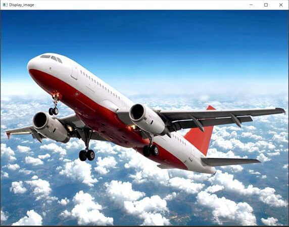
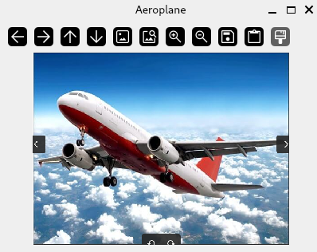
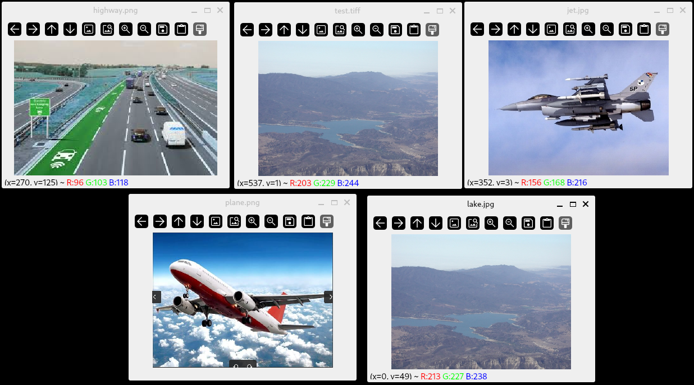

# Reading image files

:notebook_with_decorative_cover: As of Opencv 4.8.0, the following image file formats can be read:

* Windows bitmaps - *.bmp, *.dib (always supported)

* JPEG files - *.jpeg, *.jpg, *.jpe

* JPEG 2000 files - *.jp2 

* Portable Network Graphics - *.png 

* WebP - *.webp 

* AVIF - *.avif

* Portable image format - *.pbm, *.pgm, *.ppm *.pxm, *.pnm (always supported)

* PFM files - *.pfm 

* Sun rasters - *.sr, *.ras 

* TIFF files - *.tiff, *.tif

* OpenEXR Image files - *.exr

* Radiance HDR - *.hdr, *.pic (always supported)

* Raster and Vector geospatial data supported by GDAL 

:notebook_with_decorative_cover: The above statement in only true if you have installed supporting libraries for these image file formats. You should already have done this when you installed OpenCV. For example, on Linux you install what are known as developement files as follows:

* `sudo apt-get install -y libjpeg-dev` - for JPEG files
* `sudo apt-get install -y libwebp-dev` - for Webp files
* `sudo apt-get install -y libpng-dev` - for Portable Network Graphics (PNG) files
* `sudo apt-get install -y libtiff5-dev` - for TIFF files
* `sudo apt-get install -y libopenexr-dev` - for OpenEXR files
* `sudo apt-get install -y libgdal-dev` - for Raster and Vector geospatial data supported by GDAL

:notebook_with_decorative_cover: If you have an image file and are not sure if OpenCV can read its data, use the function `bool cv::haveImageReader(const cv::String& filename)`, where `filename` is the file path to the image (including file name and extension). To use this function you need the header file <a href = "https://docs.opencv.org/4.8.0/d4/da8/group__imgcodecs.html">imgcodecs.hpp</a> - which you include as `#include opencv2/imgcodecs.hpp`. This header file also contains functions for reading, writing, compressing or decompressing image files.


## `cv::imread()`

:notebook_with_decorative_cover: OpenCV provides the function `cv::imread()` for reading a single image file from a filesystem into your program. The function loads an image from the specified file and returns it. 

:notebook_with_decorative_cover: When loading an image, `cv::imread()` does not look at the file extension. Instead, it analyses the first few bytes of the file (also known as a **file signature** or **magic sequence**) and determines the appropriate package or library to use. 

:notebook_with_decorative_cover: By default, all color images are loaded in the **BGR** (Blue, Green, Red) format. 

:notebook_with_decorative_cover: If the image cannot be read (because of missing file, improper permissions, unsupported or invalid format, etc.), the function returns an empty matrix. 

:notebook_with_decorative_cover: The function has the following full syntax: 
`cv::Mat cv::imread(const cv::String& filename, int flags = cv::IMREAD_COLOR)`

1. `filename` - Name of image file. In most cases the name should be accompanied by the file path to the image. Although data type is `cv::String`, you can also use C++ `std::string`.

2. `flags` - This is a value from <a href = "https://docs.opencv.org/4.8.0/d8/d6a/group__imgcodecs__flags.html#ga61d9b0126a3e57d9277ac48327799c80">cv::ImreadModes</a>. This is how you want the image to be loaded as e.g., as is, as a single channel grayscale image, as a 3 channel color image etc. As of OpenCV 4.8.0, the most commonly used flags are shown in the table below.

| Flag | Description |
| ---- | ---- |
| `cv::IMREAD_GRAYSCALE` | If set, always convert image to the single channel grayscale image (this is done internally by the function).  |
| `cv::IMREAD_COLOR` | If set, always convert image to the 3 channel BGR color image. Even if the original image is grayscale, the loaded image will have 3 channels, with all channels containing identical information. |
| `cv::IMREAD_ANYDEPTH` | If set, return 16-bit/32-bit image when the input has the corresponding depth or data type, otherwise convert it to 8-bit. |
| `cv::IMREAD_ANYCOLOR` | If set, the image is loaded **as is**, with the result being three-channel if the image is color, and one-channel if the file is grayscale. If an image has more than 3 channels it will be cropped to 3 channels.|
| `cv::IMREAD_UNCHANGED` | If set, is equivalent to combining: `cv::IMREAD_ANYCOLOR` and `cv::IMREAD_ANYDEPTH`. This flag also has the unique effect of preserving the **alpha** channel in an image when loaded unlike most other flags. |
| `cv::IMREAD_LOAD_GDAL` | If set, use the `gdal` driver for loading the image. This flag is mostly used when loading **Raster** or **Vector** datasets. You will need to have set `WITH_GDAL` flag to `true` in CMake when installing OpenCV for this flag to work properly.|

:notebook_with_decorative_cover: When `cv::imread()` reads an image file it stores it as an array of type `cv::Mat` since it is likely to be a very large dense array.

:notebook_with_decorative_cover: In some of the previous statements I used phrases like *16-bit image*, *8-bit image*, *32-bit image* etc. This simply referes to the number of bits used to store the pixel values that make up the image. `8-bit` and `16-bit` are mainly used for integer values e.g. 0-255, while `32-bits` or `64-bits` are used for floating point values with a lot of decimal values.

### Displaying images in OpenCV

:notebook_with_decorative_cover: Once you have managed to read an image file, you most likely want to see what it looks like visually. We will take a short detour here to discuss how you can do that in OpenCV.

:notebook_with_decorative_cover: OpenCV provides a header file <a href = "https://docs.opencv.org/4.8.0/d7/dfc/group__highgui.html"><highgui.hpp></a> mainly focussing on creating a very simple **Graphical User Inteface (GUI)** for displaying your image. 

:notebook_with_decorative_cover: From this header file we need to know a few key functions:

1. `void cv::namedWindow(const cv::String& winname, int flags = cv::WINDOW_AUTOSIZE)` - Creates a window that can be used to place an image and other graphics. Created windows are referred to by their names `winname`. The `flags` parameter provides the following options:
	* `cv::WINDOW_NORMAL` - the user can resize the window (no constraint) / also use to switch a fullscreen window to a normal size.
	* `cv::WINDOW_AUTOSIZE` - the user cannot resize the window, the size is constrainted by the image displayed. 
	* `cv::WINDOW_OPENGL` - window with opengl support
	* `cv::WINDOW_FULLSCREEN` - change the window to fullscreen.
	* `cv::WINDOW_FREERATIO` - the image expands as much as it can (no ratio constraint)
	* `cv::WINDOW_KEEPRATION` - the ratio of the image is respected
	* `cv::WINDOW_GUI_EXPANDED` - window includes a statusbar and a toolbar
	* `cv::WINDOW_GUI_NORMAL` - is the old way to draw the window without statusbar and toolbar.

2. `void cv::imshow(const cv::String& winname, cv::InputArray mat)` - This function displays a single image defined by the variable `mat` in a specified window, whose name is defined by the variable `winname`. The image shown is always limited by your screen resolution. This function may scale the image depending on its depth (data type):

    * If the image is 8-bit unsigned, it is displayed as is.
    * If the image is 16-bit unsigned, the pixels are divided by 256. That is, the value range `[0, 255*256]` is mapped to `[0, 255]`.
    * If the image is 32-bit or 64-bit floating-point, the pixel values are multiplied by `255`. That is, the value range `[0, 1]`is mapped to `[0, 255]`.
    * 32-bit integer images are not processed anymore due to ambiguouty of required transform. Convert to 8-bit unsigned matrix using a custom preprocessing specific to image's context.

3. `int cv::waitKey(int delay = 0)` - This function waits for the user to press any key on their keyboard. The variable `delay` is the amount of time in **milliseconds** the operating system will wait for the user to press a key. `0` is the special value that means wait "forever". Since the OS has a minimum time between switching threads, the function will not wait exactly `delay` milliseconds, it will wait at least `delay` ms, depending on what else is running on your computer at that time. `cv::waitKey(0)` will display the window infinitely until any keypress (it is suitable for image display). `cv::waitKey(25)` will display a frame and wait approximately `25` ms for a key press (suitable for displaying a video frame-by-frame). This function returns the code of the pressed key or `-1` if no key was pressed before the specified time had elapsed. The function only works if there is at least one GUI window created and the window is active. If there are several GUI windows, any of them can be active. This function always follows `cv::imshow()`, otherwise, your image will not display.

4. `void destroyWindow(const cv::String& winname)`  - destroys the window nammed `winname`. Any memory used by the window is then returned to the system.
5. `void destroyAllWindows()` - Use this function to destroy more than one window.

:notebook_with_decorative_cover: If you run the above functions successfully, you should expect to see a default basic window displaying an image as in Figure 1.

<p align = "center"><b>Figure 1:</b> Basic HighGUI Window </p> 

<p align ="center">
        
</p>


### Qt backend support

:notebook_with_decorative_cover: OpenCV is a computer vision library NOT a Graphical User Interface library hence the windows you can create are simple, plain and down right visually boring.

:notebook_with_decorative_cover: To try to provide users an opportunity to create better quality GUI's, OpenCV provides backend support for <a href = "https://www.qt.io/">Qt</a> - a library for creating visually stunning GUI's. However, because it is backend support you won't get all Qt functionality through OpenCV, but it is better than the default graphics. For example, with Qt support, your basic window would look as follows:


<p align = "center"><b>Figure 2:</b> Basic window with Qt backend support</p>

<p align ="center">
        
</p>


:notebook_with_decorative_cover: The GUI shown in Figure 2 is already much better than the one in Figure 1 as it already provides other functionality such as panning, zooming etc whilst using the same code for creating the GUI in Figure 1.

:notebook_with_decorative_cover: To get support for Qt in OpenCV you need to: 

1. Have installed Qt on your system
2. Included the option `-D WITH_QT=ON` when building OpenCV package with CMake. 

:notebook_with_decorative_cover: For now, this will be enough to display any image files. In a future tutorial we will look at how to add other graphics to our windows.

**Example on reading and displaying an image**

:notebook_with_decorative_cover: Our example is very simple, the user provides two inputs: (1) path to an image file, (2) title of image (which will appear as the window title). Also note that any color image will be displayed in **BGR** (Blue, Green, Red) format, which is the default color sequence for OpenCV. Later on when we start to talk about image processing techniques, we will discuss how we can convert BGR to other formats such as RGB, grayscale etc. Considering that we have more than one flag we can use for the window, here we are using one default flag because with command line arguments it is not that easy to show the user the many choices we have. We can cure this frustration by designing our own GUI in a later tutorial.

:notebook_with_decorative_cover: Since we might need such a program or application in future we will create it as an independent program. The source file will be named `read_display_image.cpp` and the compiled/build program will be named `Read-Display-Image-app`. We are also going to need the OpenCV modules `core`, `highgui` and `imgcodecs`. If using CMake these changes will need to be reflected in the `CMakeLists.txt` file in the folder `Example-Code/Read-Write-Data-app/`. The file should look as follows:

```txt
# Our 'read_and_display_image.cpp' is dependent on two external libraries: 
#   1. OpenCV
#   2. utility_functions_library - contains our own user-defined commonly used functions

# We will first look at finding the OpenCV package on our local system, in order to run our code 

# Where do you find the OpenCV package? How do we link to OpenCV project
# ======================================================================

# 1. Instead of installing OpenCV to the usual path /usr/local ( on Linux O/S). I have installed
#    mine in a different directory ../Third_Party_Libraries/OpenCV_4.8.0/release/installed 
#    I do this for every version of OpenCV I install so I can have multiple versions which don't conflict with each other
# 2. When installed properly OpenCV  provides a 'cmake' folder, which contains its cmake config file named 'OpenCVConfig.cmake'
#    You need the path to this folder. For most people on Linux the path would be '/usr/local/lib/cmake/opencv4'

# Set path to directory with OpenCVConfig.cmake file
set(OpenCV_DIR "$ENV{HOME}/Third_Party_Libraries/OpenCV_4.8.0/release/installed/lib/cmake/opencv4")

# OpenCV package comes with quite a lot of modules/libraries - which we don't usually need all at once
# We want access to the 'core', `imgcodecs` and `highgui` modules
find_package(OpenCV REQUIRED core imgcodecs highgui)

if(OpenCV_FOUND)
    # Additional Include Directories - these contain the header files e.g. 'core.hpp'
    # CMake will find these for us
    include_directories(${OpenCV_INCLUDE_DIRS})

    # Additional Library Directories - these contains the libraries e.g 'libopencv_core.so', 'libopencv_core.so.4.8.0' etc
    # CMake will find these for us
    link_directories(${OpenCV_LIB_DIR})

    # Create an executable file from our 'read_and_display_image.cpp' source file
    # The executable will be called 'Read-Write-Data-app'
    add_executable(Read-Display-Image-app read_and_display_image.cpp)

    # We want to use C++17 standard (minimum)
    target_compile_features(Read-Display-Image-app PRIVATE cxx_std_17)

    # Additional dependencies
    # Our executable is dependend on OpenCV libraries and our 'utility_functions_library'
    target_link_libraries(Read-Display-Image-app ${OpenCV_LIBS} utility_functions_library)

endif(OpenCV_FOUND)
```


**Example 1** - Read and display an image file

```c++
// Program: read_and_display_image.cpp

#include "opencv2/core.hpp"
#include "opencv2/core/utility.hpp"    // for cv::CommandLineParser
#include "opencv2/highgui.hpp"         // for functions related to displaying images e.g. cv::imshow(), cv::waitKey()
#include "opencv2/imgcodecs.hpp"       // for cv::imread()

#include <UtilityFunctions/utility_functions.h> // for user-defined functions

#include <iostream>

int main(int argc, char* argv[])
{
    /*
     * Define the command line arguments:
     *  1. image - full file path to image. This should not be empty
     *  2. title - string describing the image
     * 
    */
    const cv::String keys = 
        "{help h usage ? | | Display an image without alterations }"
        "{image | <none> | full path to image to be displayed }"
        "{title |        | short text describing the image }";

    // Define a cv::CommandLineParser object
    cv::CommandLineParser parser(argc, argv, keys);

    // We also want to display a message about the program
    parser.about("\nRead and Display Images v1.0.0\n");
    parser.printMessage();

    // Now lets extract user input
    cv::String imagePath = parser.get<cv::String>("image");
    cv::String imageTitle = parser.get<cv::String>("title");

    // check for any errors encountered 
    if(!parser.check())
    {
        parser.printErrors(); // Print the errors

        return -1; // Early exit
    }

    // Before attempting to read the image, check if we have an 
    // image reader for that particular image file first
    if(!cv::haveImageReader(imagePath))
    {
        std::cerr << "\nYour system does not have a suitable image reader for the file: " 
                  << imagePath << '\n';

        return -1;
    }

    // Use cv::imread() to read an image file as is 
    // and save the image as a cv::Mat array
    cv::Mat image { cv::imread(imagePath, cv::IMREAD_UNCHANGED) };    

    // check if we have successfully opened the image
    if (image.empty())
    {
        std::cerr << "Could not read input image file data: " 
                  << imagePath << '\n';
        
        return -1;
    }

    // We also want to display some other information about the image 
    // (1)No. of channels, (2) image size, (3) data type
    std::cout << "\nImage size (width x height): " << image.cols << " x " << image.rows 
              << "\nNo. of channels: " << image.channels() 
              << "\nData type: " << CPP_CV::General::openCVDescriptiveDataType(image.type()) << '\n';

    // If the user did not provide an image title
    if(imageTitle.empty()) 
    {
        imageTitle = "Image"; // We simply name it 'Image'
    }

    // We use the image title as the window name
    // The user will be able to resize the image window
    cv::namedWindow(imageTitle, cv::WINDOW_NORMAL);

    // Show image on screen
    cv::imshow(imageTitle, image);

    // Image window will be displayed until a user presses any key
    // on the keyboard
    cv::waitKey(0);   
    
    // Release memory
    cv::destroyWindow(imageTitle);

    std::cout << '\n';

    return 0;
}
```

:notebook_with_decorative_cover: We have already discussed how to pass command line arguments to an application. Use those notes to run the above program. On my terminal I would run the programme `Read-Display-Image-app` as follows:

`yourHomeDirectory:~/Documents/OpenCV/.../Read_Write_Images/build/Read-Write-Data-app$ ./Read-Display-Image-app --image=/home/Documents/OpenCV/.../Read_Write_Images/Example-Code/images/plane.png --title=Aeroplane`

**Output**

    Image size (width x height): 573 x 428
    No. of channels: 4
    Data type: CV_8UC4 -> Array with 4 channels and primitive data type 8-bit unsigned integers with range (0 to 255)

<p align ="center">
        
</p>

**Tip**: If the title of your image contains more than one word, place the text string between double quotes e.g. `yourHomeDirectory:~/Documents/OpenCV/.../Read_Write_Images/build/Read-Write-Data-app$ ./Read-Display-Image-app --image=/home/Documents/OpenCV/.../Read_Write_Images/Example-Code/images/plane.png --title="My plane"`


**Example 2** - In this example, we will go through files from a directory/folder, read any image files and display each in its own window. **Keep pressing any key of keyboard to display the next image**. You can use your mouse to move the windows so they don't obstruct each other. We will use <a href = "https://en.cppreference.com/w/cpp/filesystem">std::filesystem</a> to navigate around files on our system. My program will have the source code file `read_display_multiple_images.cpp`, and the build file `Read-Display-Multiple-Images-app`. Hence if using CMake, make sure to make the necessary changes to the file `CMakeLists.txt` in the folder `Example-Code/Read-Write-Data-app/`, just like in the previous example.

```c++
// Program: read_display_multiple_images.cpp

// In this program we read multiple images from a folder/directory, then 
// display each in a seperate window.

#include "opencv2/core.hpp"
#include "opencv2/core/utility.hpp"    // for cv::CommandLineParser
#include "opencv2/highgui.hpp"         // for functions related to displaying images e.g. cv::imshow(), cv::waitKey()
#include "opencv2/imgcodecs.hpp"       // for cv::imread()

#include <UtilityFunctions/utility_functions.h> // for user-defined functions

#include <iostream>
#include <filesystem> // for handling file systems

int main(int argc, char* argv[])
{
    /*
     * Define the command line arguments:
     *  1. dir - full file path directory/folder with image files. 
     *           This should not be empty
     * 
    */
    const cv::String keys = 
        "{help h usage ? | | Display images without alterations }"
        "{dir | <none> | full path to directory/folder with image files }";

    // Define a cv::CommandLineParser object
    cv::CommandLineParser parser(argc, argv, keys);

    // We also want to display a message about the program
    parser.about("\nRead and Display Multiple Images v1.0.0\n");
    parser.printMessage();

    // Now lets extract user input
    cv::String dirPath = parser.get<cv::String>("dir");

    // check for any errors encountered 
    if(!parser.check())
    {
        parser.printErrors(); // Print the errors

        return -1; // Early exit
    }

    // We need to go through the contents of our directory and read 
    // the image files. We will use an iterator 'directory_iterator' 
    // from std::filesystem to go through the directory contents.
    // However, this iterator will not go through any sub-directories
    const std::filesystem::path directory {dirPath}; // Get 'dirPath' as a 'path' object

    for (auto const& dir_entry :std::filesystem::directory_iterator{directory})
    {
        // Before attempting to read the file, check if it is an image file by 
        // using cv::haveImageReader(). Even if it is an image file, here we can 
        // also check if we have an image reader for that image file
        if(!cv::haveImageReader(dir_entry.path().string()))
        {
            std::cerr << "\nCannot read the file: " << dir_entry.path() 
                      << " as an image file." << '\n';           
        }
        else 
        {
            // Use cv::imread() to read an image file as is 
            // and save the image as a cv::Mat array
            cv::Mat image { cv::imread(dir_entry.path().string(), cv::IMREAD_UNCHANGED) };    

            // check if we have successfully opened the image
            if (image.empty())
            {
                std::cerr << "Could not read data from image file: " 
                        << dir_entry.path().string() << '\n';
                
            }
            else // if we can read image data
            {

                // We also want to display some other information about the image 
                // (1)No. of channels, (2) image size, (3) data type
                std::cout << "\nImage file: " << dir_entry.path().filename().string() 
                        << "\nImage size (width x height): " << image.cols << " x " << image.rows 
                        << "\nNo. of channels: " << image.channels() 
                        << "\nData type: " << CPP_CV::General::openCVDescriptiveDataType(image.type()) << '\n';

                // We will use image file name for the window name
                cv::namedWindow(dir_entry.path().filename().string(), cv::WINDOW_NORMAL);

                // Show image on screen            
                cv::imshow(dir_entry.path().filename().string(), image);

                // Image window will be displayed until a user presses any key
                // on the keyboard
                cv::waitKey(0);  
            }

        }

    }     

    // Release all memory by destroying all windows
    cv::destroyAllWindows();

    std::cout << '\n';

    return 0;
}
```
:notebook_with_decorative_cover: If you were to run the above program using the directory `Example-Code/images` you will get output close to the following:

**Output**

    Image file: jet.jpg
    Image size (width x height): 400 x 300
    No. of channels: 3
    Data type: CV_8UC3 -> Array with 3 channels and primitive data type 8-bit unsigned integers with range (0 to 255)

    Image file: test.tiff
    Image size (width x height): 614 x 461
    No. of channels: 3
    Data type: CV_8UC3 -> Array with 3 channels and primitive data type 8-bit unsigned integers with range (0 to 255)

    Image file: highway.png
    Image size (width x height): 275 x 183
    No. of channels: 3
    Data type: CV_8UC3 -> Array with 3 channels and primitive data type 8-bit unsigned integers with range (0 to 255)

    Image file: plane.png
    Image size (width x height): 573 x 428
    No. of channels: 4
    Data type: CV_8UC4 -> Array with 4 channels and primitive data type 8-bit unsigned integers with range (0 to 255)

    Image file: lake.jpg
    Image size (width x height): 614 x 461
    No. of channels: 3
    Data type: CV_8UC3 -> Array with 3 channels and primitive data type 8-bit unsigned integers with range (0 to 255)

<p align = "center">
    
</p>


## Read a multi-page image 

:notebook_with_decorative_cover: OpenCV also provides a function we can use to read a multi-page image file. A **multi-page image file** is usually a `TIFF` file, and is created by saving more than one image using a single filename. The function `cv::imreadmulti()` has two versions, one allows you to read all the images from the file and the other allows you to choose which images to read by providing a start index and the number of images to read. With both functions, images are saved into a `std::vector`.

1. `bool cv::imreadmulti(const cv::String& filename, std::vector<cv::Mat>& mats, int flags = cv::IMREAD_ANYCOLOR)` - This version reads all images into the `std::vector` `mats`. Returns `true` if successful.

2. `bool cv::imreadmulti(const cv::String& filename, std::vector<cv::Mat>& mats, int start, int count, int flags = cv::IMREAD_ANYCOLOR)` - This version allows you to read `count` images from index position `start`. Images are saved into the `std::vector` `mats`. Function also returns `true` if successful.

:notebook_with_decorative_cover: We will provide an example on how to read multi-page image files after we have shown you how to save them first to a single file.