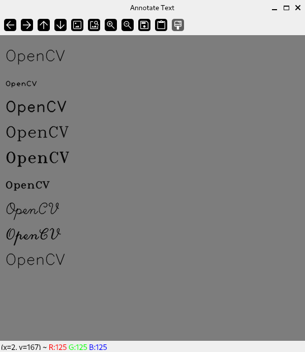
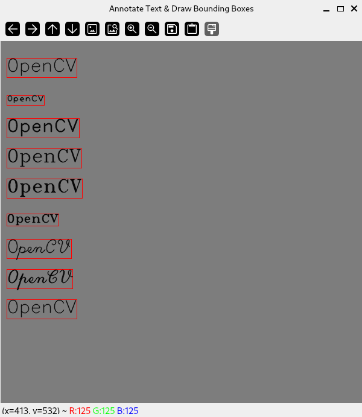

# Annotation

:notebook_with_decorative_cover: **Annotation** is a form of drawing text on images.

:notebook_with_decorative_cover: OpenCV provides solutions for simple cases only.

## Add text to an image

:notebook_with_decorative_cover: OpenCV provides the function `void cv::putText (cv::InputOutputArray img, const cv::String& text, cv::Point org, int fontFace, double fontScale, cv::Scalar color, int thickness = 1, int lineType = cv::LINE_8, bool bottomLeftOrigin = false)` for annotating an image with text of various font type, font scale and color. We discuss the parameters below:

* `img` - Image to annotate
* `text` - Text string to be drawn/annotated
* `org` - Coordinates of bottom-left corner of the text string
* `fontFace` - <a href = "https://docs.opencv.org/4.8.0/d6/d6e/group__imgproc__draw.html#ga0f9314ea6e35f99bb23f29567fc16e11">Font type</a>
* `fontScale` - Font scale factor that is multiplied by the font-specific base size
* `color` - Text color
* `thickness` - Thickness of the lines used to draw the text
* `lineType` - <a href = "https://docs.opencv.org/4.8.0/d6/d6e/group__imgproc__draw.html#gaf076ef45de481ac96e0ab3dc2c29a777">Line type</a>
* `bottomLeftOrigin` - When true, the image data origin is at the bottom-left corner. Otherwise, it is at the top-left corner (default origin). 

:notebook_with_decorative_cover: Symbols in your text string that cannot be rendered using the specified font are replaced by question marks.

**Example 1** - In the following example we annotate the text **OpenCV** using various kinds of fonts.

```c++
#include "opencv2/core/core.hpp"        // for OpenCV core types e.g. cv::Mat
#include "opencv2/highgui/highgui.hpp"  // for display windows
#include "opencv2/imgproc/imgproc.hpp"  // for Drawing and Annotation functions

#include <iostream>
#include <array>

int main()
{ 
        
    ///////////////////// Create a Canvas //////////////////////////

    // Create a 600x600 3-channel image with a gray background 
    cv::Mat image(cv::Size(600, 600), CV_8UC3, cv::Scalar(125, 125, 125));

    // check if you have successfully created the image
    if(image.empty())
    {
        std::cout << "ERROR! Could not create canvas.\n";

        return -1;
    }

    std::cout << "\nCanvas created...\n\n";
    
    ////////////////////// Annotate Text /////////////////////////////////////////
   

    // Add the various font types into a std::array
    std::array <int, 9> fontFace {cv::FONT_HERSHEY_SIMPLEX,
                                 cv::FONT_HERSHEY_PLAIN, 
                                 cv::FONT_HERSHEY_DUPLEX,
                                 cv::FONT_HERSHEY_COMPLEX, 
                                 cv::FONT_HERSHEY_TRIPLEX, 
                                 cv::FONT_HERSHEY_COMPLEX_SMALL, 
                                 cv::FONT_HERSHEY_SCRIPT_SIMPLEX, 
                                 cv::FONT_HERSHEY_SCRIPT_COMPLEX, 
                                 cv::FONT_ITALIC
                                };

    double fontScale {1};
    int thickness {1};
    int y_coordinate {50}; // Starting y-coordinate   

    for (std::size_t i {0}; i < fontFace.size(); ++i)
    {
        cv::putText(image,                        // Canvas/image
                    cv::String("OpenCV"),         // Text to annotate
                    cv::Point(10, y_coordinate),  // Bottom-left corner coordinates
                    fontFace[i],                  // Font type
                    fontScale,                    // Scale
                    cv::Scalar(0, 0, 0),          // Text color
                    thickness,                    // Line thickness
                    cv::LINE_AA                   // Use anti-aliasing
                );
                
        // Annotated Text will be seperated by 50 pixels along the y-axis
        y_coordinate += 50; 
    }
    

    ///////////////// Display Image Canvas ////////////////////////////////   


    cv::String window_name = "Annotate Text"; 
    cv::namedWindow(window_name, cv::WINDOW_AUTOSIZE);
    cv::imshow(window_name, image);

    cv::waitKey(0);

    cv::destroyWindow(window_name);

    std::cout << '\n';

    return 0;
}
```

**Output**




## Other support functions

:notebook_with_decorative_cover: OpenCV provides two other functions to use with text annotation.

### 1. `cv::getTextSize()`

:notebook_with_decorative_cover: Given a text string, font type, scale, and line thickness, we can calculate the width and height of the text string when annotated on our image. These dimensions are important if you want to draw a tight box surrounding your text string. It might seem trivial now, but in advanced topics such as **Object Detection** you will use this function to draw a box around the text marking the detected object.

:notebook_with_decorative_cover: This function has the full definition `cv::Size cv::getTextSize(const cv::String& text, int fontFace, double fontScale, int thickness, int*baseline)`, where 

* `text` - Input text string to annotate
* `fontFace` - Font type to use. See <a href = "https://docs.opencv.org/4.8.0/d6/d6e/group__imgproc__draw.html#ga0f9314ea6e35f99bb23f29567fc16e11">here</a>
* `fontScale` - Font scale factor
* `thickness` - Thickness of lines used to render the text
* `baseline` - y-coordinate of the baseline relative to the bottom-most text point. Remember the bottom-right corner of your text string is the origin of your annotated text.

:notebook_with_decorative_cover: The function returns a `cv::Size` object - which has two arguments `width` and `height`.

**Example 2** - Annotate text of various font types and draw a tight bounding box around each text string

```c++
#include "opencv2/core/core.hpp"        // for OpenCV core types e.g. cv::Mat
#include "opencv2/highgui/highgui.hpp"  // for display windows
#include "opencv2/imgproc/imgproc.hpp"  // for Drawing and Annotation functions

#include <iostream>
#include <array>

int main()
{ 
        
    ///////////////////// Create a Canvas //////////////////////////

    // Create a 600x600 3-channel image with a gray background 
    cv::Mat image(cv::Size(600, 600), CV_8UC3, cv::Scalar(125, 125, 125));

    // check if you have successfully created the image
    if(image.empty())
    {
        std::cout << "ERROR! Could not create canvas.\n";

        return -1;
    }

    std::cout << "\nCanvas created...\n\n";
    
    ////////////////////// Annotate Text & Draw a Bounding Box ///////////////////

    // Add the various font types into a std::array
    std::array <int, 9> fontFace {cv::FONT_HERSHEY_SIMPLEX,
                                 cv::FONT_HERSHEY_PLAIN, 
                                 cv::FONT_HERSHEY_DUPLEX,
                                 cv::FONT_HERSHEY_COMPLEX, 
                                 cv::FONT_HERSHEY_TRIPLEX, 
                                 cv::FONT_HERSHEY_COMPLEX_SMALL, 
                                 cv::FONT_HERSHEY_SCRIPT_SIMPLEX, 
                                 cv::FONT_HERSHEY_SCRIPT_COMPLEX, 
                                 cv::FONT_ITALIC
                                };
    double fontScale {1};
    int thickness {1}; 

    int y_coordinate {50}; // Starting y-coordinate of text string

    cv::String text {"0penCV"}; // Text to annotate

    for (std::size_t i {0}; i < fontFace.size(); ++i)
    {
        int baseline {0}; // We will use the bottom-line of the box as the baseline

        // Compute Text Size for each font type
        cv::Size textSize = cv::getTextSize(text,         // Text string
                                            fontFace[i],  // Font Type
                                            fontScale,    // Font scale
                                            thickness,    // Thickness of lines used
                                            &baseline     // Baseline for text string
                                        );

        // Draw the box  using cv::rectangle()
        // Use text 'width' and 'height' from above to get the coordinates 
        // of two opposite corners of our box
        cv::rectangle(image, 
                      cv::Point(10, y_coordinate) + cv::Point(0, baseline), // bottom-left corner
                      cv::Point(10, y_coordinate) + cv::Point(textSize.width, -textSize.height), // top-right corner
                      cv::Scalar(0, 0, 255) // Box outline color - Red
                    );
        
        // Add text to image
        cv::putText(image,                        // Canvas/image
                    text,                         // Text to annotate
                    cv::Point(10, y_coordinate),  // Bottom-left coordinates
                    fontFace[i],                  // Font type
                    fontScale,                    // Scale
                    cv::Scalar(0, 0, 0),          // Text color - Black
                    thickness,                    // Line thickness
                    cv::LINE_AA                   // Use anti-aliasing
                );

        // Annotated Text will be seperated by 50 pixels along the y-axis
        y_coordinate += 50; 
    }
    

    ///////////////// Display Image Canvas ////////////////////////////////  

    cv::String window_name = "Annotate Text & Draw Bounding Boxes"; 
    cv::namedWindow(window_name, cv::WINDOW_AUTOSIZE);
    cv::imshow(window_name, image);

    cv::waitKey(0);

    cv::destroyWindow(window_name);

    std::cout << '\n';

    return 0;
}
```
**Output**



### 2. `cv::getFontScaleFromHeight()`

:notebook_with_decorative_cover: To compute the font-specific size to use to achieve a given text height in pixels use the function `double cv::getFontScaleFromHeight(const int fontFace, const int pixelHeight, const int thickness = 1)`. `fontFace` is the <a href = "https://docs.opencv.org/4.8.0/d6/d6e/group__imgproc__draw.html#ga0f9314ea6e35f99bb23f29567fc16e11">Font type</a> to use. `pixelHeight` is the pixel height to compute the `fontScale` for. `thickness` is the thickness of lines used to render the text.

:notebook_with_decorative_cover: The returned value from this function can be used as the parameter value for `fontScale` in the function `cv::putText()`.

