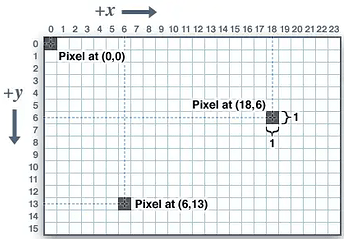
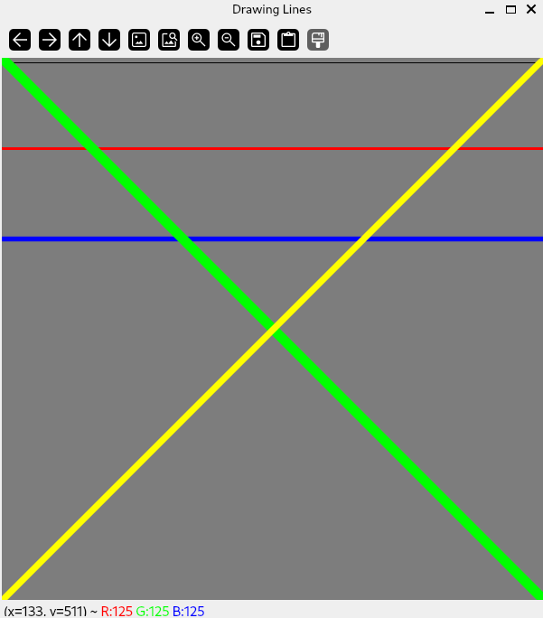
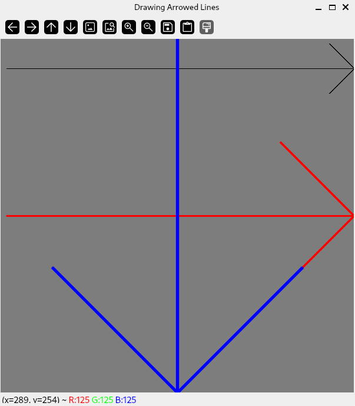
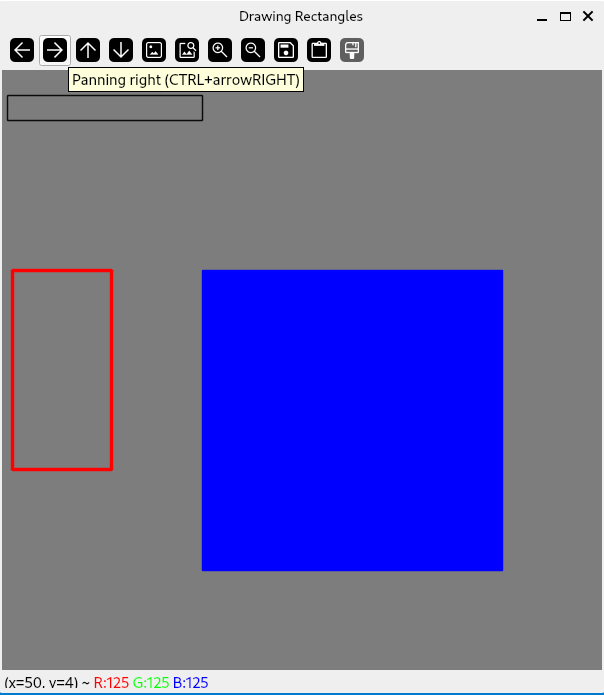

# Introduction

:notebook_with_decorative_cover: OpenCV allows us to draw basic shapes (lines, squares, circles etc.) on top of images.

:notebook_with_decorative_cover: For color images, OpenCV's drawing functions affect only the first `3` channels. For `4`-channel images, the last channel (also known as the **alpha channel**) is ignored.

:notebook_with_decorative_cover: For single-channel images, OpenCV drawing functions only use the `1` channel.

:notebook_with_decorative_cover: Drawing on top of images is considered part of image processing hence you will find the drawing functions in the header file `<imgproc.hpp>`.

:notebook_with_decorative_cover: Once we start using OpenCV's drawing functions you will notice that most will require `thickness`, `lineType` and `shift` parameters. We will discuss these first as they are important to how your drawing will visually appear.

1. `thickness` - This parameter represents the thickness of the line measured in pixels. For most shapes, you provide an integer value starting from `1`. However, for closed shapes (circles, rectangles, polygons etc), you can also provide the value `-1` (which is an alias for `cv::FILLED`) if you want the shape to be filled with the same color as the shape edges.
2. `lineType` - This is also an integer parameter which accepts the values `4` (aliase for `cv::LINE_4`), `8` (aliase for `cv::LINE_8`) or `cv::LINE_AA`. This value indicates whether the lines should be **4-connected**, **8-connected** or **anti-aliased**. **4-connected** and **8-connected** lines use the <a href = "https://en.wikipedia.org/wiki/Bresenham%27s_line_algorithm">Bresenham line algorithm</a> - which determines the pixels that should be selected in order to form a close approximation to a straight line between two points. There is a lot of literature on the Bresenham algorithm online that you can look at to expand your knowledge. Some links are in the **References** section at the end of this tutorial. `cv::LINE_AA` or <a href = "https://en.wikipedia.org/wiki/Spatial_anti-aliasing">anti-aliased</a> uses <a href = "https://www.google.com/url?sa=t&source=web&rct=j&opi=89978449&url=https://www.southampton.ac.uk/~msn/book/new_demo/gaussian/&ved=2ahUKEwj44YWW6vKMAxWjUUEAHUO3K_EQFnoECCMQAw&usg=AOvVaw3lybc2WphSBVIKrSEv17uI">Gausian filtering</a> to select which pixels to use when connecting lines. Anti-aliasing minimizes distortions (e.g. jagged polygon edges) thus making lines, edges etc., appear smooth when high-resolution images are viewed at a lower resolution (also called **zooming in**). As such if you want smooth lines use `cv::LINE_AA` followed by `cv::LINE_8` and then `cv::LINE_4` in your drawing functions. 
3. `shift` - Most of the drawing functions accept endpoints (for lines), center points (for circles), corner points (for rectangles) pixel coordinates as integer values. However, these functions also support sub-pixel accuracy through the `shift` parameter. This parameter specifies the fractional bits and the real point coordinates are computed as $cv::Point(x,y) = cv::Point2f(x*2^{-shift}, y*2^{-shift})$. For example, if you want a circle centered at `(5, 5)`, but set shift to `1`, then the circle will be drawn at `(2.5, 2.5)`. The effect of this will typically be quite subtle, and depend on the line type used. The effect is most noticiable for anti-aliased lines.

## Image Coordinate System

:notebook_with_decorative_cover: When drawing you mainly use coordinates to establish the starting point/s of your shapes. In order to do this, you need a good understanding of the 2-D image coordinate system used in OpenCV. 

1. The 2-D image coordinate system is represented as a grid made out of pixels.
2. Each pixel represents `1` unit.
3. The origin of the coordinate system is the top left pixel of the image and has the coordinates `x = 0` and `y = 0` or `(0,0)`.
4. The coordinate system is left-handed, i.e. x-axis is positive to the right and y-axis is positive downwards as shown in Figure 1.

**Figure 1:** 2-Dimensional image coordinate system in OpenCV



5. When writing coordinates you always start with the x-coordinate followed by the y-coordinate.


## Draw Lines

:notebook_with_decorative_cover: To draw a line connecting 2 points use the function `void cv::line(cv::InputOutputArray img, cv::Point pt1, cv::Point pt2, const cv::Scalar& color, int thickness = 1, int lineType = cv::LINE_8, int shift = 0)`, where, 

* `img` - Image to draw on
* `pt1` - Integer coordinates of first point of line
* `pt2` - Integer coordinates of second point of line
* `color` - Line color. This is of type `cv::Scalar` which by definition holds 4-values. However, since the drawing functions only use the first 3-channels, you only need to provide 3 values for 3-channel color images, and 1 value for 1-channel images. Remember, OpenCV color format is `BGR` (Blue, Green, Red). 
* `thickness` - Line thickness. We have already discussed this parameter.
* `lineType` - Type of the line. We have already discussed this parameter.
* `shift` - Number of fractional bits in the point coordinates.

:notebook_with_decorative_cover: If the coordinates of `pt1` or `pt2` are outside the image, the line you draw will be clipped by the image boundaries. 

:notebook_with_decorative_cover: To illustrate how to draw our shapes we will create our own image and use that as some sort of canvas. The principals are the same when using an image from another source. Our canvas will be a `600 x 600` pixel image. We will allocate space for 3-channels as we want to use color in our shapes. The background color of our canvas will be gray. Since our canvas is a BGR color image with pixel values in the range `[0, 255]` we will use the data type `8-bit unsigned`. You can still use other types such as 32-bit integers, 32/64-bit floats but they unnecessarily occupy too much memory for what we want to demonstrate. Such a canvas would be created as `cv::Mat image(cv::Size(600, 600), CV_8UC3, cv::Scalar(125, 125, 125))`.

**Example 1** - Draw lines between two points

```c++
#include "opencv2/core/core.hpp"        // for OpenCV core types e.g. cv::Mat
#include "opencv2/highgui/highgui.hpp"  // for display windows
#include "opencv2/imgproc/imgproc.hpp"  // for Drawing and Annotation functions

#include <iostream>

int main()
{ 
        
    ///////////////////// Create a Canvas /////////////////////////////////////

    // Create a 600x600 3-channel image with a gray background 
    cv::Mat image(cv::Size(600, 600), CV_8UC3, cv::Scalar(125, 125, 125));

    // check if you have successfully created the image
    if(image.empty())
    {
        std::cout << "ERROR! Could not create canvas.\n";

        return -1;
    }

    std::cout << "\nCanvas created...\n\n";
    
    ////////////////////// Draw Lines /////////////////////////////////////////

    // Draw a Black line using 4-connected Bresenham algorithm
    cv::line(image,                    // Canvas
             cv::Point2i(0,5),         // Starting point
             cv::Point2i(600, 5),      // End point
             cv::Scalar(0, 0, 0),      // Color - Black
             1,                        // Line thickness
             cv::LINE_4);              // Use 4-CONNECTED Bresenham algorithm 

    // Draw a Red line using 8-connected Bresenham algorithm
    cv::line(image,                    // Canvas
            cv::Point2i(0,100),        // Starting point
            cv::Point2i(600, 100),     // End point
            cv::Scalar(0, 0, 255),     // Color - Red
            2,                         // Line thickness
            cv::LINE_8);               // Use 8-CONNECTED Bresenham algorithm
            
    // Draw a Blue line using anti-alias
    cv::line(image,                    // Canvas
            cv::Point2i(0,200),        // Starting point
            cv::Point2i(600, 200),     // End point
            cv::Scalar(255, 0, 0),     // Color - Blue
            3,                         // Line thickness
            cv::LINE_AA);              // Use anti-alias  

    // Draw a diagonal green line 
    cv::line(image, 
            cv::Point2i(0,0), 
            cv::Point2i(600, 600), 
            cv::Scalar(0, 255, 0), 
            10, 
            cv::LINE_AA);

    // Draw a diagonal yellow line 
    cv::line(image, 
            cv::Point2i(0,600), 
            cv::Point2i(600, 0), 
            cv::Scalar(0, 255, 255), 
            5, 
            cv::LINE_AA);


    ///////////////// Display Image Canvas //////////////////////////////// 

    cv::String window_name = "Drawing Lines"; 
    cv::namedWindow(window_name, cv::WINDOW_AUTOSIZE);
    cv::imshow(window_name, image);

    cv::waitKey(0);

    cv::destroyWindow(window_name);

    std::cout << '\n';

    return 0;
}
```

**Output** - You should have an image as follows: 



## Draw Arrowed Lines

:notebook_with_decorative_cover: We can also draw an arrowed line pointing from one point to another. We use the function `void cv::arrowedLine(cv::InputOutputArray img, cv::Point pt1, cv::Point pt2, const cv::Scalar& color, int thickness = 1, int line_type = 8, int shift = 0), double tipLength = 0.1`, where, 

* `img` - Image to draw on
* `pt1` - Integer coordinates of the point the arrow starts from
* `pt2` - Integer coordinates of the point the arrow points to
* `color` - Line color. This is of type `cv::Scalar` which by definition holds 4-values. However, since the drawing functions only use the first 3-channels, you only need to provide 3 values for 3-channel color images, and 1 value for 1-channel images. Remember, OpenCV color format is `BGR` (Blue, Green, Red). 
* `thickness` - Line thickness. We have already discussed this parameter.
* `line_type` - Type of the line. Same as `lineType` parameter we have already discussed.
* `shift` - Number of fractional bits in the point coordinates.
* `tipLength` - The length of the arrow tip in relation to the arrow length.

**Example 2** - Draw arrowed lines

```c++
#include "opencv2/core/core.hpp"        // for OpenCV core types e.g. cv::Mat
#include "opencv2/highgui/highgui.hpp"  // for display windows
#include "opencv2/imgproc/imgproc.hpp"  // for Drawing and Annotation functions

#include <iostream>

int main()
{ 
        
    ///////////////////// Create a Canvas //////////////////////////

    // Create a 600x600 3-channel image with a gray background 
    cv::Mat image(cv::Size(600, 600), CV_8UC3, cv::Scalar(125, 125, 125));

    // check if you have successfully created the image
    if(image.empty())
    {
        std::cout << "ERROR! Could not create canvas.\n";

        return -1;
    }

    std::cout << "\nCanvas created...\n\n";
    
    ////////////////////// Draw Arrowed Lines /////////////////////////////////

    // Draw a Black arrow using 4-connected Bresenham algorithm
    cv::arrowedLine(image,             // Canvas
             cv::Point2i(10, 50),      // Starting point
             cv::Point2i(600, 50),     // End point
             cv::Scalar(0, 0, 0),      // Color - Black
             1,                        // Line thickness
             cv::LINE_4,               // Use 4-CONNECTED Bresenham algorithm 
             0,                        // Fractional bits
             0.1                       // tip length
    );

    // Draw a Red arrow using 8-connected Bresenham algorithm
    cv::arrowedLine(image,             // Canvas
            cv::Point2i(10,300),       // Starting point
            cv::Point2i(600, 300),     // End point
            cv::Scalar(0, 0, 255),     // Color - Red
            2,                         // Line thickness
            cv::LINE_8,                // Use 8-CONNECTED Bresenham algorithm
            0,                         // Fractional bits
            0.3                        // tip length
    );
            
    // Draw a Blue arrowed line using anti-alias
    cv::arrowedLine(image,             // Canvas
            cv::Point2i(300,0),        // Starting point
            cv::Point2i(300, 600),     // End point
            cv::Scalar(255, 0, 0),     // Color - Blue
            3,                         // Line thickness
            cv::LINE_AA,               // Use anti-alias
            0,                         // Fractional bits
            0.5                        // tip length
    ); 

    ///////////////// Display Image Canvas ////////////////////////////////   

    cv::String window_name = "Drawing Arrowed Lines"; 
    cv::namedWindow(window_name, cv::WINDOW_AUTOSIZE);
    cv::imshow(window_name, image);

    cv::waitKey(0);

    cv::destroyWindow(window_name);

    std::cout << '\n';

    return 0;
}
```

**Output**



## Draw Rectangle

:notebook_with_decorative_cover: OpenCV provides a function to draw a rectangle outline or a filled rectangle. There are two overloaded functions:

1. `void cv::rectangle(cv::InputOutputArray img, cv::Point pt1, cv::Point pt2, const cv::Scalar& color, int thickness = 1, int lineType = cv::LINE_8, int shift = 0)` - This function draws a rectangle by defining its two opposite corners `cv::Point` coordinates.

* `img` - Image to draw on
* `pt1` - Integer coordinates of vertex/corner of rectangle
* `pt2` - Integer coordinates of the opposite vertex/corner
* `color` - Line color. This is of type `cv::Scalar` which by definition holds 4-values. However, since the drawing functions only use the first 3-channels, you only need to provide 3 values for 3-channel color images, and 1 value for 1-channel images. Remember, OpenCV color format is `BGR` (Blue, Green, Red). 
* `thickness` - Thickness of lines that make up the rectangle. Negative values or `cv::FILLED` , means the function will draw a filled rectangle.
* `lineType` - Type of the line. 
* `shift` - Number of fractional bits in the point coordinates.

2. `void cv::rectangle(cv::InputOutputArray img, cv::Rect rec, const cv::Scalar& color, int thickness = 1, int lineType = cv::LINE_8, int shift = 0)` - This function uses the `cv::Rect` data type to define the rectangle. From our earlier tutorials, you should be aware that a `cv::Rect` object is defined by `4` data members: 
   * `x` & `y` of the `cv::Point` class (representing the **upper-left corner** coordinates of a rectangle)
   * `width` & `height` of the `cv::Size` class (representing the rectangle's size)


**Example 3** - Draw rectangles

```c++
#include "opencv2/core/core.hpp"        // for OpenCV core types e.g. cv::Mat
#include "opencv2/highgui/highgui.hpp"  // for display windows
#include "opencv2/imgproc/imgproc.hpp"  // for Drawing and Annotation functions

#include <iostream>

int main()
{ 
        
    ///////////////////// Create a Canvas //////////////////////////

    // Create a 600x600 3-channel image with a gray background 
    cv::Mat image(cv::Size(600, 600), CV_8UC3, cv::Scalar(125, 125, 125));

    // check if you have successfully created the image
    if(image.empty())
    {
        std::cout << "ERROR! Could not create canvas.\n";

        return -1;
    }

    std::cout << "\nCanvas created...\n\n";
    
    ////////////////////// Draw Rectangles /////////////////////////////////////////

    // 1. Draw a rectangle with a Black outline by defining its 
    //    opposite corner points
    cv::rectangle(image,             // Canvas
             cv::Point2i(10, 50),    // Top-left corner
             cv::Point2i(400, 100),  // Bottom-right corner
             cv::Scalar(0, 0, 0),    // Color - Black
             1,                      // Line thickness
             cv::LINE_AA,            // Use anti-aliase
             1                       // Fractional bits
    );

    // 2. Draw a rectangle by defining its top-left corner point, 
    //    then its width and height
    cv::Point2i topLeftCorner {10, 200};
    int width {100};
    int height {200};
    cv::Size rectangleSize {width, height};
    cv::Rect rec {topLeftCorner, rectangleSize}; // Define rectangle object
    cv::rectangle(image,        // Canvas
        rec,                    // Rectangle dimensions
        cv::Scalar(0, 0, 255),  // Color - Red
        2,                      // Line thickness
        cv::LINE_AA,            // Use anti-aliase
        0                       // Fractional bits
    );


    // 3. Draw a filled rectangle
    cv::rectangle(image,        // Canvas
        cv::Point2i(200, 200),    // Top-left corner
        cv::Point2i(500, 500),  // Bottom-right corner
        cv::Scalar(255, 0, 0),  // Color - BLUE
        cv::FILLED,             // Filled rectangle
        cv::LINE_AA,            // Use anti-aliase
        0                       // Fractional bits
    );   
    
    ///////////////// Display Image Canvas ////////////////////////////////   

    cv::String window_name = "Drawing Rectangles"; 
    cv::namedWindow(window_name, cv::WINDOW_AUTOSIZE);
    cv::imshow(window_name, image);

    cv::waitKey(0);

    cv::destroyWindow(window_name);

    std::cout << '\n';

    return 0;
}
```

**Output** 



## Other Shapes You Can Draw

:notebook_with_decorative_cover: There are a lot more functions you can use to draw other shapes on images. We can't show you every example, but here is a summary of the functions you can use:

1. `cv::circle()` - Draws a simple or filled circle with a given center and radius. 
2. `cv::clipLine()` - Draws a line clipped by a rectangle. The rectangle could be the image itself or a `cv::Rect` you have defined yourself.
3. `cv::drawMarker()` - Draws a marker on a predefined position in an image. See <a href = "https://docs.opencv.org/4.8.0/d6/d6e/group__imgproc__draw.html#ga0ad87faebef1039ec957737ecc633b7b">here</a> for marker types.
4. `cv::ellipse()` - Draws an ellipse outline, a filled ellipse, an elliptic arc, or a filled ellipse sector.
5. `cv::fillConvexPoly()` - Draws filled versions of simple polygons
6. `cv::fillPoly()` - Draws filled versions of arbitrary polygons
7. `cv::polylines()` - Draws any number of unfilled polygons. The polygons do not necessarily need to be closed.


## References

1. https://en.wikipedia.org/wiki/Bresenham%27s_line_algorithm
2. https://digitalbunker.dev/bresenhams-line-algorithm/
3. https://www.tutorialspoint.com/computer_graphics/bresenhams_line_generation_algorithm.htm
4. https://en.wikipedia.org/wiki/Spatial_anti-aliasing